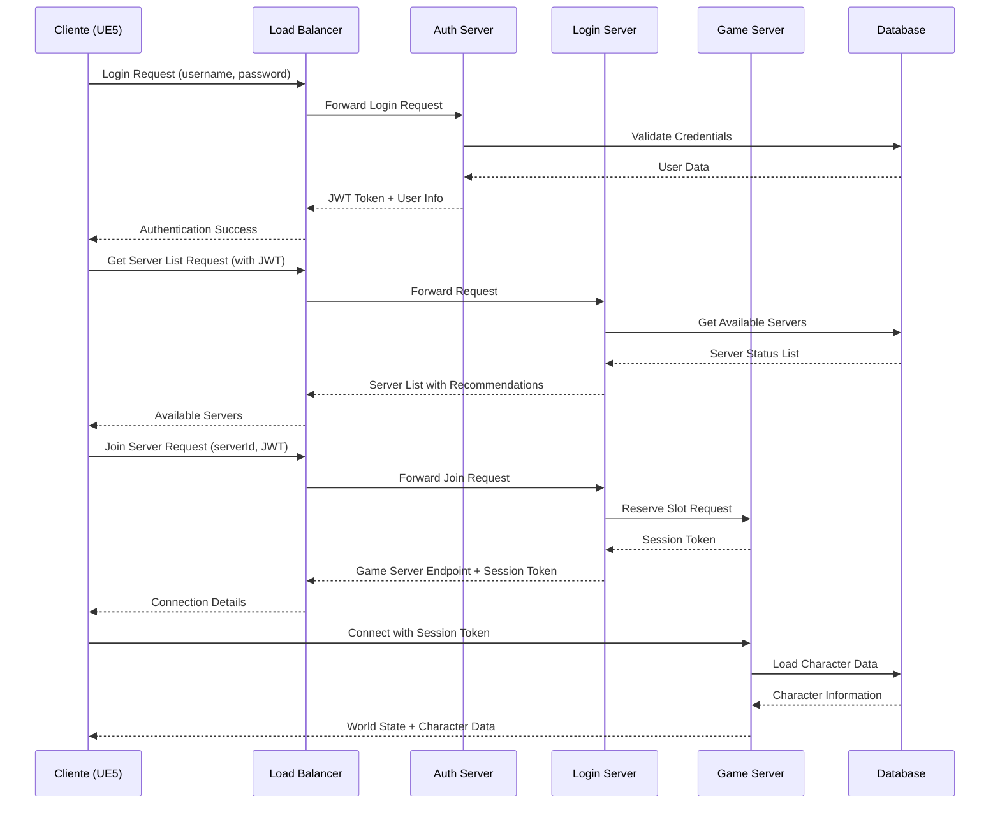
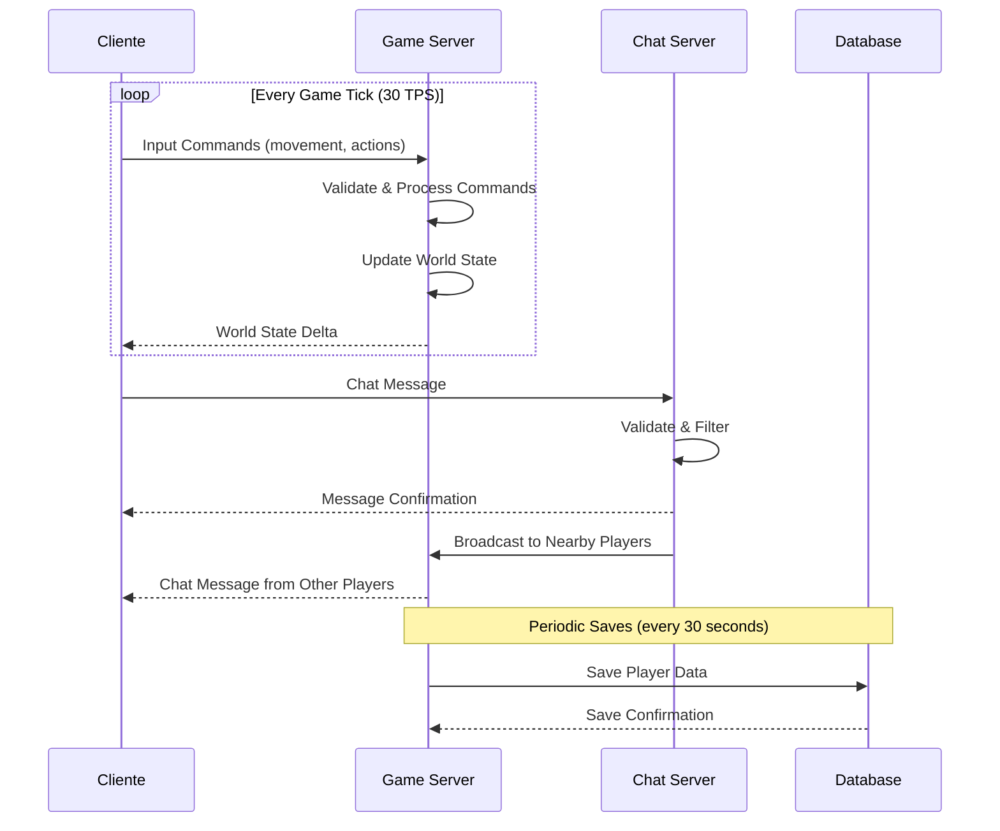

# MÓDULO 1: FUNDAMENTOS E ARQUITETURA

---

## 1.1 INTRODUÇÃO AOS MMORPGs

### O que são MMORPGs e por que são únicos?

**MMORPG** significa **Massively Multiplayer Online Role-Playing Game** (Jogo de Interpretação de Papéis Online Massivamente Multiplayer). Mas essa definição simples esconde uma complexidade técnica extraordinária.

#### Características Únicas dos MMORPGs:

1. **Escala Massiva**: Milhares de jogadores simultâneos no mesmo mundo
2. **Persistência**: O mundo continua existindo mesmo quando você não está jogando
3. **Tempo Real**: Interações acontecem instantaneamente entre todos os jogadores
4. **Estado Compartilhado**: Todos veem e interagem com o mesmo mundo
5. **Economia Virtual**: Sistemas econômicos complexos com valor real

### História e Evolução dos MMORPGs

#### Era Primitiva (1970s-1980s)
- **MUD (Multi-User Dungeon)**: Jogos baseados em texto
- **Por que importa**: Estabeleceram conceitos fundamentais como:
  - Mundos persistentes
  - Interação multiplayer
  - Sistemas de progressão
  - Economia virtual

#### Era Gráfica Inicial (1990s)
- **Meridian 59 (1996)**: Primeiro MMORPG 3D comercial
- **Ultima Online (1997)**: Popularizou o gênero
- **Desafios técnicos da época**:
  - Conexões dial-up lentas (56k)
  - Servidores limitados
  - Gráficos 2D/2.5D simples

#### Era Moderna (2000s-presente)
- **EverQuest (1999)**: 3D completo, raids complexas
- **World of Warcraft (2004)**: Definiu padrões da indústria
- **EVE Online (2003)**: Single-shard, economia complexa
- **Guild Wars 2 (2012)**: Inovações em PvP e eventos dinâmicos

### Desafios Únicos dos MMORPGs

#### 1. **Desafio da Escala**
```
Problema: Como manter 10.000+ jogadores no mesmo mundo?

Soluções Técnicas:
- Sharding (múltiplos servidores)
- Instancing (áreas privadas)
- Load balancing dinâmico
- Arquitetura distribuída

Por que é difícil:
- Estado compartilhado entre milhares de entidades
- Sincronização em tempo real
- Bandwidth exponencial
```

#### 2. **Desafio da Persistência**
```
Problema: O mundo deve existir 24/7 por anos

Implicações:
- Servidores nunca podem parar
- Updates sem downtime
- Backup contínuo de dados
- Recuperação de desastres

Soluções:
- Hot-swapping de código
- Rolling updates
- Redundância geográfica
- Database clustering
```

#### 3. **Desafio da Latência**
```
Problema: Jogadores ao redor do mundo precisam de experiência fluida

Fatores:
- Distância física (speed of light)
- Roteamento de internet
- Processamento server-side
- Sincronização de estado

Soluções:
- Servidores regionais
- Prediction/interpolation
- Lag compensation
- Priorização de pacotes
```

#### 4. **Desafio da Segurança**
```
Problema: Milhões de dólares em valor virtual

Ameaças:
- Cheating/hacking
- Duping (duplicação de itens)
- Bots/automation
- Real money trading

Soluções:
- Server authority
- Encrypted communication
- Behavioral analysis
- Statistical anomaly detection
```

### Diferenças entre MMORPG e outros gêneros multiplayer

#### MMORPG vs FPS Multiplayer
| Aspecto | MMORPG | FPS |
|---------|---------|-----|
| **Jogadores simultâneos** | 1000-50000+ | 16-100 |
| **Duração da sessão** | Horas/dias | 10-60 minutos |
| **Persistência** | Mundo permanente | Match temporário |
| **Complexidade de estado** | Milhões de entidades | Centenas |
| **Economia** | Complexa e persistente | Simples ou inexistente |

#### MMORPG vs MOBA
| Aspecto | MMORPG | MOBA |
|---------|---------|-----|
| **Progressão** | Permanente | Por partida |
| **Mundo** | Aberto e vasto | Arena fechada |
| **PvP** | Opcional/misto | Foco principal |
| **Cooperação** | Guilds/grupos | Times temporários |

### Casos de Sucesso e Fracassos

#### **Sucessos e seus Fatores**

**World of Warcraft**
- **Por que funcionou**:
  - Arquitetura escalável (realm-based)
  - Gameplay polido e acessível
  - Infraestrutura robusta
  - Updates regulares de conteúdo
- **Lições técnicas**:
  - Importância de ferramentas internas
  - Telemetria extensiva
  - Testes de carga rigorosos

**EVE Online**
- **Por que funcionou**:
  - Single-shard design único
  - Economia player-driven
  - Time dilation para grandes batalhas
- **Lições técnicas**:
  - Priorização dinâmica de recursos
  - Economia como gameplay core
  - Transparência com a comunidade

#### **Fracassos e suas Lições**

**Warhammer Online**
- **Por que falhou**:
  - Problemas de performance em RvR
  - Desequilíbrio de facções
  - Bugs críticos no lançamento
- **Lições**:
  - Testes de carga são essenciais
  - Balanceamento é crítico
  - Launch window é crucial

**Anthem**
- **Por que falhou**:
  - Não era realmente um MMO
  - Loading screens excessivos
  - Falta de conteúdo endgame
- **Lições**:
  - Definir claramente o gênero
  - Seamless world é expectativa
  - Conteúdo deve ser planejado para longo prazo

### Análise Técnica: Por que MMORPGs são os jogos mais complexos?

#### **Complexidade Computacional**
```
Sistema típico de FPS:
- 64 jogadores
- 1 mapa
- 30 minutos de duração
- Estado simples (posição, HP, ammo)

Sistema típico de MMORPG:
- 10.000+ jogadores
- Mundo massivo (100+ zonas)
- 24/7 por anos
- Estado complexo (inventory, skills, quests, economy, social)
```

#### **Complexidade de Dados**
```
FPS: ~1MB de estado por match
MMORPG: ~100GB+ de estado persistente

Operações por segundo:
FPS: ~1000 ops/sec
MMORPG: ~1.000.000 ops/sec
```

#### **Complexidade de Infraestrutura**
```
FPS: 1 servidor por match
MMORPG: Centenas de servidores interconectados
- Login servers
- Game servers  
- Database clusters
- Chat servers
- Web services
- CDN para assets
- Analytics pipelines
```

---

## 1.2 ARQUITETURA DE SISTEMAS DISTRIBUÍDOS PARA JOGOS

### Conceitos Fundamentais de Sistemas Distribuídos

#### O que é um Sistema Distribuído?

**Definição**: Um sistema distribuído é uma coleção de computadores independentes que aparecem para o usuário como um sistema único e coerente.

**No contexto de MMORPGs**: Múltiplos servidores trabalhando juntos para criar a ilusão de um mundo único e consistente.

#### Por que Sistemas Distribuídos são Necessários em MMORPGs?

1. **Limitações de Hardware Único**
   ```
   Servidor único típico:
   - CPU: ~100 cores
   - RAM: ~1TB
   - Network: ~100Gbps
   
   Necessidades de MMORPG:
   - 10.000+ jogadores simultâneos
   - Milhões de NPCs
   - Física complexa
   - IA avançada
   - Economia em tempo real
   ```

2. **Requisitos de Disponibilidade**
   ```
   Uptime necessário: 99.95%+ (4 horas de downtime por ano)
   Impossível com servidor único devido a:
   - Falhas de hardware
   - Updates de software
   - Manutenção
   - Desastres naturais
   ```

3. **Distribuição Geográfica**
   ```
   Jogadores globais precisam de:
   - Latência < 100ms
   - Servidores regionais
   - Sincronização entre regiões
   ```

### CAP Theorem Aplicado a Jogos Online

#### O que é o CAP Theorem?

**CAP Theorem** (Brewer's Theorem): Em um sistema distribuído, você pode garantir apenas 2 das 3 propriedades:

- **C**onsistency (Consistência)
- **A**vailability (Disponibilidade)  
- **P**artition Tolerance (Tolerância a Partições)

#### Aplicação em MMORPGs

**Cenário 1: Sistema de Inventário**
```
Escolha: CP (Consistency + Partition Tolerance)
Sacrifício: Availability

Por quê?
- Duplicação de itens seria catastrófica
- Players preferem erro temporário a perda permanente
- Economia do jogo depende de integridade dos dados

Implementação:
- Transações ACID no database
- Locks durante transferências
- Rollback em caso de falha
```

**Cenário 2: Sistema de Chat**
```
Escolha: AP (Availability + Partition Tolerance)
Sacrifício: Consistency

Por quê?
- Chat deve sempre funcionar
- Mensagens duplicadas/fora de ordem são aceitáveis
- Experiência social é prioritária

Implementação:
- Eventual consistency
- Message queues
- Best-effort delivery
```

**Cenário 3: Sistema de Movimento**
```
Escolha: Híbrida (diferentes garantias por contexto)

Movimento básico: AP
- Sempre responsivo
- Interpolação client-side
- Eventual consistency

Movimento crítico (combate): CP
- Server authority
- Rollback se necessário
- Precisão sobre responsividade
```

### Padrões de Arquitetura: Monolítico vs Microserviços

#### Arquitetura Monolítica

**Definição**: Todo o sistema roda em um único processo/servidor.

**Vantagens**:
```
1. Simplicidade de desenvolvimento
   - Um codebase
   - Deploy simples
   - Debugging direto

2. Performance
   - Sem overhead de rede
   - Shared memory
   - Transações locais

3. Consistência
   - ACID transactions
   - Shared state
   - Atomic operations
```

**Desvantagens**:
```
1. Escalabilidade limitada
   - Single point of failure
   - Recursos compartilhados
   - Scaling vertical apenas

2. Tecnologia lock-in
   - Uma linguagem/framework
   - Difícil de modernizar
   - Equipe única

3. Deployment complexo
   - Downtime para updates
   - Rollback difícil
   - Testing de integração
```

**Quando usar em MMORPGs**:
```
Cenários apropriados:
- Protótipos e MVPs
- Jogos pequenos (<1000 players)
- Orçamento/equipe limitados
- Gameplay simples

Exemplo: Indie MMORPG
- 500 players máximo
- Mundo pequeno
- Mecânicas básicas
- Equipe de 2-5 desenvolvedores
```

#### Arquitetura de Microserviços

**Definição**: Sistema dividido em serviços pequenos e independentes.

**Vantagens**:
```
1. Escalabilidade independente
   - Scale por demanda
   - Recursos dedicados
   - Horizontal scaling

2. Tecnologia diversa
   - Best tool for the job
   - Modernização gradual
   - Equipes especializadas

3. Resilência
   - Falhas isoladas
   - Degradação graceful
   - Recovery independente
```

**Desvantagens**:
```
1. Complexidade operacional
   - Network latency
   - Service discovery
   - Distributed debugging

2. Consistência de dados
   - Eventual consistency
   - Distributed transactions
   - Data synchronization

3. Overhead de desenvolvimento
   - Multiple codebases
   - API versioning
   - Integration testing
```

**Arquitetura Típica de MMORPG com Microserviços**:
```
┌─────────────────┐    ┌─────────────────┐
│   Load Balancer │    │   API Gateway   │
└─────────────────┘    └─────────────────┘
         │                       │
         ▼                       ▼
┌─────────────────┐    ┌─────────────────┐
│  Auth Service   │    │  Login Service  │
└─────────────────┘    └─────────────────┘
         │                       │
         ▼                       ▼
┌─────────────────┐    ┌─────────────────┐
│  Game Service   │    │  Chat Service   │
└─────────────────┘    └─────────────────┘
         │                       │
         ▼                       ▼
┌─────────────────┐    ┌─────────────────┐
│ Database Cluster│    │ Message Queue   │
└─────────────────┘    └─────────────────┘
```

### Escalabilidade Horizontal vs Vertical

#### Escalabilidade Vertical (Scale Up)

**Definição**: Adicionar mais poder ao servidor existente.

**Implementação**:
```
Aumentar recursos do servidor:
- CPU: 16 cores → 64 cores
- RAM: 64GB → 256GB  
- Storage: SSD → NVMe
- Network: 1Gbps → 10Gbps
```

**Vantagens**:
```
1. Simplicidade
   - Sem mudanças de código
   - Sem complexidade de rede
   - Transações locais

2. Performance
   - Shared memory
   - Cache locality
   - Atomic operations
```

**Limitações**:
```
1. Teto físico
   - Hardware tem limites
   - Custo exponencial
   - Single point of failure

2. Downtime
   - Upgrade requer parada
   - Migração de dados
   - Testing complexo

Exemplo prático:
Servidor de 64 cores custa ~$50k/ano
Servidor de 128 cores custa ~$200k/ano
Improvement: 2x performance, 4x cost
```

#### Escalabilidade Horizontal (Scale Out)

**Definição**: Adicionar mais servidores ao sistema.

**Implementação**:
```
Distribuir carga entre múltiplos servidores:
- Game Server 1: Zona A
- Game Server 2: Zona B
- Game Server 3: Zona C
- Load Balancer: Distribui players
```

**Vantagens**:
```
1. Escalabilidade ilimitada
   - Adicionar servidores conforme necessário
   - Custo linear
   - Sem single point of failure

2. Disponibilidade
   - Redundância natural
   - Falhas isoladas
   - Rolling updates
```

**Desafios**:
```
1. Complexidade de dados
   - Estado distribuído
   - Synchronização
   - Consistency models

2. Latência de rede
   - Inter-service communication
   - Data locality
   - Network partitions

Exemplo prático:
10 servidores de $5k/ano = $50k/ano
Mesma performance que 1 servidor de $50k/ano
Mas com redundância e flexibilidade
```

#### Estratégias Híbridas para MMORPGs

**Sharding Geográfico**:
```
US West: Servidores em Los Angeles
US East: Servidores em New York  
EU: Servidores em Frankfurt
Asia: Servidores em Singapore

Cada região:
- Scale vertical para performance local
- Scale horizontal para capacidade
- Cross-region para features globais
```

**Sharding por Funcionalidade**:
```
Login Cluster: Scale horizontal
- Stateless services
- Easy to replicate
- High availability priority

Game World Cluster: Scale vertical
- Stateful services  
- Performance critical
- Consistency priority

Database Cluster: Híbrido
- Read replicas (horizontal)
- Write master (vertical)
- Sharding por dados
```

### Latência, Throughput e Consistência

#### Latência em MMORPGs

**Definição**: Tempo entre ação do player e resposta do servidor.

**Componentes da Latência**:
```
Total Latency = Network + Processing + Queuing

Network Latency:
- Client → Server: 50ms (física + routing)
- Server → Client: 50ms
- Total: 100ms (baseline)

Processing Latency:
- Input validation: 1ms
- Game logic: 5ms
- Database query: 10ms
- Response generation: 1ms
- Total: 17ms

Queuing Latency:
- Network buffers: 5ms
- Server queues: 10ms
- Client buffers: 5ms
- Total: 20ms

Total típico: 137ms
```

**Otimizações de Latência**:
```
1. Client-side Prediction
   - Execute ação imediatamente
   - Assume sucesso
   - Rollback se servidor discorda

2. Lag Compensation
   - Rewind server state
   - Validate ações no tempo correto
   - Reconcile diferenças

3. Interpolation/Extrapolation
   - Smooth movement entre updates
   - Predict posições futuras
   - Hide network jitter

Exemplo de implementação:
// Client-side prediction
void PlayerController::MoveForward(float Value) {
    // Execute imediatamente
    LocalPosition += ForwardVector * Value * DeltaTime;
    
    // Enviar comando para servidor
    SendMovementCommand(Value, GetTime());
    
    // Armazenar para reconciliação
    PendingMoves.Add({Value, GetTime(), LocalPosition});
}
```

#### Throughput em MMORPGs

**Definição**: Quantidade de operações processadas por segundo.

**Métricas Importantes**:
```
Messages per Second (MPS):
- Chat: 10,000 MPS
- Movement: 100,000 MPS  
- Combat: 50,000 MPS
- Total: 160,000 MPS

Data Throughput:
- Incoming: 100 MB/s
- Outgoing: 500 MB/s (broadcast amplification)
- Database: 10,000 queries/s

Player Actions:
- Logins per minute: 100
- Concurrent players: 10,000
- Actions per player per second: 5
- Total actions: 50,000/s
```

**Otimizações de Throughput**:
```
1. Batching
   - Agrupar operações similares
   - Reduzir overhead por operação
   - Melhor utilização de recursos

2. Caching
   - Cache de dados frequentes
   - Reduzir database load
   - Improve response time

3. Asynchronous Processing
   - Non-blocking operations
   - Pipeline de comandos
   - Parallel processing

Exemplo de batching:
// Ao invés de:
for(Player player : players) {
    database.updatePosition(player.id, player.position);
}

// Use:
List<PositionUpdate> updates = collectAllUpdates();
database.batchUpdatePositions(updates);
```

#### Consistência em MMORPGs

**Níveis de Consistência**:

**1. Strong Consistency (Forte)**
```
Garantia: Todos veem o mesmo estado simultaneamente

Uso em MMORPGs:
- Inventário de items únicos
- Transações de gold
- Guild ownership

Implementação:
- Distributed locks
- Two-phase commit
- Consensus algorithms (Raft, Paxos)

Trade-off: Alta latência, baixa disponibilidade
```

**2. Eventual Consistency (Eventual)**
```
Garantia: Todos convergem para o mesmo estado eventualmente

Uso em MMORPGs:
- Chat messages
- Player positions (non-combat)
- Social features

Implementação:
- Vector clocks
- Conflict-free replicated data types (CRDTs)
- Gossip protocols

Trade-off: Baixa latência, alta disponibilidade
```

**3. Causal Consistency (Causal)**
```
Garantia: Operações causalmente relacionadas são vistas na ordem

Uso em MMORPGs:
- Combat sequences
- Quest progression
- Trade negotiations

Implementação:
- Lamport timestamps
- Causal ordering
- Happens-before relationships

Trade-off: Balanced latency/consistency
```

**Exemplo Prático - Sistema de Trade**:
```csharp
// Strong consistency para items únicos
public async Task<TradeResult> ExecuteTrade(TradeOffer offer) {
    using var transaction = await database.BeginTransactionAsync();
    
    try {
        // Lock ambos os inventários
        await LockInventory(offer.Player1Id);
        await LockInventory(offer.Player2Id);
        
        // Verificar se items ainda existem
        if (!await ValidateItems(offer)) {
            return TradeResult.Failed("Items no longer available");
        }
        
        // Executar transferência atômica
        await TransferItems(offer.Player1Id, offer.Player2Id, offer.Items1);
        await TransferItems(offer.Player2Id, offer.Player1Id, offer.Items2);
        
        await transaction.CommitAsync();
        return TradeResult.Success();
    }
    catch {
        await transaction.RollbackAsync();
        return TradeResult.Failed("Trade failed");
    }
}

// Eventual consistency para chat
public async Task BroadcastChatMessage(ChatMessage message) {
    // Não esperar confirmação de todos os servidores
    var tasks = chatServers.Select(server => 
        server.SendMessageAsync(message)).ToArray();
    
    // Fire and forget - eventual delivery
    _ = Task.WhenAll(tasks);
    
    // Return immediately
    return;
}
```

---

## 1.3 PLANEJAMENTO DA ARQUITETURA DO PROJETO

### Definição dos Serviços e suas Responsabilidades

#### Visão Geral da Arquitetura

Nossa arquitetura seguirá o padrão de **microserviços especializados**, onde cada serviço tem uma responsabilidade específica e bem definida. Isso nos permite escalar, manter e evoluir cada componente independentemente.

```
┌─────────────────────────────────────────────────────────────┐
│                    CLIENTE (Unreal Engine 5.6+)            │
│  ┌─────────────┐  ┌─────────────┐  ┌─────────────┐         │
│  │   Gameplay  │  │   Network   │  │     UI      │         │
│  │   Systems   │  │   Layer     │  │   Systems   │         │
│  └─────────────┘  └─────────────┘  └─────────────┘         │
└─────────────────────────┬───────────────────────────────────┘
                          │ UDP Custom Protocol
                          ▼
┌─────────────────────────────────────────────────────────────┐
│                    LOAD BALANCER                           │
│              (HAProxy / NGINX / AWS ALB)                   │
└─────────────────────┬───────────────────────────────────────┘
                      │
        ┌─────────────┼─────────────┐
        ▼             ▼             ▼
┌─────────────┐ ┌─────────────┐ ┌─────────────┐
│AUTH SERVER  │ │LOGIN SERVER │ │GAME SERVERS │
│             │ │             │ │   (Shards)  │
│- JWT Tokens │ │- Server List│ │- World State│
│- User Auth  │ │- Queue Mgmt │ │- Physics    │
│- 2FA        │ │- Load Bal.  │ │- NPCs       │
└─────────────┘ └─────────────┘ └─────────────┘
        │             │             │
        └─────────────┼─────────────┘
                      ▼
        ┌─────────────────────────────┐
        │       CHAT SERVER           │
        │- Global/Local Channels      │
        │- Moderation                 │
        │- History                    │
        └─────────────────────────────┘
                      │
                      ▼
        ┌─────────────────────────────┐
        │    DATABASE CLUSTER         │
        │- User Data                  │
        │- World State                │
        │- Game Economy              │
        │- Analytics                  │
        └─────────────────────────────┘
```

#### 1. Auth Server (Servidor de Autenticação)

**Responsabilidades Principais**:
```
1. Autenticação de Usuários
   - Validação de credenciais
   - Geração de JWT tokens
   - Refresh token management
   - Multi-factor authentication (2FA)

2. Autorização
   - Role-based access control
   - Permission management
   - Ban/suspension enforcement
   - Account status validation

3. Segurança
   - Rate limiting
   - Brute force protection
   - Suspicious activity detection
   - Audit logging
```

**Por que separado?**
- **Segurança**: Isolamento de credenciais sensíveis
- **Escalabilidade**: Auth é CPU-intensive, pode escalar independentemente
- **Reutilização**: Pode servir múltiplos jogos/serviços
- **Compliance**: Facilita auditoria e conformidade

**Tecnologias Sugeridas**:
```csharp
// Framework: ASP.NET Core 8
// Database: PostgreSQL (ACID compliance)
// Cache: Redis (session storage)
// Security: BCrypt/Argon2 (password hashing)

public class AuthController : ControllerBase {
    [HttpPost("login")]
    public async Task<AuthResult> Login(LoginRequest request) {
        // 1. Rate limiting check
        if (await rateLimiter.IsRateLimited(request.IP)) {
            return AuthResult.RateLimited();
        }
        
        // 2. Validate credentials
        var user = await userService.ValidateCredentials(
            request.Username, request.Password);
        
        if (user == null) {
            await auditService.LogFailedLogin(request);
            return AuthResult.InvalidCredentials();
        }
        
        // 3. Check account status
        if (user.IsBanned || user.IsSuspended) {
            return AuthResult.AccountRestricted(user.RestrictionReason);
        }
        
        // 4. Generate tokens
        var accessToken = await tokenService.GenerateAccessToken(user);
        var refreshToken = await tokenService.GenerateRefreshToken(user);
        
        // 5. Log successful login
        await auditService.LogSuccessfulLogin(user, request.IP);
        
        return AuthResult.Success(accessToken, refreshToken);
    }
}
```

#### 2. Login Server (Servidor de Login)

**Responsabilidades Principais**:
```
1. Server Selection
   - Lista de servidores disponíveis
   - Status de cada servidor (online/offline/full)
   - Ping/latência para cada servidor
   - Recomendação baseada em localização

2. Load Balancing
   - Distribuição de players entre shards
   - Prevenção de overload
   - Queue management para servidores cheios
   - Dynamic scaling triggers

3. Session Management
   - Tracking de sessões ativas
   - Handoff para game servers
   - Disconnect handling
   - Reconnection support
```

**Por que separado do Auth?**
- **Responsabilidade única**: Auth foca em segurança, Login em distribuição
- **Performance**: Login precisa de dados em tempo real dos game servers
- **Escalabilidade**: Diferentes padrões de carga
- **Disponibilidade**: Login pode funcionar mesmo se Auth estiver degradado

**Exemplo de Implementação**:
```csharp
public class LoginController : ControllerBase {
    [HttpGet("servers")]
    public async Task<ServerListResponse> GetAvailableServers() {
        var servers = await gameServerManager.GetActiveServers();
        
        var serverList = servers.Select(server => new ServerInfo {
            Id = server.Id,
            Name = server.Name,
            Population = server.CurrentPlayers,
            MaxPopulation = server.MaxPlayers,
            Status = server.Status,
            Ping = await pingService.GetPing(server.Endpoint),
            QueueLength = server.QueueLength,
            Recommended = IsRecommendedForUser(server, CurrentUser)
        }).ToList();
        
        return new ServerListResponse { Servers = serverList };
    }
    
    [HttpPost("join/{serverId}")]
    public async Task<JoinResult> JoinServer(int serverId) {
        var server = await gameServerManager.GetServer(serverId);
        
        // Check if server has capacity
        if (server.CurrentPlayers >= server.MaxPlayers) {
            var queuePosition = await queueManager.AddToQueue(
                serverId, CurrentUser.Id);
            return JoinResult.Queued(queuePosition);
        }
        
        // Reserve slot and generate session token
        var sessionToken = await server.ReserveSlot(CurrentUser.Id);
        
        return JoinResult.Success(server.Endpoint, sessionToken);
    }
}
```

#### 3. Game Server (Servidor de Jogo)

**Responsabilidades Principais**:
```
1. World Simulation
   - Entity management (players, NPCs, objects)
   - Physics simulation
   - AI behavior
   - Environmental systems (weather, day/night)

2. Game Logic
   - Combat calculations
   - Skill/spell effects
   - Quest progression
   - Economic transactions

3. Network Management
   - Client connections
   - State synchronization
   - Anti-cheat validation
   - Bandwidth optimization

4. Persistence
   - Player data saves
   - World state persistence
   - Backup and recovery
   - Data consistency
```

**Arquitetura Interna do Game Server**:
```
┌─────────────────────────────────────────────────────────────┐
│                    GAME SERVER PROCESS                     │
│                                                             │
│  ┌─────────────┐  ┌─────────────┐  ┌─────────────┐         │
│  │  Network    │  │   World     │  │  Database   │         │
│  │  Manager    │  │  Simulation │  │  Manager    │         │
│  └─────────────┘  └─────────────┘  └─────────────┘         │
│         │                 │                 │              │
│         ▼                 ▼                 ▼              │
│  ┌─────────────┐  ┌─────────────┐  ┌─────────────┐         │
│  │   Player    │  │    ECS      │  │   Save      │         │
│  │  Connections│  │   Engine    │  │   System    │         │
│  └─────────────┘  └─────────────┘  └─────────────┘         │
│         │                 │                 │              │
│         └─────────────────┼─────────────────┘              │
│                           ▼                                │
│                 ┌─────────────┐                            │
│                 │   Main      │                            │
│                 │   Game      │                            │
│                 │   Loop      │                            │
│                 └─────────────┘                            │
└─────────────────────────────────────────────────────────────┘
```

**Game Loop Principal**:
```csharp
public class GameServer {
    private const int TARGET_TPS = 30; // Ticks per second
    private const float TICK_RATE = 1.0f / TARGET_TPS;
    
    public async Task RunMainLoop() {
        var lastTick = DateTime.UtcNow;
        
        while (isRunning) {
            var currentTime = DateTime.UtcNow;
            var deltaTime = (float)(currentTime - lastTick).TotalSeconds;
            
            // Fixed timestep para consistência
            if (deltaTime >= TICK_RATE) {
                await ProcessTick(TICK_RATE);
                lastTick = currentTime;
                
                // Metrics para monitoramento
                await metricsService.RecordTickTime(deltaTime);
            }
            
            // Pequeno sleep para não consumir 100% CPU
            await Task.Delay(1);
        }
    }
    
    private async Task ProcessTick(float deltaTime) {
        // 1. Process input from all clients
        await networkManager.ProcessIncomingPackets();
        
        // 2. Update world simulation
        await worldSimulation.Update(deltaTime);
        
        // 3. Process game logic
        await gameLogic.ProcessSystems(deltaTime);
        
        // 4. Send updates to clients
        await networkManager.SendWorldUpdates();
        
        // 5. Persist critical data
        await persistenceManager.SaveCriticalData();
    }
}
```

#### 4. Chat Server (Servidor de Chat)

**Responsabilidades Principais**:
```
1. Message Routing
   - Global channels
   - Local/proximity chat
   - Private messages
   - Guild/group channels

2. Moderation
   - Profanity filtering
   - Spam detection
   - Rate limiting
   - Admin commands

3. History & Search
   - Message persistence
   - Search functionality
   - Audit trails
   - Data retention policies
```

**Por que separado?**
- **Escalabilidade**: Chat tem padrões diferentes de uso
- **Disponibilidade**: Chat deve funcionar mesmo com game servers down
- **Tecnologia**: Pode usar WebSockets ou message queues especializados
- **Moderação**: Ferramentas especializadas para content moderation

#### 5. Database Cluster

**Responsabilidades e Particionamento**:
```
1. User Database (PostgreSQL)
   - Account information
   - Authentication data
   - Billing/subscription data
   - ACID compliance critical

2. Game World Database (PostgreSQL + Redis)
   - Character data
   - Inventory/items
   - Guild information
   - Transactional consistency needed

3. Analytics Database (ClickHouse/BigQuery)
   - Player behavior data
   - Performance metrics
   - Business intelligence
   - High write throughput

4. Cache Layer (Redis Cluster)
   - Session data
   - Frequently accessed game data
   - Leaderboards
   - Real-time features
```

### Fluxo de Dados entre Cliente e Servidores

#### Fluxo de Login Completo



#### Fluxo de Gameplay em Tempo Real



#### Padrões de Comunicação

**1. Request-Response (Síncrono)**
```
Uso: Login, character selection, inventory operations
Características:
- Cliente espera resposta
- Timeout handling necessário
- Garantia de entrega
- Higher latency acceptable

Exemplo:
Client → Server: "Equip item ID 12345"
Server → Client: "Item equipped successfully" | "Item not found"
```

**2. Fire-and-Forget (Assíncrono)**
```
Uso: Movement updates, chat messages, analytics
Características:
- Cliente não espera resposta
- Lower latency
- Best effort delivery
- Higher throughput

Exemplo:
Client → Server: "Player moved to position (100, 200, 50)"
(No response expected)
```

**3. Publish-Subscribe (Event-driven)**
```
Uso: World events, player broadcasts, notifications
Características:
- One-to-many communication
- Event-driven architecture
- Loose coupling
- Scalable distribution

Exemplo:
Server → All Clients in Area: "Dragon spawned at (500, 300, 100)"
```

### Estratégias de Sharding e Load Balancing

#### Sharding Estratégias

**1. Geographic Sharding (Sharding Geográfico)**
```
Divisão por região geográfica:

US West Shard:
- Servidores em Los Angeles
- Players da costa oeste
- Latência: 20-50ms

US East Shard:
- Servidores em Virginia
- Players da costa leste
- Latência: 20-50ms

EU Shard:
- Servidores em Frankfurt
- Players europeus
- Latência: 30-70ms

Vantagens:
+ Baixa latência regional
+ Compliance com leis locais
+ Horários de pico distribuídos

Desvantagens:
- Players separados geograficamente
- Complexidade de cross-shard features
- Desbalanceamento de população
```

**2. Functional Sharding (Sharding Funcional)**
```
Divisão por tipo de dados/funcionalidade:

Auth Shard:
- User accounts
- Authentication data
- Global across all regions

Character Shard:
- Character data
- Inventory
- Per-region

World Shard:
- World state
- NPCs
- Environmental data
- Per-game-server

Vantagens:
+ Otimização específica por tipo de dados
+ Escalabilidade independente
+ Tecnologias especializadas

Desvantagens:
- Complexidade de queries cross-shard
- Transações distribuídas
- Data consistency challenges
```

**3. Horizontal Sharding (Sharding Horizontal)**
```
Divisão por hash/range de dados:

User ID Hash Sharding:
Shard 1: User IDs 0-999999
Shard 2: User IDs 1000000-1999999
Shard 3: User IDs 2000000-2999999

World Zone Sharding:
Shard A: Zones 1-10
Shard B: Zones 11-20
Shard C: Zones 21-30

Vantagens:
+ Distribuição uniforme
+ Escalabilidade linear
+ Load balancing automático

Desvantagens:
- Hotspots possíveis
- Cross-shard operations complexas
- Rebalancing difícil
```

#### Load Balancing Estratégias

**1. Round Robin**
```csharp
public class RoundRobinLoadBalancer {
    private readonly List<GameServer> servers;
    private int currentIndex = 0;
    
    public GameServer GetNextServer() {
        lock (servers) {
            var server = servers[currentIndex];
            currentIndex = (currentIndex + 1) % servers.Count;
            return server;
        }
    }
}

Vantagens:
+ Simples de implementar
+ Distribuição uniforme (teoricamente)

Desvantagens:
- Não considera carga atual
- Não considera capacidade diferente
- Pode sobrecarregar servidores lentos
```

**2. Least Connections**
```csharp
public class LeastConnectionsLoadBalancer {
    public GameServer GetBestServer() {
        return servers
            .Where(s => s.IsHealthy)
            .OrderBy(s => s.ActiveConnections)
            .ThenBy(s => s.CpuUsage)
            .FirstOrDefault();
    }
}

Vantagens:
+ Considera carga atual
+ Melhor para conexões de longa duração
+ Evita overload

Desvantagens:
- Overhead de tracking
- Pode criar hotspots
- Não considera qualidade das conexões
```

**3. Weighted Load Balancing**
```csharp
public class WeightedLoadBalancer {
    public GameServer GetWeightedServer() {
        var totalWeight = servers.Sum(s => s.Weight);
        var random = new Random().Next(totalWeight);
        
        var currentWeight = 0;
        foreach (var server in servers) {
            currentWeight += server.Weight;
            if (random < currentWeight) {
                return server;
            }
        }
        
        return servers.Last(); // Fallback
    }
    
    // Weight calculation based on server capacity
    private int CalculateWeight(GameServer server) {
        var cpuFactor = (100 - server.CpuUsage) / 100.0;
        var memoryFactor = (100 - server.MemoryUsage) / 100.0;
        var connectionFactor = (server.MaxConnections - server.ActiveConnections) 
                              / (double)server.MaxConnections;
        
        return (int)(server.BaseWeight * cpuFactor * memoryFactor * connectionFactor);
    }
}

Vantagens:
+ Considera capacidade dos servidores
+ Flexível e configurável
+ Pode adaptar-se dinamicamente

Desvantagens:
- Complexidade de configuração
- Overhead de cálculo
- Tuning necessário
```

**4. Geographic Load Balancing**
```csharp
public class GeographicLoadBalancer {
    public GameServer GetBestServerForRegion(string clientIP) {
        var clientRegion = geoService.GetRegion(clientIP);
        
        // Prefer servers in same region
        var regionalServers = servers
            .Where(s => s.Region == clientRegion && s.IsHealthy)
            .ToList();
            
        if (regionalServers.Any()) {
            return GetLeastLoadedServer(regionalServers);
        }
        
        // Fallback to closest region
        var closestRegion = geoService.GetClosestRegion(clientRegion);
        var fallbackServers = servers
            .Where(s => s.Region == closestRegion && s.IsHealthy)
            .ToList();
            
        return GetLeastLoadedServer(fallbackServers);
    }
}
```

### Plano de Deployment e Infraestrutura

#### Ambiente de Desenvolvimento

```yaml
# docker-compose.dev.yml
version: '3.8'
services:
  auth-server:
    build: ./AuthServer
    ports:
      - "5001:80"
    environment:
      - ASPNETCORE_ENVIRONMENT=Development
      - ConnectionStrings__DefaultConnection=Host=postgres;Database=mmorpg_auth_dev
    depends_on:
      - postgres
      - redis

  login-server:
    build: ./LoginServer
    ports:
      - "5002:80"
    environment:
      - ASPNETCORE_ENVIRONMENT=Development
    depends_on:
      - auth-server
      - postgres

  game-server:
    build: ./GameServer
    ports:
      - "7777:7777/udp"
    environment:
      - ASPNETCORE_ENVIRONMENT=Development
    depends_on:
      - postgres
      - redis

  postgres:
    image: postgres:15
    environment:
      POSTGRES_DB: mmorpg_dev
      POSTGRES_USER: dev_user
      POSTGRES_PASSWORD: dev_password
    ports:
      - "5432:5432"

  redis:
    image: redis:7-alpine
    ports:
      - "6379:6379"
```

#### Ambiente de Produção (AWS)

```yaml
# Infrastructure as Code (Terraform)
# main.tf

# VPC and Networking
resource "aws_vpc" "mmorpg_vpc" {
  cidr_block           = "10.0.0.0/16"
  enable_dns_hostnames = true
  enable_dns_support   = true
  
  tags = {
    Name = "MMORPG-VPC"
  }
}

# Subnets for different tiers
resource "aws_subnet" "public_subnets" {
  count             = 3
  vpc_id            = aws_vpc.mmorpg_vpc.id
  cidr_block        = "10.0.${count.index + 1}.0/24"
  availability_zone = data.aws_availability_zones.available.names[count.index]
  
  map_public_ip_on_launch = true
  
  tags = {
    Name = "Public-Subnet-${count.index + 1}"
    Tier = "Public"
  }
}

resource "aws_subnet" "private_subnets" {
  count             = 3
  vpc_id            = aws_vpc.mmorpg_vpc.id
  cidr_block        = "10.0.${count.index + 10}.0/24"
  availability_zone = data.aws_availability_zones.available.names[count.index]
  
  tags = {
    Name = "Private-Subnet-${count.index + 1}"
    Tier = "Private"
  }
}

# EKS Cluster for microservices
resource "aws_eks_cluster" "mmorpg_cluster" {
  name     = "mmorpg-cluster"
  role_arn = aws_iam_role.eks_cluster_role.arn
  version  = "1.28"

  vpc_config {
    subnet_ids              = concat(aws_subnet.public_subnets[*].id, aws_subnet.private_subnets[*].id)
    endpoint_private_access = true
    endpoint_public_access  = true
  }
}

# RDS for databases
resource "aws_rds_cluster" "mmorpg_db" {
  cluster_identifier      = "mmorpg-db-cluster"
  engine                 = "aurora-postgresql"
  engine_version         = "15.4"
  database_name          = "mmorpg"
  master_username        = var.db_username
  master_password        = var.db_password
  
  backup_retention_period = 7
  preferred_backup_window = "03:00-04:00"
  
  vpc_security_group_ids = [aws_security_group.rds_sg.id]
  db_subnet_group_name   = aws_db_subnet_group.mmorpg_db_subnet_group.name
  
  # Multi-AZ for high availability
  availability_zones = data.aws_availability_zones.available.names
  
  tags = {
    Name = "MMORPG-Database-Cluster"
  }
}

# ElastiCache for Redis
resource "aws_elasticache_replication_group" "mmorpg_redis" {
  replication_group_id         = "mmorpg-redis"
  description                  = "Redis cluster for MMORPG"
  
  node_type                    = "cache.r7g.large"
  port                         = 6379
  parameter_group_name         = "default.redis7"
  
  num_cache_clusters           = 3
  automatic_failover_enabled   = true
  multi_az_enabled            = true
  
  subnet_group_name           = aws_elasticache_subnet_group.mmorpg_redis_subnet_group.name
  security_group_ids          = [aws_security_group.redis_sg.id]
  
  tags = {
    Name = "MMORPG-Redis-Cluster"
  }
}
```

#### Kubernetes Deployment

```yaml
# k8s/auth-server-deployment.yml
apiVersion: apps/v1
kind: Deployment
metadata:
  name: auth-server
  labels:
    app: auth-server
spec:
  replicas: 3
  selector:
    matchLabels:
      app: auth-server
  template:
    metadata:
      labels:
        app: auth-server
    spec:
      containers:
      - name: auth-server
        image: mmorpg/auth-server:latest
        ports:
        - containerPort: 80
        env:
        - name: ConnectionStrings__DefaultConnection
          valueFrom:
            secretKeyRef:
              name: database-secrets
              key: connection-string
        - name: JWT__SecretKey
          valueFrom:
            secretKeyRef:
              name: jwt-secrets
              key: secret-key
        resources:
          requests:
            memory: "256Mi"
            cpu: "250m"
          limits:
            memory: "512Mi"
            cpu: "500m"
        livenessProbe:
          httpGet:
            path: /health
            port: 80
          initialDelaySeconds: 30
          periodSeconds: 10
        readinessProbe:
          httpGet:
            path: /ready
            port: 80
          initialDelaySeconds: 5
          periodSeconds: 5

---
apiVersion: v1
kind: Service
metadata:
  name: auth-server-service
spec:
  selector:
    app: auth-server
  ports:
    - protocol: TCP
      port: 80
      targetPort: 80
  type: ClusterIP

---
apiVersion: networking.k8s.io/v1
kind: Ingress
metadata:
  name: auth-server-ingress
  annotations:
    kubernetes.io/ingress.class: nginx
    cert-manager.io/cluster-issuer: letsencrypt-prod
    nginx.ingress.kubernetes.io/rate-limit: "100"
spec:
  tls:
  - hosts:
    - auth.mmorpg.com
    secretName: auth-tls
  rules:
  - host: auth.mmorpg.com
    http:
      paths:
      - path: /
        pathType: Prefix
        backend:
          service:
            name: auth-server-service
            port:
              number: 80
```

#### CI/CD Pipeline

```yaml
# .github/workflows/deploy.yml
name: Deploy MMORPG Services

on:
  push:
    branches: [main]
  pull_request:
    branches: [main]

jobs:
  test:
    runs-on: ubuntu-latest
    steps:
    - uses: actions/checkout@v3
    
    - name: Setup .NET
      uses: actions/setup-dotnet@v3
      with:
        dotnet-version: 8.0.x
    
    - name: Restore dependencies
      run: dotnet restore
    
    - name: Build
      run: dotnet build --no-restore
    
    - name: Test
      run: dotnet test --no-build --verbosity normal --collect:"XPlat Code Coverage"
    
    - name: Upload coverage reports
      uses: codecov/codecov-action@v3

  build-and-push:
    needs: test
    runs-on: ubuntu-latest
    if: github.ref == 'refs/heads/main'
    
    strategy:
      matrix:
        service: [auth-server, login-server, game-server, chat-server]
    
    steps:
    - uses: actions/checkout@v3
    
    - name: Configure AWS credentials
      uses: aws-actions/configure-aws-credentials@v2
      with:
        aws-access-key-id: ${{ secrets.AWS_ACCESS_KEY_ID }}
        aws-secret-access-key: ${{ secrets.AWS_SECRET_ACCESS_KEY }}
        aws-region: us-west-2
    
    - name: Login to Amazon ECR
      id: login-ecr
      uses: aws-actions/amazon-ecr-login@v1
    
    - name: Build, tag, and push image
      env:
        ECR_REGISTRY: ${{ steps.login-ecr.outputs.registry }}
        ECR_REPOSITORY: mmorpg/${{ matrix.service }}
        IMAGE_TAG: ${{ github.sha }}
      run: |
        docker build -t $ECR_REGISTRY/$ECR_REPOSITORY:$IMAGE_TAG ./src/${{ matrix.service }}
        docker push $ECR_REGISTRY/$ECR_REPOSITORY:$IMAGE_TAG
        docker tag $ECR_REGISTRY/$ECR_REPOSITORY:$IMAGE_TAG $ECR_REGISTRY/$ECR_REPOSITORY:latest
        docker push $ECR_REGISTRY/$ECR_REPOSITORY:latest

  deploy:
    needs: build-and-push
    runs-on: ubuntu-latest
    if: github.ref == 'refs/heads/main'
    
    steps:
    - uses: actions/checkout@v3
    
    - name: Configure AWS credentials
      uses: aws-actions/configure-aws-credentials@v2
      with:
        aws-access-key-id: ${{ secrets.AWS_ACCESS_KEY_ID }}
        aws-secret-access-key: ${{ secrets.AWS_SECRET_ACCESS_KEY }}
        aws-region: us-west-2
    
    - name: Update kubeconfig
      run: aws eks update-kubeconfig --name mmorpg-cluster
    
    - name: Deploy to Kubernetes
      run: |
        kubectl set image deployment/auth-server auth-server=$ECR_REGISTRY/mmorpg/auth-server:${{ github.sha }}
        kubectl set image deployment/login-server login-server=$ECR_REGISTRY/mmorpg/login-server:${{ github.sha }}
        kubectl set image deployment/game-server game-server=$ECR_REGISTRY/mmorpg/game-server:${{ github.sha }}
        kubectl set image deployment/chat-server chat-server=$ECR_REGISTRY/mmorpg/chat-server:${{ github.sha }}
        
        kubectl rollout status deployment/auth-server
        kubectl rollout status deployment/login-server
        kubectl rollout status deployment/game-server
        kubectl rollout status deployment/chat-server
```

### Métricas e Monitoramento

#### Métricas Essenciais para MMORPGs

**1. Performance Metrics**
```csharp
public class PerformanceMetrics {
    // Server Performance
    public float CpuUsage { get; set; }
    public float MemoryUsage { get; set; }
    public float NetworkBandwidth { get; set; }
    public int ActiveConnections { get; set; }
    
    // Game Performance
    public float TickRate { get; set; }           // Target: 30 TPS
    public float AverageTickTime { get; set; }    // Target: < 33ms
    public float MaxTickTime { get; set; }        // Target: < 50ms
    public int EntitiesSimulated { get; set; }
    
    // Network Performance
    public float AverageLatency { get; set; }     // Target: < 100ms
    public float PacketLoss { get; set; }         // Target: < 0.1%
    public int PacketsPerSecond { get; set; }
    public float BandwidthPerPlayer { get; set; } // Target: < 10KB/s
}

// Exemplo de coleta
public class MetricsCollector {
    private readonly IMetricsLogger metricsLogger;
    
    public async Task CollectMetrics() {
        var metrics = new PerformanceMetrics {
            CpuUsage = await GetCpuUsage(),
            MemoryUsage = await GetMemoryUsage(),
            TickRate = gameLoop.CurrentTPS,
            AverageLatency = networkManager.AverageLatency,
            ActiveConnections = connectionManager.ActiveConnections
        };
        
        await metricsLogger.LogMetrics(metrics);
        
        // Alertas automáticos
        if (metrics.CpuUsage > 80) {
            await alertService.SendAlert("High CPU usage detected");
        }
        
        if (metrics.AverageLatency > 150) {
            await alertService.SendAlert("High latency detected");
        }
    }
}
```

**2. Business Metrics**
```csharp
public class BusinessMetrics {
    // Player Metrics
    public int ConcurrentPlayers { get; set; }
    public int DailyActiveUsers { get; set; }
    public int MonthlyActiveUsers { get; set; }
    public float AverageSessionLength { get; set; }
    public float PlayerRetention { get; set; }
    
    // Gameplay Metrics
    public int QuestsCompleted { get; set; }
    public int ItemsTraded { get; set; }
    public int PvPMatches { get; set; }
    public float EconomyInflation { get; set; }
    
    // Revenue Metrics
    public decimal DailyRevenue { get; set; }
    public float ConversionRate { get; set; }
    public decimal AverageRevenuePerUser { get; set; }
}
```

#### Monitoring Stack

**1. Prometheus + Grafana**
```yaml
# prometheus.yml
global:
  scrape_interval: 15s

scrape_configs:
  - job_name: 'auth-server'
    static_configs:
      - targets: ['auth-server:80']
    metrics_path: '/metrics'
    
  - job_name: 'game-server'
    static_configs:
      - targets: ['game-server:8080']
    metrics_path: '/metrics'
    scrape_interval: 5s  # More frequent for game servers
    
  - job_name: 'postgres'
    static_configs:
      - targets: ['postgres-exporter:9187']

rule_files:
  - "alert_rules.yml"

alerting:
  alertmanagers:
    - static_configs:
        - targets:
          - alertmanager:9093
```

**2. Alerting Rules**
```yaml
# alert_rules.yml
groups:
- name: mmorpg_alerts
  rules:
  - alert: HighCPUUsage
    expr: cpu_usage_percent > 80
    for: 5m
    labels:
      severity: warning
    annotations:
      summary: "High CPU usage detected"
      description: "CPU usage is above 80% for more than 5 minutes"

  - alert: HighLatency
    expr: average_latency_ms > 150
    for: 2m
    labels:
      severity: critical
    annotations:
      summary: "High network latency detected"
      description: "Average latency is above 150ms"

  - alert: LowTickRate
    expr: game_server_tps < 25
    for: 1m
    labels:
      severity: critical
    annotations:
      summary: "Game server tick rate too low"
      description: "Tick rate below 25 TPS, gameplay will be affected"

  - alert: DatabaseConnectionFailure
    expr: database_connections_failed_total > 10
    for: 1m
    labels:
      severity: critical
    annotations:
      summary: "Database connection failures"
      description: "Multiple database connection failures detected"
```

**3. Logging Strategy**
```csharp
public class StructuredLogger {
    private readonly ILogger logger;
    
    public void LogPlayerAction(string playerId, string action, object data) {
        logger.LogInformation("Player action: {PlayerId} performed {Action} with data {Data}",
            playerId, action, JsonSerializer.Serialize(data));
    }
    
    public void LogSecurityEvent(string eventType, string details, string ipAddress) {
        logger.LogWarning("Security event: {EventType} from {IpAddress} - {Details}",
            eventType, ipAddress, details);
    }
    
    public void LogPerformanceIssue(string component, float value, float threshold) {
        logger.LogError("Performance issue in {Component}: {Value} exceeds threshold {Threshold}",
            component, value, threshold);
    }
}

// Configuração do Serilog
public static void ConfigureLogging(WebApplicationBuilder builder) {
    builder.Host.UseSerilog((context, configuration) => {
        configuration
            .WriteTo.Console(outputTemplate: 
                "[{Timestamp:HH:mm:ss} {Level:u3}] {Message:lj} {Properties:j}{NewLine}{Exception}")
            .WriteTo.File("logs/mmorpg-.log", 
                rollingInterval: RollingInterval.Day,
                retainedFileCountLimit: 7)
            .WriteTo.Elasticsearch(new ElasticsearchSinkOptions(new Uri("http://elasticsearch:9200")) {
                IndexFormat = "mmorpg-logs-{0:yyyy.MM.dd}",
                AutoRegisterTemplate = true
            })
            .Enrich.FromLogContext()
            .Enrich.WithProperty("Service", "GameServer")
            .Enrich.WithProperty("Version", Assembly.GetExecutingAssembly().GetName().Version);
    });
}
```

---

## Conclusão do Módulo 1

Neste módulo cobrimos os **fundamentos essenciais** para entender e planejar um MMORPG:

### O que aprendemos:

1. **Natureza única dos MMORPGs**: Escala, persistência, tempo real e complexidade
2. **Sistemas distribuídos**: CAP theorem, trade-offs e padrões arquiteturais
3. **Planejamento arquitetural**: Definição de serviços, fluxos de dados e estratégias de deployment

### Principais takeaways:

- **MMORPGs são os jogos mais complexos** de se desenvolver devido à escala e requisitos únicos
- **Não existe solução perfeita** - sempre há trade-offs entre consistência, disponibilidade e performance
- **Planejamento é crucial** - decisões arquiteturais iniciais impactam todo o projeto
- **Monitoramento é essencial** - sistemas complexos requerem observabilidade extensiva

### Próximos passos:

No **Módulo 2**, vamos configurar nosso ambiente de desenvolvimento completo, instalando e configurando:
- Unreal Engine 5.6+ com projeto C++
- .NET 8+ backend com estrutura de microserviços
- Ferramentas de desenvolvimento e debugging
- Ambiente Docker para desenvolvimento local

**Está pronto para prosseguir para o Módulo 2 ou tem alguma dúvida sobre os conceitos apresentados?**

Lembre-se: cada conceito aqui será aplicado na prática nos próximos módulos. É importante ter uma compreensão sólida destes fundamentos antes de avançarmos para a implementação.