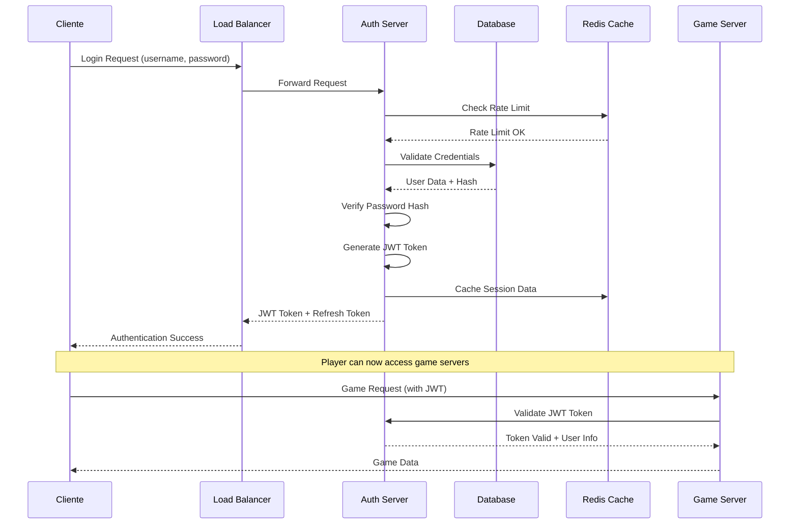

# MÓDULO 4: SERVIDOR DE AUTENTICAÇÃO (AUTH SERVER)

---

## Introdução ao Módulo 4

Neste módulo, vamos implementar um servidor de autenticação robusto e escalável para nosso MMORPG. O Auth Server é o primeiro ponto de contato dos players com nosso sistema e deve ser extremamente seguro, rápido e confiável.

**Por que um Auth Server dedicado é crucial para MMORPGs?**

1. **Segurança Centralizada**: Todas as credenciais ficam em um local seguro
2. **Escalabilidade**: Pode servir múltiplos game servers
3. **Auditoria**: Log centralizado de todas as autenticações
4. **Compliance**: Facilita conformidade com regulamentações (GDPR, etc.)
5. **Flexibilidade**: Suporte a múltiplos métodos de autenticação

---

## 4.1 ARQUITETURA DE AUTENTICAÇÃO

### Fluxo de Autenticação Segura

#### Visão Geral do Fluxo



#### Componentes da Arquitetura

```csharp
public class AuthenticationArchitecture
{
    /*
    Componentes principais:
    
    1. Authentication Controller
       - Recebe requests de login/logout
       - Valida credenciais
       - Gera tokens JWT
       - Rate limiting
    
    2. User Service
       - Gerencia dados de usuários
       - Password hashing/verification
       - Account status management
       - User profile operations
    
    3. Token Service
       - JWT generation/validation
       - Refresh token management
       - Token blacklisting
       - Claims management
    
    4. Security Service
       - Rate limiting
       - Brute force protection
       - Suspicious activity detection
       - Audit logging
    
    5. Database Layer
       - User credentials
       - Session data
       - Audit logs
       - Security events
    */
}
```

### JWT Tokens vs Session-Based Authentication

#### Comparação Detalhada

**Session-Based Authentication:**
```csharp
// Tradicional: Session armazenada no servidor
public class SessionBasedAuth
{
    private readonly Dictionary<string, UserSession> _sessions = new();

    public class UserSession
    {
        public string SessionId { get; set; }
        public int UserId { get; set; }
        public DateTime CreatedAt { get; set; }
        public DateTime LastActivity { get; set; }
        public string IpAddress { get; set; }
        public Dictionary<string, object> Data { get; set; } = new();
    }

    public string CreateSession(int userId, string ipAddress)
    {
        var sessionId = Guid.NewGuid().ToString();
        var session = new UserSession
        {
            SessionId = sessionId,
            UserId = userId,
            CreatedAt = DateTime.UtcNow,
            LastActivity = DateTime.UtcNow,
            IpAddress = ipAddress
        };

        _sessions[sessionId] = session;
        return sessionId;
    }

    public UserSession ValidateSession(string sessionId)
    {
        if (_sessions.TryGetValue(sessionId, out var session))
        {
            // Check expiration
            if (DateTime.UtcNow - session.LastActivity > TimeSpan.FromHours(24))
            {
                _sessions.Remove(sessionId);
                return null;
            }

            session.LastActivity = DateTime.UtcNow;
            return session;
        }

        return null;
    }
}

/*
Vantagens:
✅ Server-side control completo
✅ Fácil invalidação imediata
✅ Dados de sessão flexíveis
✅ Auditoria detalhada

Desvantagens:
❌ Estado no servidor (não stateless)
❌ Scaling horizontal complexo
❌ Memory overhead
❌ Database lookups constantes
*/
```

**JWT Token-Based Authentication:**
```csharp
// Moderno: Token autocontido
public class JwtTokenService
{
    private readonly string _secretKey;
    private readonly string _issuer;
    private readonly IMemoryCache _blacklistedTokens;

    public class JwtClaims
    {
        public int UserId { get; set; }
        public string Username { get; set; }
        public string Email { get; set; }
        public List<string> Roles { get; set; } = new();
        public DateTime IssuedAt { get; set; }
        public DateTime ExpiresAt { get; set; }
        public string SessionId { get; set; }
        public string IpAddress { get; set; }
    }

    public string GenerateToken(JwtClaims claims)
    {
        var tokenHandler = new JwtSecurityTokenHandler();
        var key = Encoding.ASCII.GetBytes(_secretKey);

        var tokenDescriptor = new SecurityTokenDescriptor
        {
            Subject = new ClaimsIdentity(new[]
            {
                new Claim("user_id", claims.UserId.ToString()),
                new Claim("username", claims.Username),
                new Claim("email", claims.Email),
                new Claim("session_id", claims.SessionId),
                new Claim("ip_address", claims.IpAddress),
                new Claim("iat", ((DateTimeOffset)claims.IssuedAt).ToUnixTimeSeconds().ToString()),
            }),
            Expires = claims.ExpiresAt,
            Issuer = _issuer,
            Audience = _issuer,
            SigningCredentials = new SigningCredentials(
                new SymmetricSecurityKey(key), 
                SecurityAlgorithms.HmacSha256Signature)
        };

        // Add roles as claims
        foreach (var role in claims.Roles)
        {
            tokenDescriptor.Subject.AddClaim(new Claim(ClaimTypes.Role, role));
        }

        var token = tokenHandler.CreateToken(tokenDescriptor);
        return tokenHandler.WriteToken(token);
    }

    public ClaimsPrincipal ValidateToken(string token)
    {
        // Check if token is blacklisted
        if (_blacklistedTokens.TryGetValue(token, out _))
        {
            throw new SecurityTokenValidationException("Token has been revoked");
        }

        var tokenHandler = new JwtSecurityTokenHandler();
        var key = Encoding.ASCII.GetBytes(_secretKey);

        var validationParameters = new TokenValidationParameters
        {
            ValidateIssuerSigningKey = true,
            IssuerSigningKey = new SymmetricSecurityKey(key),
            ValidateIssuer = true,
            ValidIssuer = _issuer,
            ValidateAudience = true,
            ValidAudience = _issuer,
            ValidateLifetime = true,
            ClockSkew = TimeSpan.Zero
        };

        var principal = tokenHandler.ValidateToken(token, validationParameters, out var validatedToken);
        return principal;
    }

    public void BlacklistToken(string token, TimeSpan expiry)
    {
        _blacklistedTokens.Set(token, true, expiry);
    }
}

/*
Vantagens:
✅ Stateless (sem estado no servidor)
✅ Scaling horizontal fácil
✅ Performance alta
✅ Cross-service authentication

Desvantagens:
❌ Difícil invalidação imediata
❌ Token size overhead
❌ Secret key management
❌ Menos flexibilidade de dados
*/
```

#### Por que JWT para MMORPGs?

**Análise de Requisitos para MMORPGs:**
```
Requisitos típicos:
- 10,000+ concurrent users
- Multiple game servers
- Cross-service authentication
- High performance needs
- Global distribution

JWT Advantages for MMORPGs:
✅ Stateless: Game servers não precisam consultar auth server
✅ Performance: Validação local sem database hits
✅ Scalability: Horizontal scaling sem shared state
✅ Distribution: Funciona entre data centers
✅ Microservices: Ideal para arquitetura distribuída

Session Disadvantages for MMORPGs:
❌ Database bottleneck: Cada request precisa validar sessão
❌ Memory usage: 10k sessions = significant RAM
❌ Single point of failure: Session store é crítico
❌ Cross-service complexity: Sharing sessions é difícil
```

### Refresh Tokens e Expiração

#### Sistema de Refresh Tokens

```csharp
public class RefreshTokenService
{
    private readonly IDatabase _database;
    private readonly JwtTokenService _jwtService;

    public class RefreshToken
    {
        public string Token { get; set; }
        public int UserId { get; set; }
        public DateTime CreatedAt { get; set; }
        public DateTime ExpiresAt { get; set; }
        public bool IsRevoked { get; set; }
        public string CreatedByIp { get; set; }
        public string ReplacedByToken { get; set; }
        public DateTime? RevokedAt { get; set; }
        public string RevokedByIp { get; set; }
    }

    public async Task<(string accessToken, string refreshToken)> GenerateTokenPair(
        int userId, string ipAddress)
    {
        // Generate short-lived access token (15 minutes)
        var accessTokenClaims = new JwtClaims
        {
            UserId = userId,
            Username = await GetUsername(userId),
            Email = await GetUserEmail(userId),
            Roles = await GetUserRoles(userId),
            IssuedAt = DateTime.UtcNow,
            ExpiresAt = DateTime.UtcNow.AddMinutes(15),
            SessionId = Guid.NewGuid().ToString(),
            IpAddress = ipAddress
        };

        var accessToken = _jwtService.GenerateToken(accessTokenClaims);

        // Generate long-lived refresh token (7 days)
        var refreshToken = new RefreshToken
        {
            Token = GenerateSecureToken(),
            UserId = userId,
            CreatedAt = DateTime.UtcNow,
            ExpiresAt = DateTime.UtcNow.AddDays(7),
            CreatedByIp = ipAddress
        };

        await StoreRefreshToken(refreshToken);

        return (accessToken, refreshToken.Token);
    }

    public async Task<(string accessToken, string refreshToken)> RefreshTokenPair(
        string refreshTokenString, string ipAddress)
    {
        var refreshToken = await GetRefreshToken(refreshTokenString);

        if (refreshToken == null || refreshToken.IsRevoked || 
            refreshToken.ExpiresAt < DateTime.UtcNow)
        {
            throw new SecurityTokenException("Invalid refresh token");
        }

        // Revoke old refresh token
        refreshToken.IsRevoked = true;
        refreshToken.RevokedAt = DateTime.UtcNow;
        refreshToken.RevokedByIp = ipAddress;

        // Generate new token pair
        var (newAccessToken, newRefreshToken) = await GenerateTokenPair(
            refreshToken.UserId, ipAddress);

        // Link old token to new one for audit trail
        refreshToken.ReplacedByToken = newRefreshToken;
        await UpdateRefreshToken(refreshToken);

        return (newAccessToken, newRefreshToken);
    }

    public async Task RevokeRefreshToken(string refreshTokenString, string ipAddress)
    {
        var refreshToken = await GetRefreshToken(refreshTokenString);
        
        if (refreshToken != null && !refreshToken.IsRevoked)
        {
            refreshToken.IsRevoked = true;
            refreshToken.RevokedAt = DateTime.UtcNow;
            refreshToken.RevokedByIp = ipAddress;
            await UpdateRefreshToken(refreshToken);
        }
    }

    private string GenerateSecureToken()
    {
        using var rng = RandomNumberGenerator.Create();
        var bytes = new byte[32];
        rng.GetBytes(bytes);
        return Convert.ToBase64String(bytes);
    }

    // Database operations
    private async Task StoreRefreshToken(RefreshToken token)
    {
        var sql = @"
            INSERT INTO RefreshTokens (Token, UserId, CreatedAt, ExpiresAt, CreatedByIp)
            VALUES (@Token, @UserId, @CreatedAt, @ExpiresAt, @CreatedByIp)";
        
        await _database.ExecuteAsync(sql, token);
    }

    private async Task<RefreshToken> GetRefreshToken(string token)
    {
        var sql = @"
            SELECT * FROM RefreshTokens 
            WHERE Token = @Token AND IsRevoked = 0";
        
        return await _database.QueryFirstOrDefaultAsync<RefreshToken>(sql, new { Token = token });
    }
}

/*
Por que Refresh Tokens?

1. Security: Access tokens de curta duração limitam exposure
2. Usability: Users não precisam fazer login constantemente
3. Control: Refresh tokens podem ser revogados imediatamente
4. Audit: Trail completo de token usage
5. Compromise Recovery: Tokens comprometidos expiram rapidamente
*/
```

### Multi-Factor Authentication (2FA)

#### Implementação de TOTP (Time-based One-Time Password)

```csharp
public class TwoFactorAuthService
{
    private readonly IDatabase _database;
    private readonly IQRCodeGenerator _qrGenerator;

    public class TwoFactorSecret
    {
        public int UserId { get; set; }
        public string Secret { get; set; }
        public DateTime CreatedAt { get; set; }
        public bool IsEnabled { get; set; }
        public List<string> BackupCodes { get; set; } = new();
        public DateTime? LastUsed { get; set; }
        public int FailedAttempts { get; set; }
    }

    public async Task<(string secret, string qrCodeUrl)> GenerateSecret(int userId, string username)
    {
        // Generate cryptographically secure secret
        var secret = GenerateBase32Secret();
        
        // Create QR code URL for authenticator apps
        var issuer = "MMORPG Game";
        var qrCodeUrl = $"otpauth://totp/{issuer}:{username}?secret={secret}&issuer={issuer}";

        // Store secret (disabled until verified)
        var twoFactorSecret = new TwoFactorSecret
        {
            UserId = userId,
            Secret = secret,
            CreatedAt = DateTime.UtcNow,
            IsEnabled = false,
            BackupCodes = GenerateBackupCodes()
        };

        await StoreTwoFactorSecret(twoFactorSecret);

        return (secret, qrCodeUrl);
    }

    public async Task<bool> EnableTwoFactor(int userId, string verificationCode)
    {
        var secret = await GetTwoFactorSecret(userId);
        if (secret == null) return false;

        if (ValidateTOTP(secret.Secret, verificationCode))
        {
            secret.IsEnabled = true;
            await UpdateTwoFactorSecret(secret);
            
            // Log security event
            await LogSecurityEvent(userId, "2FA_ENABLED", "Two-factor authentication enabled");
            
            return true;
        }

        return false;
    }

    public async Task<bool> ValidateTwoFactorCode(int userId, string code)
    {
        var secret = await GetTwoFactorSecret(userId);
        if (secret == null || !secret.IsEnabled) return false;

        // Check for too many failed attempts
        if (secret.FailedAttempts >= 5)
        {
            var timeSinceLastAttempt = DateTime.UtcNow - (secret.LastUsed ?? DateTime.MinValue);
            if (timeSinceLastAttempt < TimeSpan.FromMinutes(15))
            {
                await LogSecurityEvent(userId, "2FA_RATE_LIMITED", 
                    "Too many failed 2FA attempts");
                return false;
            }
            
            // Reset failed attempts after cooldown
            secret.FailedAttempts = 0;
        }

        // Try TOTP code first
        if (ValidateTOTP(secret.Secret, code))
        {
            secret.FailedAttempts = 0;
            secret.LastUsed = DateTime.UtcNow;
            await UpdateTwoFactorSecret(secret);
            return true;
        }

        // Try backup codes
        if (secret.BackupCodes.Contains(code))
        {
            secret.BackupCodes.Remove(code);
            secret.FailedAttempts = 0;
            secret.LastUsed = DateTime.UtcNow;
            await UpdateTwoFactorSecret(secret);
            
            await LogSecurityEvent(userId, "2FA_BACKUP_CODE_USED", 
                "Backup code used for authentication");
            
            return true;
        }

        // Failed attempt
        secret.FailedAttempts++;
        await UpdateTwoFactorSecret(secret);
        
        await LogSecurityEvent(userId, "2FA_FAILED", 
            $"Failed 2FA attempt #{secret.FailedAttempts}");

        return false;
    }

    private bool ValidateTOTP(string secret, string code)
    {
        var secretBytes = Base32Decode(secret);
        var timestamp = DateTimeOffset.UtcNow.ToUnixTimeSeconds() / 30;

        // Check current time window and ±1 window for clock skew
        for (int i = -1; i <= 1; i++)
        {
            var testTimestamp = timestamp + i;
            var expectedCode = GenerateTOTP(secretBytes, testTimestamp);
            
            if (expectedCode == code)
            {
                return true;
            }
        }

        return false;
    }

    private string GenerateTOTP(byte[] secret, long timestamp)
    {
        var timestampBytes = BitConverter.GetBytes(timestamp);
        if (BitConverter.IsLittleEndian)
        {
            Array.Reverse(timestampBytes);
        }

        using var hmac = new HMACSHA1(secret);
        var hash = hmac.ComputeHash(timestampBytes);

        var offset = hash[hash.Length - 1] & 0x0F;
        var code = ((hash[offset] & 0x7F) << 24) |
                   ((hash[offset + 1] & 0xFF) << 16) |
                   ((hash[offset + 2] & 0xFF) << 8) |
                   (hash[offset + 3] & 0xFF);

        return (code % 1000000).ToString("D6");
    }

    private string GenerateBase32Secret()
    {
        using var rng = RandomNumberGenerator.Create();
        var bytes = new byte[20]; // 160-bit secret
        rng.GetBytes(bytes);
        return Base32Encode(bytes);
    }

    private List<string> GenerateBackupCodes()
    {
        var codes = new List<string>();
        using var rng = RandomNumberGenerator.Create();

        for (int i = 0; i < 10; i++)
        {
            var bytes = new byte[4];
            rng.GetBytes(bytes);
            var code = BitConverter.ToUInt32(bytes, 0) % 100000000;
            codes.Add(code.ToString("D8"));
        }

        return codes;
    }

    private string Base32Encode(byte[] bytes)
    {
        const string alphabet = "ABCDEFGHIJKLMNOPQRSTUVWXYZ234567";
        var result = new StringBuilder();
        
        for (int i = 0; i < bytes.Length; i += 5)
        {
            var chunk = new byte[5];
            Array.Copy(bytes, i, chunk, 0, Math.Min(5, bytes.Length - i));
            
            var value = 0UL;
            for (int j = 0; j < 5; j++)
            {
                value = (value << 8) | chunk[j];
            }
            
            for (int j = 0; j < 8; j++)
            {
                result.Append(alphabet[(int)(value >> (35 - j * 5)) & 0x1F]);
            }
        }
        
        return result.ToString();
    }

    private byte[] Base32Decode(string base32)
    {
        const string alphabet = "ABCDEFGHIJKLMNOPQRSTUVWXYZ234567";
        var result = new List<byte>();
        
        for (int i = 0; i < base32.Length; i += 8)
        {
            var chunk = base32.Substring(i, Math.Min(8, base32.Length - i));
            var value = 0UL;
            
            foreach (char c in chunk)
            {
                value = (value << 5) | (uint)alphabet.IndexOf(c);
            }
            
            for (int j = 0; j < 5; j++)
            {
                result.Add((byte)(value >> (32 - j * 8)));
            }
        }
        
        return result.ToArray();
    }
}

/*
Por que TOTP para MMORPGs?

1. Security: Adiciona camada extra de proteção
2. Compatibility: Funciona com Google Authenticator, Authy, etc.
3. Offline: Não precisa de SMS ou internet no dispositivo
4. Standard: RFC 6238 - padrão da indústria
5. User Control: Users controlam seus próprios tokens
*/
```

---

## 4.2 IMPLEMENTAÇÃO DO AUTH SERVER

### API REST para Autenticação

#### Controllers de Autenticação

```csharp
[ApiController]
[Route("api/[controller]")]
[EnableRateLimiting("AuthPolicy")]
public class AuthController : ControllerBase
{
    private readonly IAuthService _authService;
    private readonly ITokenService _tokenService;
    private readonly ITwoFactorAuthService _twoFactorService;
    private readonly ILogger<AuthController> _logger;
    private readonly IMetrics _metrics;

    public AuthController(
        IAuthService authService,
        ITokenService tokenService,
        ITwoFactorAuthService twoFactorService,
        ILogger<AuthController> logger,
        IMetrics metrics)
    {
        _authService = authService;
        _tokenService = tokenService;
        _twoFactorService = twoFactorService;
        _logger = logger;
        _metrics = metrics;
    }

    [HttpPost("register")]
    [AllowAnonymous]
    public async Task<IActionResult> Register([FromBody] RegisterRequest request)
    {
        var stopwatch = Stopwatch.StartNew();
        var clientIp = GetClientIpAddress();

        try
        {
            // Validate request
            if (!ModelState.IsValid)
            {
                return BadRequest(ModelState);
            }

            // Check if user already exists
            if (await _authService.UserExistsAsync(request.Username, request.Email))
            {
                _metrics.Counter("auth.register.duplicate").Increment();
                return Conflict(new { message = "User already exists" });
            }

            // Create user
            var user = await _authService.CreateUserAsync(request);
            
            // Send verification email
            await _authService.SendVerificationEmailAsync(user.Id);

            _logger.LogInformation("User registered: {Username} from {IpAddress}", 
                request.Username, clientIp);
            
            _metrics.Counter("auth.register.success").Increment();

            return Ok(new RegisterResponse
            {
                UserId = user.Id,
                Message = "Registration successful. Please check your email for verification."
            });
        }
        catch (Exception ex)
        {
            _logger.LogError(ex, "Registration failed for {Username} from {IpAddress}", 
                request.Username, clientIp);
            
            _metrics.Counter("auth.register.error").Increment();
            
            return StatusCode(500, new { message = "Registration failed" });
        }
        finally
        {
            _metrics.Timer("auth.register.duration").Record(stopwatch.Elapsed);
        }
    }

    [HttpPost("login")]
    [AllowAnonymous]
    public async Task<IActionResult> Login([FromBody] LoginRequest request)
    {
        var stopwatch = Stopwatch.StartNew();
        var clientIp = GetClientIpAddress();

        try
        {
            // Validate request
            if (!ModelState.IsValid)
            {
                return BadRequest(ModelState);
            }

            // Authenticate user
            var authResult = await _authService.AuthenticateAsync(
                request.Username, request.Password, clientIp);

            if (!authResult.Success)
            {
                _logger.LogWarning("Login failed for {Username} from {IpAddress}: {Reason}", 
                    request.Username, clientIp, authResult.FailureReason);
                
                _metrics.Counter("auth.login.failed")
                    .WithTag("reason", authResult.FailureReason.ToString())
                    .Increment();

                return Unauthorized(new { message = authResult.Message });
            }

            var user = authResult.User;

            // Check if 2FA is enabled
            if (user.TwoFactorEnabled)
            {
                if (string.IsNullOrEmpty(request.TwoFactorCode))
                {
                    return Ok(new LoginResponse
                    {
                        RequiresTwoFactor = true,
                        Message = "Two-factor authentication required"
                    });
                }

                if (!await _twoFactorService.ValidateTwoFactorCode(user.Id, request.TwoFactorCode))
                {
                    _logger.LogWarning("2FA validation failed for {Username} from {IpAddress}", 
                        request.Username, clientIp);
                    
                    _metrics.Counter("auth.2fa.failed").Increment();
                    
                    return Unauthorized(new { message = "Invalid two-factor code" });
                }
            }

            // Generate token pair
            var (accessToken, refreshToken) = await _tokenService.GenerateTokenPair(
                user.Id, clientIp);

            // Update last login
            await _authService.UpdateLastLoginAsync(user.Id, clientIp);

            _logger.LogInformation("User logged in: {Username} from {IpAddress}", 
                user.Username, clientIp);
            
            _metrics.Counter("auth.login.success").Increment();

            return Ok(new LoginResponse
            {
                AccessToken = accessToken,
                RefreshToken = refreshToken,
                ExpiresIn = 900, // 15 minutes
                TokenType = "Bearer",
                User = new UserInfo
                {
                    Id = user.Id,
                    Username = user.Username,
                    Email = user.Email,
                    Roles = user.Roles
                }
            });
        }
        catch (Exception ex)
        {
            _logger.LogError(ex, "Login error for {Username} from {IpAddress}", 
                request.Username, clientIp);
            
            _metrics.Counter("auth.login.error").Increment();
            
            return StatusCode(500, new { message = "Login failed" });
        }
        finally
        {
            _metrics.Timer("auth.login.duration").Record(stopwatch.Elapsed);
        }
    }

    [HttpPost("refresh")]
    [AllowAnonymous]
    public async Task<IActionResult> RefreshToken([FromBody] RefreshTokenRequest request)
    {
        var stopwatch = Stopwatch.StartNew();
        var clientIp = GetClientIpAddress();

        try
        {
            var (accessToken, refreshToken) = await _tokenService.RefreshTokenPair(
                request.RefreshToken, clientIp);

            _metrics.Counter("auth.refresh.success").Increment();

            return Ok(new RefreshTokenResponse
            {
                AccessToken = accessToken,
                RefreshToken = refreshToken,
                ExpiresIn = 900,
                TokenType = "Bearer"
            });
        }
        catch (SecurityTokenException ex)
        {
            _logger.LogWarning("Invalid refresh token from {IpAddress}: {Message}", 
                clientIp, ex.Message);
            
            _metrics.Counter("auth.refresh.invalid").Increment();
            
            return Unauthorized(new { message = "Invalid refresh token" });
        }
        catch (Exception ex)
        {
            _logger.LogError(ex, "Refresh token error from {IpAddress}", clientIp);
            
            _metrics.Counter("auth.refresh.error").Increment();
            
            return StatusCode(500, new { message = "Token refresh failed" });
        }
        finally
        {
            _metrics.Timer("auth.refresh.duration").Record(stopwatch.Elapsed);
        }
    }

    [HttpPost("logout")]
    [Authorize]
    public async Task<IActionResult> Logout([FromBody] LogoutRequest request)
    {
        var clientIp = GetClientIpAddress();
        var userId = GetCurrentUserId();

        try
        {
            // Revoke refresh token
            if (!string.IsNullOrEmpty(request.RefreshToken))
            {
                await _tokenService.RevokeRefreshToken(request.RefreshToken, clientIp);
            }

            // Blacklist access token
            var accessToken = GetCurrentAccessToken();
            if (!string.IsNullOrEmpty(accessToken))
            {
                await _tokenService.BlacklistToken(accessToken, TimeSpan.FromHours(1));
            }

            _logger.LogInformation("User logged out: {UserId} from {IpAddress}", 
                userId, clientIp);
            
            _metrics.Counter("auth.logout.success").Increment();

            return Ok(new { message = "Logout successful" });
        }
        catch (Exception ex)
        {
            _logger.LogError(ex, "Logout error for user {UserId} from {IpAddress}", 
                userId, clientIp);
            
            _metrics.Counter("auth.logout.error").Increment();
            
            return StatusCode(500, new { message = "Logout failed" });
        }
    }

    [HttpPost("change-password")]
    [Authorize]
    public async Task<IActionResult> ChangePassword([FromBody] ChangePasswordRequest request)
    {
        var userId = GetCurrentUserId();
        var clientIp = GetClientIpAddress();

        try
        {
            var result = await _authService.ChangePasswordAsync(
                userId, request.CurrentPassword, request.NewPassword);

            if (!result.Success)
            {
                return BadRequest(new { message = result.Message });
            }

            _logger.LogInformation("Password changed for user {UserId} from {IpAddress}", 
                userId, clientIp);
            
            _metrics.Counter("auth.password_change.success").Increment();

            return Ok(new { message = "Password changed successfully" });
        }
        catch (Exception ex)
        {
            _logger.LogError(ex, "Password change error for user {UserId} from {IpAddress}", 
                userId, clientIp);
            
            _metrics.Counter("auth.password_change.error").Increment();
            
            return StatusCode(500, new { message = "Password change failed" });
        }
    }

    [HttpPost("enable-2fa")]
    [Authorize]
    public async Task<IActionResult> EnableTwoFactor()
    {
        var userId = GetCurrentUserId();
        var username = GetCurrentUsername();

        try
        {
            var (secret, qrCodeUrl) = await _twoFactorService.GenerateSecret(userId, username);

            return Ok(new EnableTwoFactorResponse
            {
                Secret = secret,
                QrCodeUrl = qrCodeUrl,
                BackupCodes = await _twoFactorService.GetBackupCodes(userId)
            });
        }
        catch (Exception ex)
        {
            _logger.LogError(ex, "2FA setup error for user {UserId}", userId);
            return StatusCode(500, new { message = "2FA setup failed" });
        }
    }

    [HttpPost("verify-2fa")]
    [Authorize]
    public async Task<IActionResult> VerifyTwoFactor([FromBody] VerifyTwoFactorRequest request)
    {
        var userId = GetCurrentUserId();

        try
        {
            var success = await _twoFactorService.EnableTwoFactor(userId, request.Code);

            if (success)
            {
                _metrics.Counter("auth.2fa.enabled").Increment();
                return Ok(new { message = "Two-factor authentication enabled" });
            }

            return BadRequest(new { message = "Invalid verification code" });
        }
        catch (Exception ex)
        {
            _logger.LogError(ex, "2FA verification error for user {UserId}", userId);
            return StatusCode(500, new { message = "2FA verification failed" });
        }
    }

    private string GetClientIpAddress()
    {
        return HttpContext.Connection.RemoteIpAddress?.ToString() ?? "unknown";
    }

    private int GetCurrentUserId()
    {
        var userIdClaim = HttpContext.User.FindFirst("user_id");
        return userIdClaim != null ? int.Parse(userIdClaim.Value) : 0;
    }

    private string GetCurrentUsername()
    {
        return HttpContext.User.FindFirst("username")?.Value ?? "";
    }

    private string GetCurrentAccessToken()
    {
        var authHeader = HttpContext.Request.Headers["Authorization"].FirstOrDefault();
        return authHeader?.StartsWith("Bearer ") == true ? authHeader.Substring(7) : null;
    }
}

/*
Por que esta estrutura de API?

1. RESTful: Segue padrões REST para consistência
2. Rate Limited: Proteção contra ataques de força bruta
3. Comprehensive Logging: Auditoria completa de eventos
4. Metrics: Monitoramento de performance e uso
5. Error Handling: Tratamento robusto de erros
6. Security: Validação e sanitização em todas as camadas
*/
```

### Banco de Dados e Schema

#### Schema de Database para Autenticação

```sql
-- Users table - informações básicas dos usuários
CREATE TABLE Users (
    Id INT IDENTITY(1,1) PRIMARY KEY,
    Username NVARCHAR(50) NOT NULL UNIQUE,
    Email NVARCHAR(255) NOT NULL UNIQUE,
    PasswordHash NVARCHAR(255) NOT NULL,
    Salt NVARCHAR(255) NOT NULL,
    IsEmailVerified BIT DEFAULT 0,
    EmailVerificationToken NVARCHAR(255) NULL,
    TwoFactorEnabled BIT DEFAULT 0,
    IsActive BIT DEFAULT 1,
    IsLocked BIT DEFAULT 0,
    FailedLoginAttempts INT DEFAULT 0,
    LastFailedLogin DATETIME2 NULL,
    LockoutEnd DATETIME2 NULL,
    CreatedAt DATETIME2 DEFAULT GETUTCDATE(),
    UpdatedAt DATETIME2 DEFAULT GETUTCDATE(),
    LastLoginAt DATETIME2 NULL,
    LastLoginIp NVARCHAR(45) NULL,
    
    INDEX IX_Users_Username (Username),
    INDEX IX_Users_Email (Email),
    INDEX IX_Users_IsActive (IsActive),
    INDEX IX_Users_CreatedAt (CreatedAt)
);

-- UserRoles table - roles de usuários
CREATE TABLE UserRoles (
    Id INT IDENTITY(1,1) PRIMARY KEY,
    UserId INT NOT NULL,
    Role NVARCHAR(50) NOT NULL,
    GrantedAt DATETIME2 DEFAULT GETUTCDATE(),
    GrantedBy INT NULL,
    
    FOREIGN KEY (UserId) REFERENCES Users(Id) ON DELETE CASCADE,
    FOREIGN KEY (GrantedBy) REFERENCES Users(Id),
    UNIQUE (UserId, Role),
    INDEX IX_UserRoles_UserId (UserId)
);

-- RefreshTokens table - tokens de refresh
CREATE TABLE RefreshTokens (
    Id INT IDENTITY(1,1) PRIMARY KEY,
    Token NVARCHAR(255) NOT NULL UNIQUE,
    UserId INT NOT NULL,
    CreatedAt DATETIME2 DEFAULT GETUTCDATE(),
    ExpiresAt DATETIME2 NOT NULL,
    IsRevoked BIT DEFAULT 0,
    RevokedAt DATETIME2 NULL,
    RevokedByIp NVARCHAR(45) NULL,
    ReplacedByToken NVARCHAR(255) NULL,
    CreatedByIp NVARCHAR(45) NOT NULL,
    
    FOREIGN KEY (UserId) REFERENCES Users(Id) ON DELETE CASCADE,
    INDEX IX_RefreshTokens_Token (Token),
    INDEX IX_RefreshTokens_UserId (UserId),
    INDEX IX_RefreshTokens_ExpiresAt (ExpiresAt)
);

-- TwoFactorSecrets table - segredos 2FA
CREATE TABLE TwoFactorSecrets (
    Id INT IDENTITY(1,1) PRIMARY KEY,
    UserId INT NOT NULL UNIQUE,
    Secret NVARCHAR(255) NOT NULL,
    BackupCodes NVARCHAR(MAX) NULL, -- JSON array
    IsEnabled BIT DEFAULT 0,
    CreatedAt DATETIME2 DEFAULT GETUTCDATE(),
    LastUsed DATETIME2 NULL,
    FailedAttempts INT DEFAULT 0,
    
    FOREIGN KEY (UserId) REFERENCES Users(Id) ON DELETE CASCADE
);

-- SecurityEvents table - log de eventos de segurança
CREATE TABLE SecurityEvents (
    Id BIGINT IDENTITY(1,1) PRIMARY KEY,
    UserId INT NULL,
    EventType NVARCHAR(50) NOT NULL,
    Description NVARCHAR(500) NOT NULL,
    IpAddress NVARCHAR(45) NOT NULL,
    UserAgent NVARCHAR(500) NULL,
    CreatedAt DATETIME2 DEFAULT GETUTCDATE(),
    AdditionalData NVARCHAR(MAX) NULL, -- JSON
    
    FOREIGN KEY (UserId) REFERENCES Users(Id),
    INDEX IX_SecurityEvents_UserId (UserId),
    INDEX IX_SecurityEvents_EventType (EventType),
    INDEX IX_SecurityEvents_CreatedAt (CreatedAt),
    INDEX IX_SecurityEvents_IpAddress (IpAddress)
);

-- LoginAttempts table - tentativas de login para rate limiting
CREATE TABLE LoginAttempts (
    Id BIGINT IDENTITY(1,1) PRIMARY KEY,
    IpAddress NVARCHAR(45) NOT NULL,
    Username NVARCHAR(50) NULL,
    Success BIT NOT NULL,
    AttemptedAt DATETIME2 DEFAULT GETUTCDATE(),
    
    INDEX IX_LoginAttempts_IpAddress_AttemptedAt (IpAddress, AttemptedAt),
    INDEX IX_LoginAttempts_Username_AttemptedAt (Username, AttemptedAt)
);

-- PasswordResetTokens table - tokens de reset de senha
CREATE TABLE PasswordResetTokens (
    Id INT IDENTITY(1,1) PRIMARY KEY,
    UserId INT NOT NULL,
    Token NVARCHAR(255) NOT NULL UNIQUE,
    CreatedAt DATETIME2 DEFAULT GETUTCDATE(),
    ExpiresAt DATETIME2 NOT NULL,
    IsUsed BIT DEFAULT 0,
    UsedAt DATETIME2 NULL,
    RequestedByIp NVARCHAR(45) NOT NULL,
    
    FOREIGN KEY (UserId) REFERENCES Users(Id) ON DELETE CASCADE,
    INDEX IX_PasswordResetTokens_Token (Token),
    INDEX IX_PasswordResetTokens_UserId (UserId),
    INDEX IX_PasswordResetTokens_ExpiresAt (ExpiresAt)
);

-- Stored procedures para operações comuns
GO

-- Procedure para limpeza de tokens expirados
CREATE PROCEDURE CleanupExpiredTokens
AS
BEGIN
    SET NOCOUNT ON;
    
    -- Remove refresh tokens expirados
    DELETE FROM RefreshTokens 
    WHERE ExpiresAt < GETUTCDATE() AND IsRevoked = 1;
    
    -- Remove password reset tokens expirados
    DELETE FROM PasswordResetTokens 
    WHERE ExpiresAt < GETUTCDATE();
    
    -- Remove login attempts antigos (mais de 24 horas)
    DELETE FROM LoginAttempts 
    WHERE AttemptedAt < DATEADD(HOUR, -24, GETUTCDATE());
    
    -- Remove security events antigos (mais de 90 dias)
    DELETE FROM SecurityEvents 
    WHERE CreatedAt < DATEADD(DAY, -90, GETUTCDATE());
END;
GO

-- Procedure para verificar rate limiting
CREATE PROCEDURE CheckRateLimit
    @IpAddress NVARCHAR(45),
    @Username NVARCHAR(50) = NULL,
    @WindowMinutes INT = 15,
    @MaxAttempts INT = 5
AS
BEGIN
    SET NOCOUNT ON;
    
    DECLARE @AttemptCount INT;
    DECLARE @WindowStart DATETIME2 = DATEADD(MINUTE, -@WindowMinutes, GETUTCDATE());
    
    -- Contar tentativas no período
    SELECT @AttemptCount = COUNT(*)
    FROM LoginAttempts
    WHERE IpAddress = @IpAddress
      AND (@Username IS NULL OR Username = @Username)
      AND AttemptedAt >= @WindowStart
      AND Success = 0;
    
    -- Retornar se rate limit foi excedido
    SELECT 
        CASE WHEN @AttemptCount >= @MaxAttempts THEN 1 ELSE 0 END AS IsRateLimited,
        @AttemptCount AS CurrentAttempts,
        @MaxAttempts AS MaxAttempts;
END;
GO

/*
Por que este schema?

1. Normalization: Dados organizados eficientemente
2. Indexing: Queries otimizadas para operações comuns
3. Audit Trail: Log completo de eventos de segurança
4. Scalability: Estrutura preparada para crescimento
5. Security: Separação de dados sensíveis
6. Maintenance: Procedures para limpeza automática
*/
```

#### Entity Framework Models

```csharp
// User entity
public class User
{
    public int Id { get; set; }
    public string Username { get; set; } = string.Empty;
    public string Email { get; set; } = string.Empty;
    public string PasswordHash { get; set; } = string.Empty;
    public string Salt { get; set; } = string.Empty;
    public bool IsEmailVerified { get; set; }
    public string? EmailVerificationToken { get; set; }
    public bool TwoFactorEnabled { get; set; }
    public bool IsActive { get; set; } = true;
    public bool IsLocked { get; set; }
    public int FailedLoginAttempts { get; set; }
    public DateTime? LastFailedLogin { get; set; }
    public DateTime? LockoutEnd { get; set; }
    public DateTime CreatedAt { get; set; } = DateTime.UtcNow;
    public DateTime UpdatedAt { get; set; } = DateTime.UtcNow;
    public DateTime? LastLoginAt { get; set; }
    public string? LastLoginIp { get; set; }

    // Navigation properties
    public List<UserRole> Roles { get; set; } = new();
    public List<RefreshToken> RefreshTokens { get; set; } = new();
    public TwoFactorSecret? TwoFactorSecret { get; set; }
    public List<SecurityEvent> SecurityEvents { get; set; } = new();
}

// DbContext configuration
public class AuthDbContext : DbContext
{
    public AuthDbContext(DbContextOptions<AuthDbContext> options) : base(options) { }

    public DbSet<User> Users { get; set; }
    public DbSet<UserRole> UserRoles { get; set; }
    public DbSet<RefreshToken> RefreshTokens { get; set; }
    public DbSet<TwoFactorSecret> TwoFactorSecrets { get; set; }
    public DbSet<SecurityEvent> SecurityEvents { get; set; }
    public DbSet<LoginAttempt> LoginAttempts { get; set; }
    public DbSet<PasswordResetToken> PasswordResetTokens { get; set; }

    protected override void OnModelCreating(ModelBuilder modelBuilder)
    {
        base.OnModelCreating(modelBuilder);

        // User configuration
        modelBuilder.Entity<User>(entity =>
        {
            entity.HasKey(e => e.Id);
            entity.HasIndex(e => e.Username).IsUnique();
            entity.HasIndex(e => e.Email).IsUnique();
            entity.HasIndex(e => e.IsActive);
            entity.HasIndex(e => e.CreatedAt);

            entity.Property(e => e.Username).HasMaxLength(50).IsRequired();
            entity.Property(e => e.Email).HasMaxLength(255).IsRequired();
            entity.Property(e => e.PasswordHash).HasMaxLength(255).IsRequired();
            entity.Property(e => e.Salt).HasMaxLength(255).IsRequired();
            entity.Property(e => e.LastLoginIp).HasMaxLength(45);
        });

        // UserRole configuration
        modelBuilder.Entity<UserRole>(entity =>
        {
            entity.HasKey(e => e.Id);
            entity.HasIndex(e => e.UserId);
            entity.HasIndex(e => new { e.UserId, e.Role }).IsUnique();

            entity.Property(e => e.Role).HasMaxLength(50).IsRequired();

            entity.HasOne<User>()
                .WithMany(u => u.Roles)
                .HasForeignKey(ur => ur.UserId)
                .OnDelete(DeleteBehavior.Cascade);
        });

        // RefreshToken configuration
        modelBuilder.Entity<RefreshToken>(entity =>
        {
            entity.HasKey(e => e.Id);
            entity.HasIndex(e => e.Token).IsUnique();
            entity.HasIndex(e => e.UserId);
            entity.HasIndex(e => e.ExpiresAt);

            entity.Property(e => e.Token).HasMaxLength(255).IsRequired();
            entity.Property(e => e.CreatedByIp).HasMaxLength(45).IsRequired();
            entity.Property(e => e.RevokedByIp).HasMaxLength(45);

            entity.HasOne<User>()
                .WithMany(u => u.RefreshTokens)
                .HasForeignKey(rt => rt.UserId)
                .OnDelete(DeleteBehavior.Cascade);
        });

        // TwoFactorSecret configuration
        modelBuilder.Entity<TwoFactorSecret>(entity =>
        {
            entity.HasKey(e => e.Id);
            entity.HasIndex(e => e.UserId).IsUnique();

            entity.Property(e => e.Secret).HasMaxLength(255).IsRequired();
            entity.Property(e => e.BackupCodes).HasColumnType("nvarchar(max)");

            entity.HasOne<User>()
                .WithOne(u => u.TwoFactorSecret)
                .HasForeignKey<TwoFactorSecret>(tfs => tfs.UserId)
                .OnDelete(DeleteBehavior.Cascade);
        });

        // SecurityEvent configuration
        modelBuilder.Entity<SecurityEvent>(entity =>
        {
            entity.HasKey(e => e.Id);
            entity.HasIndex(e => e.UserId);
            entity.HasIndex(e => e.EventType);
            entity.HasIndex(e => e.CreatedAt);
            entity.HasIndex(e => e.IpAddress);

            entity.Property(e => e.EventType).HasMaxLength(50).IsRequired();
            entity.Property(e => e.Description).HasMaxLength(500).IsRequired();
            entity.Property(e => e.IpAddress).HasMaxLength(45).IsRequired();
            entity.Property(e => e.UserAgent).HasMaxLength(500);
            entity.Property(e => e.AdditionalData).HasColumnType("nvarchar(max)");

            entity.HasOne<User>()
                .WithMany(u => u.SecurityEvents)
                .HasForeignKey(se => se.UserId)
                .OnDelete(DeleteBehavior.SetNull);
        });

        // Configure automatic timestamps
        foreach (var entityType in modelBuilder.Model.GetEntityTypes())
        {
            var properties = entityType.ClrType.GetProperties()
                .Where(p => p.PropertyType == typeof(DateTime) && 
                           (p.Name == "UpdatedAt" || p.Name == "ModifiedAt"));

            foreach (var property in properties)
            {
                modelBuilder.Entity(entityType.ClrType)
                    .Property(property.Name)
                    .HasDefaultValueSql("GETUTCDATE()");
            }
        }
    }

    public override int SaveChanges()
    {
        UpdateTimestamps();
        return base.SaveChanges();
    }

    public override Task<int> SaveChangesAsync(CancellationToken cancellationToken = default)
    {
        UpdateTimestamps();
        return base.SaveChangesAsync(cancellationToken);
    }

    private void UpdateTimestamps()
    {
        var entries = ChangeTracker.Entries()
            .Where(e => e.State == EntityState.Modified)
            .Where(e => e.Entity.GetType().GetProperty("UpdatedAt") != null);

        foreach (var entry in entries)
        {
            entry.Property("UpdatedAt").CurrentValue = DateTime.UtcNow;
        }
    }
}

/*
Por que Entity Framework?

1. Productivity: Desenvolvimento mais rápido
2. Type Safety: Queries type-safe em compile time
3. Migrations: Versionamento automático do schema
4. Performance: Query optimization e caching
5. Maintainability: Código mais limpo e organizado
*/
```

### Hashing de Senhas (BCrypt, Argon2)

#### Implementação de Password Hashing

```csharp
public interface IPasswordHashingService
{
    string HashPassword(string password);
    bool VerifyPassword(string password, string hash);
    bool NeedsRehash(string hash);
}

public class Argon2PasswordHashingService : IPasswordHashingService
{
    private readonly Argon2Config _config;

    public Argon2PasswordHashingService()
    {
        // Configuração otimizada para servidores de produção
        _config = new Argon2Config
        {
            Type = Argon2Type.Argon2id,  // Resistente a ataques GPU e side-channel
            Version = Argon2Version.Nineteen,
            TimeCost = 3,        // Iterações (3 é um bom balance)
            MemoryCost = 65536,  // 64 MB de memória
            Lanes = 4,           // Paralelização
            Threads = 4,         // Threads
            HashLength = 32,     // 256-bit hash
            SaltLength = 16      // 128-bit salt
        };
    }

    public string HashPassword(string password)
    {
        if (string.IsNullOrEmpty(password))
            throw new ArgumentException("Password cannot be null or empty");

        using var argon2 = new Argon2id(Encoding.UTF8.GetBytes(password));
        
        argon2.Salt = GenerateRandomSalt(_config.SaltLength);
        argon2.DegreeOfParallelism = _config.Threads;
        argon2.Iterations = _config.TimeCost;
        argon2.MemorySize = _config.MemoryCost;
        
        var hash = argon2.GetBytes(_config.HashLength);
        
        // Encode em formato verificável
        return $"$argon2id$v={_config.Version}$m={_config.MemoryCost},t={_config.TimeCost},p={_config.Threads}${Convert.ToBase64String(argon2.Salt)}${Convert.ToBase64String(hash)}";
    }

    public bool VerifyPassword(string password, string hash)
    {
        if (string.IsNullOrEmpty(password) || string.IsNullOrEmpty(hash))
            return false;

        try
        {
            var parts = hash.Split('$');
            if (parts.Length != 6) return false;

            // Parse parameters
            var version = parts[2];
            var paramsPart = parts[3];
            var saltBase64 = parts[4];
            var hashBase64 = parts[5];

            var parameters = ParseParameters(paramsPart);
            var salt = Convert.FromBase64String(saltBase64);
            var expectedHash = Convert.FromBase64String(hashBase64);

            using var argon2 = new Argon2id(Encoding.UTF8.GetBytes(password));
            argon2.Salt = salt;
            argon2.DegreeOfParallelism = parameters.Threads;
            argon2.Iterations = parameters.TimeCost;
            argon2.MemorySize = parameters.MemoryCost;

            var computedHash = argon2.GetBytes(expectedHash.Length);
            
            // Constant-time comparison para prevenir timing attacks
            return CryptographicOperations.FixedTimeEquals(expectedHash, computedHash);
        }
        catch
        {
            return false;
        }
    }

    public bool NeedsRehash(string hash)
    {
        try
        {
            var parts = hash.Split('$');
            if (parts.Length != 6) return true;

            var paramsPart = parts[3];
            var parameters = ParseParameters(paramsPart);

            // Verificar se os parâmetros estão desatualizados
            return parameters.TimeCost < _config.TimeCost ||
                   parameters.MemoryCost < _config.MemoryCost ||
                   parameters.Threads < _config.Threads;
        }
        catch
        {
            return true;
        }
    }

    private byte[] GenerateRandomSalt(int length)
    {
        using var rng = RandomNumberGenerator.Create();
        var salt = new byte[length];
        rng.GetBytes(salt);
        return salt;
    }

    private (int TimeCost, int MemoryCost, int Threads) ParseParameters(string paramsPart)
    {
        var timeCost = 3;
        var memoryCost = 65536;
        var threads = 4;

        var params_ = paramsPart.Split(',');
        foreach (var param in params_)
        {
            var keyValue = param.Split('=');
            if (keyValue.Length == 2)
            {
                switch (keyValue[0])
                {
                    case "t":
                        timeCost = int.Parse(keyValue[1]);
                        break;
                    case "m":
                        memoryCost = int.Parse(keyValue[1]);
                        break;
                    case "p":
                        threads = int.Parse(keyValue[1]);
                        break;
                }
            }
        }

        return (timeCost, memoryCost, threads);
    }
}

// Fallback para BCrypt (compatibilidade com sistemas legados)
public class BCryptPasswordHashingService : IPasswordHashingService
{
    private const int WorkFactor = 12; // 2^12 = 4096 rounds

    public string HashPassword(string password)
    {
        if (string.IsNullOrEmpty(password))
            throw new ArgumentException("Password cannot be null or empty");

        return BCrypt.Net.BCrypt.HashPassword(password, WorkFactor);
    }

    public bool VerifyPassword(string password, string hash)
    {
        if (string.IsNullOrEmpty(password) || string.IsNullOrEmpty(hash))
            return false;

        try
        {
            return BCrypt.Net.BCrypt.Verify(password, hash);
        }
        catch
        {
            return false;
        }
    }

    public bool NeedsRehash(string hash)
    {
        try
        {
            // BCrypt format: $2a$rounds$salt+hash
            var parts = hash.Split('$');
            if (parts.Length < 4) return true;

            var rounds = int.Parse(parts[2]);
            return rounds < WorkFactor;
        }
        catch
        {
            return true;
        }
    }
}

// Service para gerenciar múltiplos algoritmos
public class HybridPasswordHashingService : IPasswordHashingService
{
    private readonly Argon2PasswordHashingService _argon2Service;
    private readonly BCryptPasswordHashingService _bcryptService;

    public HybridPasswordHashingService()
    {
        _argon2Service = new Argon2PasswordHashingService();
        _bcryptService = new BCryptPasswordHashingService();
    }

    public string HashPassword(string password)
    {
        // Sempre usar Argon2 para novos hashes
        return _argon2Service.HashPassword(password);
    }

    public bool VerifyPassword(string password, string hash)
    {
        // Detectar tipo de hash e usar o service apropriado
        if (hash.StartsWith("$argon2"))
        {
            return _argon2Service.VerifyPassword(password, hash);
        }
        else if (hash.StartsWith("$2a$") || hash.StartsWith("$2b$") || hash.StartsWith("$2y$"))
        {
            return _bcryptService.VerifyPassword(password, hash);
        }

        return false;
    }

    public bool NeedsRehash(string hash)
    {
        if (hash.StartsWith("$argon2"))
        {
            return _argon2Service.NeedsRehash(hash);
        }
        else if (hash.StartsWith("$2a$") || hash.StartsWith("$2b$") || hash.StartsWith("$2y$"))
        {
            // BCrypt sempre precisa de rehash para Argon2
            return true;
        }

        return true;
    }
}

/*
Por que Argon2id?

1. Security: Vencedor do Password Hashing Competition
2. Resistance: Resistente a ataques GPU, ASIC e side-channel
3. Tunable: Parâmetros ajustáveis (tempo, memória, paralelismo)
4. Future-proof: Design moderno e extensível
5. Performance: Boa performance em hardware moderno

Por que manter BCrypt?

1. Compatibility: Sistemas legados podem ter senhas BCrypt
2. Migration: Permite migração gradual
3. Fallback: Backup caso Argon2 tenha problemas
4. Industry Standard: Ainda amplamente usado
*/
```

---

## Conclusão da Primeira Parte do Módulo 4

Implementamos os **fundamentos sólidos** do nosso servidor de autenticação:

### ✅ O que foi implementado:

#### **4.1 Arquitetura de Autenticação**
- ✅ **Fluxo de autenticação** completo e seguro
- ✅ **JWT vs Session** - análise e implementação JWT
- ✅ **Refresh tokens** com rotação e revogação
- ✅ **Multi-factor authentication** com TOTP

#### **4.2 Implementação do Auth Server (Parte 1)**
- ✅ **API REST completa** com todos os endpoints
- ✅ **Schema de database** otimizado e indexado
- ✅ **Entity Framework** models e configurações
- ✅ **Password hashing** com Argon2id + BCrypt fallback

### 🎯 Características Técnicas Implementadas:

1. **Segurança**: Argon2id hashing, JWT tokens, 2FA TOTP
2. **Performance**: Indexação otimizada, caching, rate limiting
3. **Escalabilidade**: Stateless JWT, database sharding ready
4. **Auditoria**: Log completo de eventos de segurança
5. **Flexibilidade**: Suporte a múltiplos algoritmos de hash

### 🚀 Próxima Parte:

Na **continuação do Módulo 4**, vamos implementar:
- **Rate Limiting avançado** com múltiplos algoritmos
- **Proteção contra ataques** (brute force, DDoS)
- **Integração OAuth2** (Google, Steam, Discord)
- **Sistema de email** para verificação e recovery
- **Métricas e monitoramento** completos

**Está pronto para continuar com a parte de proteção e integrações externas?**

O Auth Server que estamos construindo já tem uma base sólida de segurança e performance, pronta para suportar milhares de usuários simultâneos com máxima segurança!