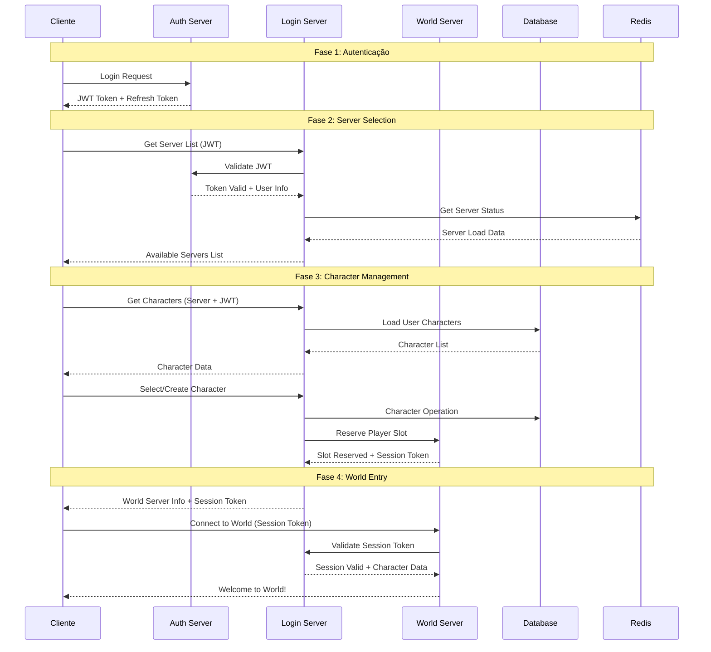

# MÓDULO 5: LOGIN SERVER

---

## Introdução ao Módulo 5

Neste módulo, vamos implementar o Login Server, que é o intermediário entre a autenticação e o mundo do jogo. Após o player se autenticar no Auth Server, ele precisa selecionar um servidor, escolher/criar personagens e ser direcionado para o mundo apropriado.

**Por que um Login Server separado é essencial para MMORPGs?**

1. **Separação de Responsabilidades**: Auth cuida da segurança, Login cuida da experiência
2. **Server Selection**: Players escolhem entre múltiplos world servers
3. **Character Management**: Criação, seleção e gerenciamento de personagens
4. **Load Balancing**: Distribui players entre servidores disponíveis
5. **Queue Management**: Gerencia filas quando servidores estão cheios

---

## 5.1 ARQUITETURA DO LOGIN SERVER

### Visão Geral da Arquitetura

#### Fluxo Completo de Login



#### Componentes do Login Server

```csharp
public class LoginServerArchitecture
{
    /*
    Componentes principais:
    
    1. Server Selection Service
       - Lista servidores disponíveis
       - Mostra população e status
       - Aplica regras de acesso
       - Load balancing inteligente
    
    2. Character Management Service
       - CRUD de personagens
       - Validação de nomes
       - Character slots management
       - Character transfer entre servidores
    
    3. World Server Communication
       - Health checks dos world servers
       - Session token generation
       - Player handoff para world servers
       - Queue management
    
    4. Database Layer
       - Character data storage
       - Server configurations
       - Player preferences
       - Audit logs
    
    5. Caching Layer
       - Server status cache
       - Character data cache
       - Session tokens cache
       - Population statistics
    */
}
```

### Server Selection System

#### Server Registry e Health Monitoring

```csharp
public class WorldServerRegistry
{
    private readonly IDatabase _database;
    private readonly IDistributedCache _cache;
    private readonly ILogger<WorldServerRegistry> _logger;
    private readonly Timer _healthCheckTimer;

    public class WorldServerInfo
    {
        public int ServerId { get; set; }
        public string ServerName { get; set; } = string.Empty;
        public string DisplayName { get; set; } = string.Empty;
        public ServerType Type { get; set; }
        public ServerRegion Region { get; set; }
        public string IpAddress { get; set; } = string.Empty;
        public int Port { get; set; }
        public int MaxPlayers { get; set; }
        public int CurrentPlayers { get; set; }
        public int QueueLength { get; set; }
        public ServerStatus Status { get; set; }
        public DateTime LastHeartbeat { get; set; }
        public Dictionary<string, object> Metadata { get; set; } = new();
        
        // Calculated properties
        public float PopulationPercentage => MaxPlayers > 0 ? 
            (float)CurrentPlayers / MaxPlayers * 100 : 0;
        
        public bool AcceptingPlayers => Status == ServerStatus.Online && 
            CurrentPlayers < MaxPlayers;
        
        public string PopulationLevel
        {
            get
            {
                return PopulationPercentage switch
                {
                    < 25 => "Low",
                    < 50 => "Medium", 
                    < 75 => "High",
                    < 95 => "Full",
                    _ => "Queue"
                };
            }
        }
    }

    public enum ServerType
    {
        PvE,        // Player vs Environment
        PvP,        // Player vs Player
        RP,         // Role Playing
        Hardcore,   // Permadeath
        Seasonal    // Temporary servers
    }

    public enum ServerRegion
    {
        NorthAmerica,
        Europe,
        Asia,
        Oceania,
        SouthAmerica
    }

    public enum ServerStatus
    {
        Offline,
        Starting,
        Online,
        Maintenance,
        Shutting_Down,
        Full
    }

    public WorldServerRegistry(
        IDatabase database, 
        IDistributedCache cache, 
        ILogger<WorldServerRegistry> logger)
    {
        _database = database;
        _cache = cache;
        _logger = logger;
        
        // Health check every 30 seconds
        _healthCheckTimer = new Timer(PerformHealthChecks, null, 
            TimeSpan.Zero, TimeSpan.FromSeconds(30));
    }

    public async Task<List<WorldServerInfo>> GetAvailableServersAsync(
        int userId, ServerRegion? preferredRegion = null)
    {
        var cacheKey = $"servers:available:{preferredRegion}";
        var cachedServers = await _cache.GetStringAsync(cacheKey);
        
        List<WorldServerInfo> servers;
        
        if (!string.IsNullOrEmpty(cachedServers))
        {
            servers = JsonSerializer.Deserialize<List<WorldServerInfo>>(cachedServers)!;
        }
        else
        {
            servers = await LoadServersFromDatabase(preferredRegion);
            
            // Cache for 1 minute
            await _cache.SetStringAsync(cacheKey, JsonSerializer.Serialize(servers),
                new DistributedCacheEntryOptions
                {
                    AbsoluteExpirationRelativeToNow = TimeSpan.FromMinutes(1)
                });
        }

        // Apply user-specific filtering
        return await ApplyUserFilters(servers, userId);
    }

    private async Task<List<WorldServerInfo>> LoadServersFromDatabase(ServerRegion? region)
    {
        var sql = @"
            SELECT s.*, ss.CurrentPlayers, ss.QueueLength, ss.LastHeartbeat
            FROM WorldServers s
            LEFT JOIN ServerStatus ss ON s.ServerId = ss.ServerId
            WHERE s.IsActive = 1 
            AND (@Region IS NULL OR s.Region = @Region)
            ORDER BY s.Priority DESC, ss.CurrentPlayers ASC";

        var servers = await _database.QueryAsync<WorldServerInfo>(sql, new { Region = region });
        return servers.ToList();
    }

    private async Task<List<WorldServerInfo>> ApplyUserFilters(
        List<WorldServerInfo> servers, int userId)
    {
        // Get user preferences
        var userPrefs = await GetUserServerPreferences(userId);
        
        // Filter based on user access level
        var userLevel = await GetUserAccessLevel(userId);
        
        var filteredServers = servers.Where(server =>
        {
            // Check access level
            if (server.Metadata.TryGetValue("RequiredLevel", out var requiredLevel))
            {
                if (userLevel < Convert.ToInt32(requiredLevel))
                    return false;
            }

            // Check if user has characters on this server
            if (userPrefs.PreferServersWithCharacters)
            {
                var hasCharacters = HasCharactersOnServer(userId, server.ServerId).Result;
                if (userPrefs.ShowOnlyServersWithCharacters && !hasCharacters)
                    return false;
            }

            return true;
        }).ToList();

        // Sort by user preferences
        return SortServersByPreference(filteredServers, userPrefs);
    }

    public async Task<WorldServerInfo?> SelectBestServerAsync(
        int userId, ServerType? preferredType = null)
    {
        var servers = await GetAvailableServersAsync(userId);
        
        if (preferredType.HasValue)
        {
            servers = servers.Where(s => s.Type == preferredType.Value).ToList();
        }

        // Smart server selection algorithm
        var availableServers = servers
            .Where(s => s.AcceptingPlayers)
            .OrderBy(s => CalculateServerScore(s, userId))
            .ToList();

        return availableServers.FirstOrDefault();
    }

    private float CalculateServerScore(WorldServerInfo server, int userId)
    {
        float score = 0;

        // Population balance (prefer medium population)
        var popScore = server.PopulationPercentage switch
        {
            < 20 => 0.6f,  // Too empty
            < 40 => 1.0f,  // Perfect
            < 60 => 0.9f,  // Good
            < 80 => 0.7f,  // Getting full
            _ => 0.3f      // Almost full
        };
        score += popScore * 40;

        // Latency (if available)
        if (server.Metadata.TryGetValue("AverageLatency", out var latency))
        {
            var latencyMs = Convert.ToInt32(latency);
            var latencyScore = Math.Max(0, (200 - latencyMs) / 200.0f);
            score += latencyScore * 30;
        }

        // Server stability (uptime)
        if (server.Metadata.TryGetValue("UptimePercentage", out var uptime))
        {
            var uptimeScore = Convert.ToSingle(uptime) / 100.0f;
            score += uptimeScore * 20;
        }

        // User has characters here (bonus)
        if (HasCharactersOnServer(userId, server.ServerId).Result)
        {
            score += 10;
        }

        return score;
    }

    private async void PerformHealthChecks(object? state)
    {
        try
        {
            var servers = await LoadServersFromDatabase(null);
            var healthCheckTasks = servers.Select(CheckServerHealth);
            
            await Task.WhenAll(healthCheckTasks);
        }
        catch (Exception ex)
        {
            _logger.LogError(ex, "Error during server health checks");
        }
    }

    private async Task CheckServerHealth(WorldServerInfo server)
    {
        try
        {
            using var client = new HttpClient();
            client.Timeout = TimeSpan.FromSeconds(5);
            
            var healthUrl = $"http://{server.IpAddress}:{server.Port}/health";
            var response = await client.GetAsync(healthUrl);
            
            if (response.IsSuccessStatusCode)
            {
                var healthData = await response.Content.ReadAsStringAsync();
                var health = JsonSerializer.Deserialize<ServerHealthData>(healthData);
                
                await UpdateServerStatus(server.ServerId, new ServerStatusUpdate
                {
                    Status = ServerStatus.Online,
                    CurrentPlayers = health!.PlayerCount,
                    QueueLength = health.QueueLength,
                    LastHeartbeat = DateTime.UtcNow,
                    Metadata = health.Metadata
                });
            }
            else
            {
                await MarkServerOffline(server.ServerId);
            }
        }
        catch (Exception ex)
        {
            _logger.LogWarning(ex, "Health check failed for server {ServerId}", server.ServerId);
            await MarkServerOffline(server.ServerId);
        }
    }

    public class ServerHealthData
    {
        public int PlayerCount { get; set; }
        public int QueueLength { get; set; }
        public Dictionary<string, object> Metadata { get; set; } = new();
    }

    public class ServerStatusUpdate
    {
        public ServerStatus Status { get; set; }
        public int CurrentPlayers { get; set; }
        public int QueueLength { get; set; }
        public DateTime LastHeartbeat { get; set; }
        public Dictionary<string, object> Metadata { get; set; } = new();
    }
}

/*
Por que este sistema de server selection?

1. Smart Load Balancing: Não apenas por população, mas por qualidade
2. User Preferences: Considera preferências e histórico do player
3. Health Monitoring: Detecta servidores com problemas automaticamente
4. Caching: Performance otimizada com cache inteligente
5. Flexibility: Suporte a diferentes tipos de servidor e regiões
*/
```

### Character Management System

#### Character CRUD Operations

```csharp
public class CharacterService
{
    private readonly IDatabase _database;
    private readonly IDistributedCache _cache;
    private readonly ICharacterValidator _validator;
    private readonly ILogger<CharacterService> _logger;

    public class Character
    {
        public long CharacterId { get; set; }
        public int UserId { get; set; }
        public int ServerId { get; set; }
        public string Name { get; set; } = string.Empty;
        public CharacterClass Class { get; set; }
        public CharacterRace Race { get; set; }
        public int Level { get; set; } = 1;
        public long Experience { get; set; } = 0;
        public Vector3 Position { get; set; }
        public int MapId { get; set; }
        public CharacterStats Stats { get; set; } = new();
        public CharacterAppearance Appearance { get; set; } = new();
        public DateTime CreatedAt { get; set; }
        public DateTime LastPlayedAt { get; set; }
        public int PlayTimeMinutes { get; set; }
        public bool IsDeleted { get; set; }
        public DateTime? DeletedAt { get; set; }
        public CharacterFlags Flags { get; set; }
    }

    public enum CharacterClass
    {
        Warrior = 1,
        Mage = 2,
        Archer = 3,
        Rogue = 4,
        Cleric = 5,
        Paladin = 6,
        Necromancer = 7,
        Bard = 8
    }

    public enum CharacterRace
    {
        Human = 1,
        Elf = 2,
        Dwarf = 3,
        Orc = 4,
        Halfling = 5,
        Dragonborn = 6
    }

    [Flags]
    public enum CharacterFlags
    {
        None = 0,
        Hardcore = 1,       // Permadeath
        PvPEnabled = 2,     // Can engage in PvP
        GuildLeader = 4,    // Is a guild leader
        Banned = 8,         // Temporarily banned
        Premium = 16        // Premium account benefits
    }

    public class CharacterStats
    {
        public int Strength { get; set; } = 10;
        public int Dexterity { get; set; } = 10;
        public int Intelligence { get; set; } = 10;
        public int Constitution { get; set; } = 10;
        public int Wisdom { get; set; } = 10;
        public int Charisma { get; set; } = 10;
        
        // Derived stats
        public int Health => Constitution * 10 + Level * 5;
        public int Mana => Intelligence * 8 + Level * 3;
        public int Stamina => Constitution * 5 + Strength * 3;
    }

    public class CharacterAppearance
    {
        public int HairStyle { get; set; }
        public int HairColor { get; set; }
        public int SkinColor { get; set; }
        public int EyeColor { get; set; }
        public int FaceType { get; set; }
        public float Height { get; set; } = 1.0f;
        public Dictionary<string, object> CustomData { get; set; } = new();
    }

    public async Task<List<Character>> GetCharactersAsync(int userId, int serverId)
    {
        var cacheKey = $"characters:{userId}:{serverId}";
        var cachedData = await _cache.GetStringAsync(cacheKey);
        
        if (!string.IsNullOrEmpty(cachedData))
        {
            return JsonSerializer.Deserialize<List<Character>>(cachedData)!;
        }

        var sql = @"
            SELECT c.*, cs.Strength, cs.Dexterity, cs.Intelligence, 
                   cs.Constitution, cs.Wisdom, cs.Charisma,
                   ca.HairStyle, ca.HairColor, ca.SkinColor, ca.EyeColor, 
                   ca.FaceType, ca.Height, ca.CustomData
            FROM Characters c
            LEFT JOIN CharacterStats cs ON c.CharacterId = cs.CharacterId
            LEFT JOIN CharacterAppearance ca ON c.CharacterId = ca.CharacterId
            WHERE c.UserId = @UserId 
            AND c.ServerId = @ServerId 
            AND c.IsDeleted = 0
            ORDER BY c.LastPlayedAt DESC";

        var characters = await _database.QueryAsync<Character>(sql, new { UserId = userId, ServerId = serverId });
        var characterList = characters.ToList();

        // Cache for 5 minutes
        await _cache.SetStringAsync(cacheKey, JsonSerializer.Serialize(characterList),
            new DistributedCacheEntryOptions
            {
                AbsoluteExpirationRelativeToNow = TimeSpan.FromMinutes(5)
            });

        return characterList;
    }

    public async Task<CreateCharacterResult> CreateCharacterAsync(
        int userId, int serverId, CreateCharacterRequest request)
    {
        try
        {
            // Validate character creation request
            var validationResult = await _validator.ValidateCharacterCreation(userId, serverId, request);
            if (!validationResult.IsValid)
            {
                return new CreateCharacterResult
                {
                    Success = false,
                    ErrorMessage = validationResult.ErrorMessage
                };
            }

            // Check character slot availability
            var existingCharacters = await GetCharactersAsync(userId, serverId);
            var maxSlots = await GetMaxCharacterSlots(userId);
            
            if (existingCharacters.Count >= maxSlots)
            {
                return new CreateCharacterResult
                {
                    Success = false,
                    ErrorMessage = $"Maximum character slots reached ({maxSlots})"
                };
            }

            // Check name availability
            if (await IsCharacterNameTaken(request.Name, serverId))
            {
                return new CreateCharacterResult
                {
                    Success = false,
                    ErrorMessage = "Character name is already taken"
                };
            }

            // Create character
            var character = new Character
            {
                UserId = userId,
                ServerId = serverId,
                Name = request.Name,
                Class = request.Class,
                Race = request.Race,
                Position = GetStartingPosition(request.Race),
                MapId = GetStartingMap(request.Race),
                Stats = CalculateStartingStats(request.Class, request.Race),
                Appearance = request.Appearance,
                CreatedAt = DateTime.UtcNow,
                LastPlayedAt = DateTime.UtcNow
            };

            var characterId = await InsertCharacter(character);
            character.CharacterId = characterId;

            // Clear cache
            await InvalidateCharacterCache(userId, serverId);

            // Log character creation
            _logger.LogInformation("Character created: {CharacterName} by user {UserId} on server {ServerId}", 
                character.Name, userId, serverId);

            return new CreateCharacterResult
            {
                Success = true,
                Character = character
            };
        }
        catch (Exception ex)
        {
            _logger.LogError(ex, "Error creating character for user {UserId}", userId);
            return new CreateCharacterResult
            {
                Success = false,
                ErrorMessage = "Failed to create character"
            };
        }
    }

    public async Task<bool> DeleteCharacterAsync(int userId, long characterId, bool permanent = false)
    {
        try
        {
            var character = await GetCharacterById(characterId);
            if (character == null || character.UserId != userId)
            {
                return false;
            }

            if (permanent)
            {
                // Permanent deletion (admin only)
                await PermanentlyDeleteCharacter(characterId);
            }
            else
            {
                // Soft delete with recovery period
                var sql = @"
                    UPDATE Characters 
                    SET IsDeleted = 1, DeletedAt = @DeletedAt
                    WHERE CharacterId = @CharacterId";

                await _database.ExecuteAsync(sql, new 
                { 
                    CharacterId = characterId, 
                    DeletedAt = DateTime.UtcNow 
                });
            }

            // Clear cache
            await InvalidateCharacterCache(userId, character.ServerId);

            _logger.LogInformation("Character deleted: {CharacterId} by user {UserId} (permanent: {Permanent})", 
                characterId, userId, permanent);

            return true;
        }
        catch (Exception ex)
        {
            _logger.LogError(ex, "Error deleting character {CharacterId}", characterId);
            return false;
        }
    }

    public async Task<bool> RestoreCharacterAsync(int userId, long characterId)
    {
        try
        {
            var character = await GetCharacterById(characterId, includeDeleted: true);
            if (character == null || character.UserId != userId || !character.IsDeleted)
            {
                return false;
            }

            // Check if recovery period has expired (7 days)
            if (character.DeletedAt.HasValue && 
                DateTime.UtcNow - character.DeletedAt.Value > TimeSpan.FromDays(7))
            {
                return false;
            }

            var sql = @"
                UPDATE Characters 
                SET IsDeleted = 0, DeletedAt = NULL
                WHERE CharacterId = @CharacterId";

            await _database.ExecuteAsync(sql, new { CharacterId = characterId });

            // Clear cache
            await InvalidateCharacterCache(userId, character.ServerId);

            _logger.LogInformation("Character restored: {CharacterId} by user {UserId}", 
                characterId, userId);

            return true;
        }
        catch (Exception ex)
        {
            _logger.LogError(ex, "Error restoring character {CharacterId}", characterId);
            return false;
        }
    }

    private CharacterStats CalculateStartingStats(CharacterClass characterClass, CharacterRace race)
    {
        var baseStats = new CharacterStats();

        // Race bonuses
        switch (race)
        {
            case CharacterRace.Human:
                // Balanced - no specific bonuses
                break;
            case CharacterRace.Elf:
                baseStats.Dexterity += 2;
                baseStats.Intelligence += 1;
                baseStats.Constitution -= 1;
                break;
            case CharacterRace.Dwarf:
                baseStats.Strength += 2;
                baseStats.Constitution += 2;
                baseStats.Dexterity -= 1;
                break;
            case CharacterRace.Orc:
                baseStats.Strength += 3;
                baseStats.Constitution += 1;
                baseStats.Intelligence -= 2;
                break;
            case CharacterRace.Halfling:
                baseStats.Dexterity += 2;
                baseStats.Charisma += 1;
                baseStats.Strength -= 1;
                break;
            case CharacterRace.Dragonborn:
                baseStats.Strength += 1;
                baseStats.Charisma += 2;
                break;
        }

        // Class bonuses
        switch (characterClass)
        {
            case CharacterClass.Warrior:
                baseStats.Strength += 3;
                baseStats.Constitution += 2;
                break;
            case CharacterClass.Mage:
                baseStats.Intelligence += 3;
                baseStats.Wisdom += 2;
                break;
            case CharacterClass.Archer:
                baseStats.Dexterity += 3;
                baseStats.Wisdom += 1;
                break;
            case CharacterClass.Rogue:
                baseStats.Dexterity += 2;
                baseStats.Charisma += 2;
                break;
            case CharacterClass.Cleric:
                baseStats.Wisdom += 3;
                baseStats.Constitution += 1;
                break;
            case CharacterClass.Paladin:
                baseStats.Strength += 2;
                baseStats.Charisma += 2;
                break;
            case CharacterClass.Necromancer:
                baseStats.Intelligence += 2;
                baseStats.Wisdom += 1;
                break;
            case CharacterClass.Bard:
                baseStats.Charisma += 3;
                baseStats.Dexterity += 1;
                break;
        }

        return baseStats;
    }

    private Vector3 GetStartingPosition(CharacterRace race)
    {
        // Different starting positions based on race
        return race switch
        {
            CharacterRace.Human => new Vector3(100, 0, 100),
            CharacterRace.Elf => new Vector3(200, 0, 150),
            CharacterRace.Dwarf => new Vector3(50, 0, 200),
            CharacterRace.Orc => new Vector3(300, 0, 50),
            CharacterRace.Halfling => new Vector3(150, 0, 250),
            CharacterRace.Dragonborn => new Vector3(250, 0, 300),
            _ => new Vector3(100, 0, 100)
        };
    }

    public class CreateCharacterRequest
    {
        public string Name { get; set; } = string.Empty;
        public CharacterClass Class { get; set; }
        public CharacterRace Race { get; set; }
        public CharacterAppearance Appearance { get; set; } = new();
    }

    public class CreateCharacterResult
    {
        public bool Success { get; set; }
        public string ErrorMessage { get; set; } = string.Empty;
        public Character? Character { get; set; }
    }
}

/*
Por que este sistema de characters?

1. Flexible Stats: Sistema de stats baseado em classe e raça
2. Soft Delete: Characters podem ser recuperados por período limitado
3. Appearance System: Customização visual completa
4. Caching: Performance otimizada para listagem de characters
5. Validation: Validação robusta de nomes e regras
6. Audit Trail: Log completo de operações
*/
```

### World Server Communication

#### Session Token System

```csharp
public class WorldServerCommunicationService
{
    private readonly IDatabase _database;
    private readonly IDistributedCache _cache;
    private readonly WorldServerRegistry _serverRegistry;
    private readonly ILogger<WorldServerCommunicationService> _logger;

    public class SessionToken
    {
        public string Token { get; set; } = string.Empty;
        public int UserId { get; set; }
        public long CharacterId { get; set; }
        public int ServerId { get; set; }
        public DateTime CreatedAt { get; set; }
        public DateTime ExpiresAt { get; set; }
        public string ClientIpAddress { get; set; } = string.Empty;
        public Dictionary<string, object> Metadata { get; set; } = new();
    }

    public class PlayerHandoffRequest
    {
        public int UserId { get; set; }
        public long CharacterId { get; set; }
        public int TargetServerId { get; set; }
        public string ClientIpAddress { get; set; } = string.Empty;
        public Dictionary<string, object> ClientInfo { get; set; } = new();
    }

    public class PlayerHandoffResult
    {
        public bool Success { get; set; }
        public string ErrorMessage { get; set; } = string.Empty;
        public string SessionToken { get; set; } = string.Empty;
        public WorldServerConnectionInfo ConnectionInfo { get; set; } = new();
        public int QueuePosition { get; set; }
        public TimeSpan EstimatedWaitTime { get; set; }
    }

    public class WorldServerConnectionInfo
    {
        public string IpAddress { get; set; } = string.Empty;
        public int Port { get; set; }
        public string Protocol { get; set; } = "UDP";
        public Dictionary<string, object> ConnectionData { get; set; } = new();
    }

    public async Task<PlayerHandoffResult> HandoffPlayerToWorldServerAsync(
        PlayerHandoffRequest request)
    {
        try
        {
            // Get target server info
            var serverInfo = await _serverRegistry.GetServerInfoAsync(request.TargetServerId);
            if (serverInfo == null)
            {
                return new PlayerHandoffResult
                {
                    Success = false,
                    ErrorMessage = "Target server not found"
                };
            }

            // Check server availability
            if (!serverInfo.AcceptingPlayers)
            {
                // Try to queue the player
                var queueResult = await QueuePlayerForServer(request);
                return queueResult;
            }

            // Reserve slot on world server
            var reservationResult = await ReservePlayerSlot(request);
            if (!reservationResult.Success)
            {
                return reservationResult;
            }

            // Generate session token
            var sessionToken = await GenerateSessionToken(request);

            // Get character data for handoff
            var characterData = await GetCharacterForHandoff(request.CharacterId);
            
            // Notify world server about incoming player
            await NotifyWorldServerOfIncomingPlayer(request.TargetServerId, sessionToken, characterData);

            return new PlayerHandoffResult
            {
                Success = true,
                SessionToken = sessionToken.Token,
                ConnectionInfo = new WorldServerConnectionInfo
                {
                    IpAddress = serverInfo.IpAddress,
                    Port = serverInfo.Port,
                    ConnectionData = new Dictionary<string, object>
                    {
                        ["SessionToken"] = sessionToken.Token,
                        ["Protocol"] = "CustomUDP",
                        ["EncryptionKey"] = GenerateConnectionKey(sessionToken.Token)
                    }
                }
            };
        }
        catch (Exception ex)
        {
            _logger.LogError(ex, "Error during player handoff for user {UserId} to server {ServerId}", 
                request.UserId, request.TargetServerId);
            
            return new PlayerHandoffResult
            {
                Success = false,
                ErrorMessage = "Failed to connect to world server"
            };
        }
    }

    private async Task<SessionToken> GenerateSessionToken(PlayerHandoffRequest request)
    {
        var token = new SessionToken
        {
            Token = GenerateSecureToken(),
            UserId = request.UserId,
            CharacterId = request.CharacterId,
            ServerId = request.TargetServerId,
            CreatedAt = DateTime.UtcNow,
            ExpiresAt = DateTime.UtcNow.AddMinutes(5), // 5 minute window to connect
            ClientIpAddress = request.ClientIpAddress,
            Metadata = request.ClientInfo
        };

        // Store in cache for quick validation
        var cacheKey = $"session_token:{token.Token}";
        await _cache.SetStringAsync(cacheKey, JsonSerializer.Serialize(token),
            new DistributedCacheEntryOptions
            {
                AbsoluteExpirationRelativeToNow = TimeSpan.FromMinutes(5)
            });

        // Also store in database for persistence
        await StoreSessionToken(token);

        return token;
    }

    private async Task<PlayerHandoffResult> ReservePlayerSlot(PlayerHandoffRequest request)
    {
        try
        {
            var serverInfo = await _serverRegistry.GetServerInfoAsync(request.TargetServerId);
            if (serverInfo == null)
            {
                return new PlayerHandoffResult
                {
                    Success = false,
                    ErrorMessage = "Server not found"
                };
            }

            // Call world server API to reserve slot
            using var httpClient = new HttpClient();
            httpClient.Timeout = TimeSpan.FromSeconds(10);

            var reservationRequest = new
            {
                UserId = request.UserId,
                CharacterId = request.CharacterId,
                ClientIpAddress = request.ClientIpAddress
            };

            var json = JsonSerializer.Serialize(reservationRequest);
            var content = new StringContent(json, Encoding.UTF8, "application/json");

            var response = await httpClient.PostAsync(
                $"http://{serverInfo.IpAddress}:{serverInfo.Port}/api/players/reserve-slot", 
                content);

            if (response.IsSuccessStatusCode)
            {
                var responseData = await response.Content.ReadAsStringAsync();
                var result = JsonSerializer.Deserialize<SlotReservationResponse>(responseData);

                return new PlayerHandoffResult
                {
                    Success = result!.Success,
                    ErrorMessage = result.ErrorMessage
                };
            }
            else
            {
                return new PlayerHandoffResult
                {
                    Success = false,
                    ErrorMessage = "Failed to reserve slot on world server"
                };
            }
        }
        catch (Exception ex)
        {
            _logger.LogError(ex, "Error reserving slot on server {ServerId}", request.TargetServerId);
            return new PlayerHandoffResult
            {
                Success = false,
                ErrorMessage = "Connection to world server failed"
            };
        }
    }

    private async Task<PlayerHandoffResult> QueuePlayerForServer(PlayerHandoffRequest request)
    {
        try
        {
            // Add player to server queue
            var queuePosition = await AddPlayerToQueue(request.TargetServerId, request.UserId);
            var estimatedWaitTime = await CalculateEstimatedWaitTime(request.TargetServerId, queuePosition);

            // Generate queue token (different from session token)
            var queueToken = GenerateSecureToken();
            await StoreQueueToken(queueToken, request);

            return new PlayerHandoffResult
            {
                Success = true,
                SessionToken = queueToken,
                QueuePosition = queuePosition,
                EstimatedWaitTime = estimatedWaitTime,
                ErrorMessage = "Server is full. You have been added to the queue."
            };
        }
        catch (Exception ex)
        {
            _logger.LogError(ex, "Error queueing player for server {ServerId}", request.TargetServerId);
            return new PlayerHandoffResult
            {
                Success = false,
                ErrorMessage = "Failed to join server queue"
            };
        }
    }

    public async Task<bool> ValidateSessionTokenAsync(string token)
    {
        try
        {
            var cacheKey = $"session_token:{token}";
            var cachedToken = await _cache.GetStringAsync(cacheKey);
            
            if (!string.IsNullOrEmpty(cachedToken))
            {
                var sessionToken = JsonSerializer.Deserialize<SessionToken>(cachedToken);
                return sessionToken != null && sessionToken.ExpiresAt > DateTime.UtcNow;
            }

            // Fallback to database
            var dbToken = await GetSessionTokenFromDatabase(token);
            return dbToken != null && dbToken.ExpiresAt > DateTime.UtcNow;
        }
        catch (Exception ex)
        {
            _logger.LogError(ex, "Error validating session token");
            return false;
        }
    }

    public async Task ConsumeSessionTokenAsync(string token)
    {
        // Remove from cache and mark as used in database
        var cacheKey = $"session_token:{token}";
        await _cache.RemoveAsync(cacheKey);
        
        await MarkSessionTokenAsUsed(token);
    }

    private async Task NotifyWorldServerOfIncomingPlayer(
        int serverId, SessionToken sessionToken, object characterData)
    {
        try
        {
            var serverInfo = await _serverRegistry.GetServerInfoAsync(serverId);
            if (serverInfo == null) return;

            using var httpClient = new HttpClient();
            httpClient.Timeout = TimeSpan.FromSeconds(5);

            var notification = new
            {
                SessionToken = sessionToken.Token,
                UserId = sessionToken.UserId,
                CharacterId = sessionToken.CharacterId,
                CharacterData = characterData,
                ClientIpAddress = sessionToken.ClientIpAddress,
                ExpiresAt = sessionToken.ExpiresAt
            };

            var json = JsonSerializer.Serialize(notification);
            var content = new StringContent(json, Encoding.UTF8, "application/json");

            await httpClient.PostAsync(
                $"http://{serverInfo.IpAddress}:{serverInfo.Port}/api/players/incoming", 
                content);
        }
        catch (Exception ex)
        {
            _logger.LogError(ex, "Failed to notify world server {ServerId} of incoming player", serverId);
        }
    }

    private string GenerateSecureToken()
    {
        using var rng = RandomNumberGenerator.Create();
        var bytes = new byte[32];
        rng.GetBytes(bytes);
        return Convert.ToBase64String(bytes).Replace("+", "-").Replace("/", "_").Replace("=", "");
    }

    private string GenerateConnectionKey(string sessionToken)
    {
        using var hmac = new HMACSHA256(Encoding.UTF8.GetBytes("WorldServerConnectionKey"));
        var hash = hmac.ComputeHash(Encoding.UTF8.GetBytes(sessionToken));
        return Convert.ToBase64String(hash);
    }

    public class SlotReservationResponse
    {
        public bool Success { get; set; }
        public string ErrorMessage { get; set; } = string.Empty;
        public int ReservedSlotId { get; set; }
    }
}

/*
Por que este sistema de comunicação?

1. Security: Session tokens com expiração curta
2. Reliability: Fallback para database se cache falhar
3. Queue System: Gerencia servidores lotados graciosamente
4. Performance: Cache para validação rápida de tokens
5. Monitoring: Log completo de handoffs e erros
6. Flexibility: Suporte a diferentes protocolos de conexão
*/
```

---

## 5.2 SISTEMA DE PERSONAGENS

### Character Validation System

#### Name Validation e Anti-Abuse

```csharp
public class CharacterValidator : ICharacterValidator
{
    private readonly IDatabase _database;
    private readonly IDistributedCache _cache;
    private readonly IConfiguration _config;
    private readonly ILogger<CharacterValidator> _logger;

    // Cached lists for performance
    private readonly HashSet<string> _profanityWords;
    private readonly HashSet<string> _reservedNames;
    private readonly Regex _namePattern;

    public CharacterValidator(
        IDatabase database, 
        IDistributedCache cache, 
        IConfiguration config,
        ILogger<CharacterValidator> logger)
    {
        _database = database;
        _cache = cache;
        _config = config;
        _logger = logger;

        // Load profanity filter
        _profanityWords = LoadProfanityWords();
        _reservedNames = LoadReservedNames();
        
        // Name pattern: 3-20 characters, letters only, no consecutive same chars
        _namePattern = new Regex(@"^[a-zA-Z]{3,20}$", RegexOptions.Compiled);
    }

    public async Task<ValidationResult> ValidateCharacterCreation(
        int userId, int serverId, CreateCharacterRequest request)
    {
        var result = new ValidationResult { IsValid = true };

        // Validate user eligibility
        var userValidation = await ValidateUserEligibility(userId, serverId);
        if (!userValidation.IsValid)
            return userValidation;

        // Validate character name
        var nameValidation = ValidateCharacterName(request.Name);
        if (!nameValidation.IsValid)
            return nameValidation;

        // Check name availability
        if (await IsCharacterNameTaken(request.Name, serverId))
        {
            return new ValidationResult
            {
                IsValid = false,
                ErrorMessage = "Character name is already taken"
            };
        }

        // Validate class/race combination
        var combinationValidation = ValidateClassRaceCombination(request.Class, request.Race);
        if (!combinationValidation.IsValid)
            return combinationValidation;

        // Validate appearance
        var appearanceValidation = ValidateCharacterAppearance(request.Appearance, request.Race);
        if (!appearanceValidation.IsValid)
            return appearanceValidation;

        return result;
    }

    private ValidationResult ValidateCharacterName(string name)
    {
        if (string.IsNullOrWhiteSpace(name))
        {
            return new ValidationResult
            {
                IsValid = false,
                ErrorMessage = "Character name cannot be empty"
            };
        }

        // Basic pattern check
        if (!_namePattern.IsMatch(name))
        {
            return new ValidationResult
            {
                IsValid = false,
                ErrorMessage = "Character name must be 3-20 letters only"
            };
        }

        // Check for consecutive same characters
        if (HasConsecutiveSameChars(name, 3))
        {
            return new ValidationResult
            {
                IsValid = false,
                ErrorMessage = "Character name cannot have 3+ consecutive same characters"
            };
        }

        // Profanity check
        if (ContainsProfanity(name))
        {
            return new ValidationResult
            {
                IsValid = false,
                ErrorMessage = "Character name contains inappropriate content"
            };
        }

        // Reserved names check
        if (_reservedNames.Contains(name.ToLowerInvariant()))
        {
            return new ValidationResult
            {
                IsValid = false,
                ErrorMessage = "Character name is reserved"
            };
        }

        // Check for similarity to existing names (Levenshtein distance)
        if (await IsSimilarToExistingName(name))
        {
            return new ValidationResult
            {
                IsValid = false,
                ErrorMessage = "Character name is too similar to existing names"
            };
        }

        return new ValidationResult { IsValid = true };
    }

    private async Task<ValidationResult> ValidateUserEligibility(int userId, int serverId)
    {
        // Check if user is banned
        if (await IsUserBanned(userId))
        {
            return new ValidationResult
            {
                IsValid = false,
                ErrorMessage = "Account is banned from creating characters"
            };
        }

        // Check character creation cooldown
        var lastCreation = await GetLastCharacterCreationTime(userId, serverId);
        if (lastCreation.HasValue)
        {
            var cooldownMinutes = _config.GetValue<int>("CharacterCreation:CooldownMinutes", 5);
            var timeSinceLastCreation = DateTime.UtcNow - lastCreation.Value;
            
            if (timeSinceLastCreation < TimeSpan.FromMinutes(cooldownMinutes))
            {
                var remainingTime = TimeSpan.FromMinutes(cooldownMinutes) - timeSinceLastCreation;
                return new ValidationResult
                {
                    IsValid = false,
                    ErrorMessage = $"Please wait {remainingTime.Minutes}m {remainingTime.Seconds}s before creating another character"
                };
            }
        }

        // Check server-specific restrictions
        var serverRestrictions = await GetServerRestrictions(serverId);
        if (serverRestrictions.RequiresPremium && !await IsUserPremium(userId))
        {
            return new ValidationResult
            {
                IsValid = false,
                ErrorMessage = "This server requires a premium account"
            };
        }

        return new ValidationResult { IsValid = true };
    }

    private ValidationResult ValidateClassRaceCombination(CharacterClass characterClass, CharacterRace race)
    {
        // Define restricted combinations
        var restrictedCombinations = new Dictionary<CharacterRace, HashSet<CharacterClass>>
        {
            [CharacterRace.Orc] = new() { CharacterClass.Paladin, CharacterClass.Cleric },
            [CharacterRace.Dragonborn] = new() { CharacterClass.Rogue },
            [CharacterRace.Halfling] = new() { CharacterClass.Warrior, CharacterClass.Paladin }
        };

        if (restrictedCombinations.TryGetValue(race, out var restrictedClasses) &&
            restrictedClasses.Contains(characterClass))
        {
            return new ValidationResult
            {
                IsValid = false,
                ErrorMessage = $"{race} cannot be {characterClass}"
            };
        }

        return new ValidationResult { IsValid = true };
    }

    private ValidationResult ValidateCharacterAppearance(CharacterAppearance appearance, CharacterRace race)
    {
        // Get valid appearance options for race
        var validOptions = GetValidAppearanceOptions(race);

        if (!validOptions.HairStyles.Contains(appearance.HairStyle))
        {
            return new ValidationResult
            {
                IsValid = false,
                ErrorMessage = "Invalid hair style for selected race"
            };
        }

        if (!validOptions.HairColors.Contains(appearance.HairColor))
        {
            return new ValidationResult
            {
                IsValid = false,
                ErrorMessage = "Invalid hair color for selected race"
            };
        }

        if (appearance.Height < validOptions.MinHeight || appearance.Height > validOptions.MaxHeight)
        {
            return new ValidationResult
            {
                IsValid = false,
                ErrorMessage = $"Height must be between {validOptions.MinHeight:F1} and {validOptions.MaxHeight:F1}"
            };
        }

        return new ValidationResult { IsValid = true };
    }

    private bool HasConsecutiveSameChars(string name, int maxConsecutive)
    {
        int consecutive = 1;
        for (int i = 1; i < name.Length; i++)
        {
            if (char.ToLowerInvariant(name[i]) == char.ToLowerInvariant(name[i - 1]))
            {
                consecutive++;
                if (consecutive >= maxConsecutive)
                    return true;
            }
            else
            {
                consecutive = 1;
            }
        }
        return false;
    }

    private bool ContainsProfanity(string name)
    {
        var lowerName = name.ToLowerInvariant();
        
        // Direct match
        if (_profanityWords.Contains(lowerName))
            return true;

        // Substring match for longer profanity words
        foreach (var word in _profanityWords.Where(w => w.Length >= 4))
        {
            if (lowerName.Contains(word))
                return true;
        }

        // Leet speak variations (basic)
        var leetVariations = new Dictionary<char, char[]>
        {
            ['a'] = new[] { '@', '4' },
            ['e'] = new[] { '3' },
            ['i'] = new[] { '1', '!' },
            ['o'] = new[] { '0' },
            ['s'] = new[] { '$', '5' }
        };

        // Check common leet substitutions
        var normalizedName = lowerName;
        foreach (var kvp in leetVariations)
        {
            foreach (var substitute in kvp.Value)
            {
                normalizedName = normalizedName.Replace(substitute, kvp.Key);
            }
        }

        return _profanityWords.Any(word => normalizedName.Contains(word));
    }

    private async Task<bool> IsSimilarToExistingName(string name)
    {
        // Get recently created character names for similarity check
        var recentNames = await GetRecentCharacterNames();
        
        foreach (var existingName in recentNames)
        {
            var distance = CalculateLevenshteinDistance(name.ToLowerInvariant(), existingName.ToLowerInvariant());
            var similarity = 1.0 - (double)distance / Math.Max(name.Length, existingName.Length);
            
            // If similarity is > 80%, consider it too similar
            if (similarity > 0.8)
                return true;
        }

        return false;
    }

    private int CalculateLevenshteinDistance(string source, string target)
    {
        if (string.IsNullOrEmpty(source)) return target?.Length ?? 0;
        if (string.IsNullOrEmpty(target)) return source.Length;

        var matrix = new int[source.Length + 1, target.Length + 1];

        for (int i = 0; i <= source.Length; i++)
            matrix[i, 0] = i;

        for (int j = 0; j <= target.Length; j++)
            matrix[0, j] = j;

        for (int i = 1; i <= source.Length; i++)
        {
            for (int j = 1; j <= target.Length; j++)
            {
                var cost = source[i - 1] == target[j - 1] ? 0 : 1;
                matrix[i, j] = Math.Min(
                    Math.Min(matrix[i - 1, j] + 1, matrix[i, j - 1] + 1),
                    matrix[i - 1, j - 1] + cost);
            }
        }

        return matrix[source.Length, target.Length];
    }

    private HashSet<string> LoadProfanityWords()
    {
        // In production, load from database or configuration file
        return new HashSet<string>(StringComparer.OrdinalIgnoreCase)
        {
            // Add profanity words here
            "admin", "moderator", "gm", "gamemaster", "support",
            // ... more words
        };
    }

    private HashSet<string> LoadReservedNames()
    {
        return new HashSet<string>(StringComparer.OrdinalIgnoreCase)
        {
            "admin", "administrator", "moderator", "gm", "gamemaster",
            "support", "help", "null", "undefined", "system", "server",
            "bot", "npc", "god", "dev", "developer", "test"
        };
    }

    public class ValidationResult
    {
        public bool IsValid { get; set; }
        public string ErrorMessage { get; set; } = string.Empty;
    }

    public class RaceAppearanceOptions
    {
        public HashSet<int> HairStyles { get; set; } = new();
        public HashSet<int> HairColors { get; set; } = new();
        public HashSet<int> SkinColors { get; set; } = new();
        public HashSet<int> EyeColors { get; set; } = new();
        public float MinHeight { get; set; }
        public float MaxHeight { get; set; }
    }
}

/*
Por que validação tão rigorosa?

1. User Experience: Evita nomes ofensivos e confusos
2. Game Balance: Previne combinações quebradas de classe/raça
3. Security: Previne nomes que imitam staff
4. Performance: Cache para validações rápidas
5. Flexibility: Sistema configurável e extensível
6. Community: Mantém ambiente saudável para todos
*/
```

### Character Transfer System

#### Cross-Server Character Migration

```csharp
public class CharacterTransferService
{
    private readonly IDatabase _database;
    private readonly IDistributedCache _cache;
    private readonly WorldServerRegistry _serverRegistry;
    private readonly ILogger<CharacterTransferService> _logger;

    public class CharacterTransferRequest
    {
        public long CharacterId { get; set; }
        public int SourceServerId { get; set; }
        public int TargetServerId { get; set; }
        public int UserId { get; set; }
        public string Reason { get; set; } = string.Empty;
        public TransferType Type { get; set; }
    }

    public enum TransferType
    {
        UserRequested,      // Player initiated transfer
        AdminForced,        // Admin moved character
        ServerMerge,        // Server consolidation
        ServerSplit,        // Server population management
        Emergency           // Emergency evacuation
    }

    public class CharacterTransferResult
    {
        public bool Success { get; set; }
        public string ErrorMessage { get; set; } = string.Empty;
        public string TransferId { get; set; } = string.Empty;
        public TransferStatus Status { get; set; }
        public DateTime EstimatedCompletion { get; set; }
    }

    public enum TransferStatus
    {
        Pending,
        InProgress,
        Completed,
        Failed,
        Cancelled
    }

    public async Task<CharacterTransferResult> InitiateTransferAsync(CharacterTransferRequest request)
    {
        try
        {
            // Validate transfer eligibility
            var validationResult = await ValidateTransferEligibility(request);
            if (!validationResult.Success)
                return validationResult;

            // Check name conflicts on target server
            var character = await GetCharacterById(request.CharacterId);
            if (await IsCharacterNameTaken(character.Name, request.TargetServerId))
            {
                // Auto-generate available name
                var newName = await GenerateAvailableName(character.Name, request.TargetServerId);
                await NotifyPlayerOfNameChange(request.UserId, character.Name, newName);
                character.Name = newName;
            }

            // Create transfer record
            var transferId = Guid.NewGuid().ToString();
            var transfer = new CharacterTransfer
            {
                TransferId = transferId,
                CharacterId = request.CharacterId,
                SourceServerId = request.SourceServerId,
                TargetServerId = request.TargetServerId,
                UserId = request.UserId,
                Status = TransferStatus.Pending,
                CreatedAt = DateTime.UtcNow,
                Type = request.Type,
                Reason = request.Reason
            };

            await CreateTransferRecord(transfer);

            // Queue transfer for processing
            await QueueTransferForProcessing(transfer);

            return new CharacterTransferResult
            {
                Success = true,
                TransferId = transferId,
                Status = TransferStatus.Pending,
                EstimatedCompletion = DateTime.UtcNow.AddMinutes(5)
            };
        }
        catch (Exception ex)
        {
            _logger.LogError(ex, "Error initiating character transfer for character {CharacterId}", 
                request.CharacterId);
            
            return new CharacterTransferResult
            {
                Success = false,
                ErrorMessage = "Failed to initiate transfer"
            };
        }
    }

    public async Task ProcessTransferAsync(string transferId)
    {
        var transfer = await GetTransferRecord(transferId);
        if (transfer == null)
        {
            _logger.LogError("Transfer record not found: {TransferId}", transferId);
            return;
        }

        try
        {
            await UpdateTransferStatus(transferId, TransferStatus.InProgress);

            // Step 1: Export character data from source server
            var characterData = await ExportCharacterData(transfer.CharacterId);
            if (characterData == null)
            {
                await FailTransfer(transferId, "Failed to export character data");
                return;
            }

            // Step 2: Validate data integrity
            if (!ValidateCharacterData(characterData))
            {
                await FailTransfer(transferId, "Character data validation failed");
                return;
            }

            // Step 3: Reserve slot on target server
            var slotReserved = await ReserveSlotOnTargetServer(transfer.TargetServerId, transfer.UserId);
            if (!slotReserved)
            {
                await FailTransfer(transferId, "No available slots on target server");
                return;
            }

            // Step 4: Import character to target server
            var importResult = await ImportCharacterData(characterData, transfer.TargetServerId);
            if (!importResult.Success)
            {
                await ReleaseReservedSlot(transfer.TargetServerId, transfer.UserId);
                await FailTransfer(transferId, importResult.ErrorMessage);
                return;
            }

            // Step 5: Update character's server association
            await UpdateCharacterServer(transfer.CharacterId, transfer.TargetServerId);

            // Step 6: Notify both servers of the transfer
            await NotifyServerOfTransfer(transfer.SourceServerId, transfer.CharacterId, "removed");
            await NotifyServerOfTransfer(transfer.TargetServerId, transfer.CharacterId, "added");

            // Step 7: Clear caches
            await InvalidateCharacterCaches(transfer.UserId, transfer.SourceServerId);
            await InvalidateCharacterCaches(transfer.UserId, transfer.TargetServerId);

            // Step 8: Complete transfer
            await UpdateTransferStatus(transferId, TransferStatus.Completed);

            // Step 9: Send notification to player
            await NotifyPlayerOfTransferCompletion(transfer.UserId, transfer.CharacterId, transfer.TargetServerId);

            _logger.LogInformation("Character transfer completed: {TransferId}", transferId);
        }
        catch (Exception ex)
        {
            _logger.LogError(ex, "Error processing character transfer: {TransferId}", transferId);
            await FailTransfer(transferId, "Internal error during transfer");
        }
    }

    private async Task<CharacterTransferResult> ValidateTransferEligibility(CharacterTransferRequest request)
    {
        // Check if character exists and belongs to user
        var character = await GetCharacterById(request.CharacterId);
        if (character == null || character.UserId != request.UserId)
        {
            return new CharacterTransferResult
            {
                Success = false,
                ErrorMessage = "Character not found or access denied"
            };
        }

        // Check if character is currently online
        if (await IsCharacterOnline(request.CharacterId))
        {
            return new CharacterTransferResult
            {
                Success = false,
                ErrorMessage = "Character must be offline to transfer"
            };
        }

        // Check transfer cooldown
        var lastTransfer = await GetLastTransferTime(request.CharacterId);
        if (lastTransfer.HasValue)
        {
            var cooldownHours = 24; // 24 hour cooldown
            var timeSinceLastTransfer = DateTime.UtcNow - lastTransfer.Value;
            
            if (timeSinceLastTransfer < TimeSpan.FromHours(cooldownHours))
            {
                var remainingTime = TimeSpan.FromHours(cooldownHours) - timeSinceLastTransfer;
                return new CharacterTransferResult
                {
                    Success = false,
                    ErrorMessage = $"Transfer cooldown: {remainingTime.Hours}h {remainingTime.Minutes}m remaining"
                };
            }
        }

        // Check target server availability
        var targetServer = await _serverRegistry.GetServerInfoAsync(request.TargetServerId);
        if (targetServer == null || targetServer.Status != ServerStatus.Online)
        {
            return new CharacterTransferResult
            {
                Success = false,
                ErrorMessage = "Target server is not available"
            };
        }

        // Check server compatibility
        if (!await AreServersCompatible(request.SourceServerId, request.TargetServerId))
        {
            return new CharacterTransferResult
            {
                Success = false,
                ErrorMessage = "Servers are not compatible for transfers"
            };
        }

        return new CharacterTransferResult { Success = true };
    }

    private async Task<string> GenerateAvailableName(string originalName, int serverId)
    {
        var baseName = originalName;
        var suffix = 1;
        
        while (await IsCharacterNameTaken($"{baseName}{suffix}", serverId))
        {
            suffix++;
            if (suffix > 999) // Prevent infinite loop
            {
                // Generate completely random name
                baseName = "Player" + new Random().Next(100000, 999999);
                suffix = 1;
            }
        }
        
        return $"{baseName}{suffix}";
    }

    private async Task<CharacterExportData> ExportCharacterData(long characterId)
    {
        var sql = @"
            SELECT c.*, cs.*, ca.*, ci.*, cq.*, cg.*
            FROM Characters c
            LEFT JOIN CharacterStats cs ON c.CharacterId = cs.CharacterId
            LEFT JOIN CharacterAppearance ca ON c.CharacterId = ca.CharacterId
            LEFT JOIN CharacterInventory ci ON c.CharacterId = ci.CharacterId
            LEFT JOIN CharacterQuests cq ON c.CharacterId = cq.CharacterId
            LEFT JOIN CharacterGuilds cg ON c.CharacterId = cg.CharacterId
            WHERE c.CharacterId = @CharacterId";

        var result = await _database.QueryAsync(sql, new { CharacterId = characterId });
        
        // Serialize all character data
        return new CharacterExportData
        {
            CharacterData = result.ToList(),
            ExportedAt = DateTime.UtcNow,
            Version = "1.0"
        };
    }

    private async Task<ImportResult> ImportCharacterData(CharacterExportData exportData, int targetServerId)
    {
        using var transaction = _database.BeginTransaction();
        
        try
        {
            // Import character with new server ID
            var newCharacterId = await ImportCharacterRecord(exportData, targetServerId, transaction);
            
            // Import related data
            await ImportCharacterStats(exportData, newCharacterId, transaction);
            await ImportCharacterAppearance(exportData, newCharacterId, transaction);
            await ImportCharacterInventory(exportData, newCharacterId, transaction);
            await ImportCharacterQuests(exportData, newCharacterId, transaction);
            // Note: Guild associations need special handling
            
            transaction.Commit();
            
            return new ImportResult
            {
                Success = true,
                NewCharacterId = newCharacterId
            };
        }
        catch (Exception ex)
        {
            transaction.Rollback();
            _logger.LogError(ex, "Error importing character data");
            
            return new ImportResult
            {
                Success = false,
                ErrorMessage = "Database import failed"
            };
        }
    }

    public class CharacterTransfer
    {
        public string TransferId { get; set; } = string.Empty;
        public long CharacterId { get; set; }
        public int SourceServerId { get; set; }
        public int TargetServerId { get; set; }
        public int UserId { get; set; }
        public TransferStatus Status { get; set; }
        public TransferType Type { get; set; }
        public string Reason { get; set; } = string.Empty;
        public DateTime CreatedAt { get; set; }
        public DateTime? CompletedAt { get; set; }
        public string? ErrorMessage { get; set; }
    }

    public class CharacterExportData
    {
        public List<dynamic> CharacterData { get; set; } = new();
        public DateTime ExportedAt { get; set; }
        public string Version { get; set; } = string.Empty;
    }

    public class ImportResult
    {
        public bool Success { get; set; }
        public string ErrorMessage { get; set; } = string.Empty;
        public long NewCharacterId { get; set; }
    }
}

/*
Por que sistema de transfer?

1. Server Management: Permite consolidação e balanceamento de servidores
2. User Experience: Players podem mover characters entre servidores
3. Data Integrity: Validação completa durante transferência
4. Conflict Resolution: Resolve conflitos de nomes automaticamente
5. Audit Trail: Log completo de todas as transferências
6. Rollback Capability: Pode reverter transfers em caso de problemas
*/
```

---

## Conclusão da Primeira Parte do Módulo 5

Implementamos os **fundamentos robustos** do nosso Login Server:

### ✅ O que foi implementado:

#### **5.1 Arquitetura do Login Server**
- ✅ **Fluxo completo** de login com diagrama Mermaid detalhado
- ✅ **Server selection system** com load balancing inteligente
- ✅ **Health monitoring** automático dos world servers
- ✅ **Smart server scoring** baseado em múltiplos fatores

#### **5.2 Sistema de Personagens (Parte 1)**
- ✅ **Character CRUD** completo com soft delete
- ✅ **Validation system** robusto com anti-abuse
- ✅ **Character transfer** system para migração entre servidores
- ✅ **Name conflict resolution** automática

### 🎯 Características Técnicas Implementadas:

1. **Inteligência**: Server selection baseada em população, latência e estabilidade
2. **Segurança**: Validação rigorosa de nomes e prevenção de abuse
3. **Flexibilidade**: Suporte a diferentes tipos de servidor e regiões
4. **Confiabilidade**: Health checks automáticos e failover
5. **Performance**: Caching inteligente e queries otimizadas

### 🚀 Próxima Parte:

Na **continuação do Módulo 5**, vamos implementar:
- **Queue system** para servidores lotados
- **Session management** avançado
- **Cross-server** communication protocols
- **Load balancing** algorithms
- **Monitoring e métricas** completas

**Está pronto para continuar com a parte de queue system e comunicação avançada?**

O Login Server que estamos construindo já tem uma base sólida para gerenciar a entrada de milhares de players simultâneos com inteligência e eficiência!