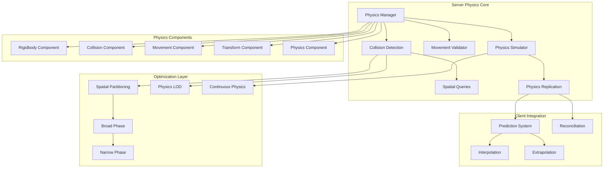

# MÓDULO 8: SISTEMA DE FÍSICA E COLLISION DETECTION

---

## Introdução ao Módulo 8

O sistema de física é fundamental para criar uma experiência de gameplay realista e responsiva. Em MMORPGs, a física deve ser **server-authoritative** para prevenir cheating, **otimizada** para milhares de entidades simultâneas, e **sincronizada** entre clients para garantir consistência visual.

**Por que Physics System é crítico para MMORPGs?**

1. **Anti-cheat**: Server-side validation previne speed hacks e teleporting
2. **Consistency**: Todos os players veem o mesmo mundo físico
3. **Responsiveness**: Movement prediction mantém gameplay fluido
4. **Performance**: Otimizações são essenciais para escalabilidade
5. **Immersion**: Física realista aumenta a imersão no mundo virtual

---

## 8.1 ARQUITETURA DE FÍSICA

### Visão Geral da Arquitetura

#### Physics System Architecture



#### Physics Manager Implementation

```csharp
public class PhysicsManager
{
    private readonly ILogger<PhysicsManager> _logger;
    private readonly EntityManager _entityManager;
    private readonly ZoneManager _zoneManager;
    
    // Core physics systems
    private readonly CollisionDetectionSystem _collisionSystem;
    private readonly MovementValidationSystem _movementValidator;
    private readonly PhysicsSimulator _physicsSimulator;
    private readonly SpatialQuerySystem _spatialQueries;
    private readonly PhysicsReplicationSystem _replicationSystem;
    
    // Performance optimization
    private readonly PhysicsLODSystem _lodSystem;
    private readonly SpatialPartitioning _spatialPartitioning;
    
    // Configuration
    private readonly PhysicsConfig _config;
    private readonly PhysicsMetrics _metrics;
    
    // Physics world state
    private readonly Dictionary<uint, PhysicsBody> _physicsBodies = new();
    private readonly Dictionary<int, List<uint>> _zonePhysicsBodies = new();
    
    public const float PHYSICS_TIMESTEP = 1.0f / 60.0f; // 60 Hz physics
    public const float GRAVITY = -9.81f;
    public const int MAX_PHYSICS_BODIES_PER_ZONE = 1000;

    public class PhysicsConfig
    {
        public bool EnableServerPhysics { get; set; } = true;
        public bool EnableCollisionDetection { get; set; } = true;
        public bool EnableMovementValidation { get; set; } = true;
        public bool EnablePhysicsLOD { get; set; } = true;
        public float MaxMovementSpeed { get; set; } = 20.0f; // m/s
        public float MaxAcceleration { get; set; } = 50.0f; // m/s²
        public float CollisionTolerance { get; set; } = 0.01f; // meters
        public int MaxCollisionChecksPerFrame { get; set; } = 10000;
        public float PhysicsLODDistance { get; set; } = 100.0f; // meters
    }

    public class PhysicsBody
    {
        public uint EntityId { get; set; }
        public Vector3 Position { get; set; }
        public Vector3 Velocity { get; set; }
        public Vector3 Acceleration { get; set; }
        public Quaternion Rotation { get; set; }
        public Vector3 AngularVelocity { get; set; }
        
        // Physics properties
        public float Mass { get; set; } = 1.0f;
        public float Drag { get; set; } = 0.1f;
        public float AngularDrag { get; set; } = 0.1f;
        public bool UseGravity { get; set; } = true;
        public bool IsKinematic { get; set; } = false;
        public bool IsSleeping { get; set; } = false;
        
        // Collision properties
        public CollisionShape Shape { get; set; } = CollisionShape.Capsule;
        public Vector3 CollisionSize { get; set; } = Vector3.One;
        public CollisionLayer Layer { get; set; } = CollisionLayer.Default;
        public CollisionMask Mask { get; set; } = CollisionMask.All;
        
        // State tracking
        public DateTime LastUpdate { get; set; }
        public Vector3 LastValidPosition { get; set; }
        public bool IsDirty { get; set; }
        public int ZoneId { get; set; }
    }

    public enum CollisionShape
    {
        Sphere,
        Capsule,
        Box,
        Mesh
    }

    [Flags]
    public enum CollisionLayer
    {
        Default = 1 << 0,
        Player = 1 << 1,
        NPC = 1 << 2,
        Environment = 1 << 3,
        Projectile = 1 << 4,
        Trigger = 1 << 5,
        Water = 1 << 6,
        Terrain = 1 << 7
    }

    [Flags]
    public enum CollisionMask
    {
        None = 0,
        Default = CollisionLayer.Default,
        Player = CollisionLayer.Player,
        NPC = CollisionLayer.NPC,
        Environment = CollisionLayer.Environment,
        Projectile = CollisionLayer.Projectile,
        Trigger = CollisionLayer.Trigger,
        Water = CollisionLayer.Water,
        Terrain = CollisionLayer.Terrain,
        All = ~0
    }

    public PhysicsManager(
        ILogger<PhysicsManager> logger,
        EntityManager entityManager,
        ZoneManager zoneManager,
        PhysicsConfig config)
    {
        _logger = logger;
        _entityManager = entityManager;
        _zoneManager = zoneManager;
        _config = config;
        
        _collisionSystem = new CollisionDetectionSystem(config);
        _movementValidator = new MovementValidationSystem(config);
        _physicsSimulator = new PhysicsSimulator(config);
        _spatialQueries = new SpatialQuerySystem();
        _replicationSystem = new PhysicsReplicationSystem();
        
        _lodSystem = new PhysicsLODSystem(config);
        _spatialPartitioning = new SpatialPartitioning();
        
        _metrics = new PhysicsMetrics();
    }

    public async Task InitializeAsync()
    {
        _logger.LogInformation("Initializing Physics Manager...");
        
        // Initialize physics systems
        await _collisionSystem.InitializeAsync();
        await _movementValidator.InitializeAsync();
        await _physicsSimulator.InitializeAsync();
        await _spatialQueries.InitializeAsync();
        await _replicationSystem.InitializeAsync();
        
        // Initialize optimization systems
        await _lodSystem.InitializeAsync();
        await _spatialPartitioning.InitializeAsync();
        
        _logger.LogInformation("Physics Manager initialized");
    }

    public async Task UpdatePhysicsAsync(TickContext tickContext)
    {
        var stopwatch = Stopwatch.StartNew();
        
        try
        {
            // Phase 1: Update spatial partitioning
            await UpdateSpatialPartitioning();
            
            // Phase 2: Apply physics LOD
            await _lodSystem.UpdateLODAsync(_physicsBodies.Values);
            
            // Phase 3: Simulate physics
            await _physicsSimulator.SimulateAsync(tickContext, _physicsBodies.Values);
            
            // Phase 4: Detect collisions
            await _collisionSystem.DetectCollisionsAsync(_physicsBodies.Values);
            
            // Phase 5: Validate movements
            await _movementValidator.ValidateMovementsAsync(_physicsBodies.Values);
            
            // Phase 6: Update entity positions
            await UpdateEntityPositions();
            
            // Phase 7: Replicate to clients
            await _replicationSystem.ReplicatePhysicsAsync(tickContext, _physicsBodies.Values);
            
            _metrics.PhysicsUpdateTime.Record(stopwatch.Elapsed);
        }
        catch (Exception ex)
        {
            _logger.LogError(ex, "Error updating physics");
            _metrics.PhysicsErrors.Increment();
        }
        finally
        {
            stopwatch.Stop();
        }
    }

    public uint CreatePhysicsBody(uint entityId, PhysicsBodyCreateInfo createInfo)
    {
        var physicsBody = new PhysicsBody
        {
            EntityId = entityId,
            Position = createInfo.Position,
            Rotation = createInfo.Rotation,
            Mass = createInfo.Mass,
            Drag = createInfo.Drag,
            AngularDrag = createInfo.AngularDrag,
            UseGravity = createInfo.UseGravity,
            IsKinematic = createInfo.IsKinematic,
            Shape = createInfo.Shape,
            CollisionSize = createInfo.CollisionSize,
            Layer = createInfo.Layer,
            Mask = createInfo.Mask,
            LastUpdate = DateTime.UtcNow,
            LastValidPosition = createInfo.Position,
            ZoneId = _zoneManager.GetZoneId(createInfo.Position)
        };
        
        _physicsBodies[entityId] = physicsBody;
        
        // Add to zone tracking
        if (!_zonePhysicsBodies.ContainsKey(physicsBody.ZoneId))
        {
            _zonePhysicsBodies[physicsBody.ZoneId] = new List<uint>();
        }
        _zonePhysicsBodies[physicsBody.ZoneId].Add(entityId);
        
        // Add to spatial partitioning
        _spatialPartitioning.AddBody(physicsBody);
        
        _logger.LogDebug("Created physics body for entity {EntityId}", entityId);
        
        return entityId;
    }

    public void DestroyPhysicsBody(uint entityId)
    {
        if (_physicsBodies.TryGetValue(entityId, out var physicsBody))
        {
            // Remove from zone tracking
            if (_zonePhysicsBodies.ContainsKey(physicsBody.ZoneId))
            {
                _zonePhysicsBodies[physicsBody.ZoneId].Remove(entityId);
            }
            
            // Remove from spatial partitioning
            _spatialPartitioning.RemoveBody(physicsBody);
            
            _physicsBodies.Remove(entityId);
            
            _logger.LogDebug("Destroyed physics body for entity {EntityId}", entityId);
        }
    }

    public async Task<MovementValidationResult> ValidateMovementAsync(uint entityId, Vector3 newPosition, float deltaTime)
    {
        if (!_physicsBodies.TryGetValue(entityId, out var physicsBody))
        {
            return new MovementValidationResult
            {
                IsValid = false,
                Reason = "Physics body not found"
            };
        }
        
        return await _movementValidator.ValidateMovementAsync(physicsBody, newPosition, deltaTime);
    }

    public List<CollisionResult> QueryCollisions(Vector3 center, float radius, CollisionMask mask)
    {
        return _spatialQueries.QuerySphere(center, radius, mask);
    }

    public List<CollisionResult> QueryCollisions(Vector3 start, Vector3 end, CollisionMask mask)
    {
        return _spatialQueries.QueryRay(start, end, mask);
    }

    public PhysicsBody? GetPhysicsBody(uint entityId)
    {
        return _physicsBodies.TryGetValue(entityId, out var body) ? body : null;
    }

    private async Task UpdateSpatialPartitioning()
    {
        var bodiesToUpdate = _physicsBodies.Values.Where(body => body.IsDirty).ToList();
        
        foreach (var body in bodiesToUpdate)
        {
            var newZoneId = _zoneManager.GetZoneId(body.Position);
            
            if (newZoneId != body.ZoneId)
            {
                // Move body to new zone
                if (_zonePhysicsBodies.ContainsKey(body.ZoneId))
                {
                    _zonePhysicsBodies[body.ZoneId].Remove(body.EntityId);
                }
                
                if (!_zonePhysicsBodies.ContainsKey(newZoneId))
                {
                    _zonePhysicsBodies[newZoneId] = new List<uint>();
                }
                _zonePhysicsBodies[newZoneId].Add(body.EntityId);
                
                body.ZoneId = newZoneId;
            }
            
            _spatialPartitioning.UpdateBody(body);
            body.IsDirty = false;
        }
        
        await Task.CompletedTask;
    }

    private async Task UpdateEntityPositions()
    {
        var updateTasks = new List<Task>();
        
        foreach (var physicsBody in _physicsBodies.Values)
        {
            if (physicsBody.IsDirty)
            {
                updateTasks.Add(UpdateEntityPosition(physicsBody));
            }
        }
        
        await Task.WhenAll(updateTasks);
    }

    private async Task UpdateEntityPosition(PhysicsBody physicsBody)
    {
        var transform = _entityManager.GetComponent<TransformComponent>(physicsBody.EntityId);
        if (transform != null)
        {
            transform.Position = physicsBody.Position;
            transform.Rotation = physicsBody.Rotation;
            transform.IsDirty = true;
        }
        
        await Task.CompletedTask;
    }

    public class PhysicsBodyCreateInfo
    {
        public Vector3 Position { get; set; }
        public Quaternion Rotation { get; set; } = Quaternion.Identity;
        public float Mass { get; set; } = 1.0f;
        public float Drag { get; set; } = 0.1f;
        public float AngularDrag { get; set; } = 0.1f;
        public bool UseGravity { get; set; } = true;
        public bool IsKinematic { get; set; } = false;
        public CollisionShape Shape { get; set; } = CollisionShape.Capsule;
        public Vector3 CollisionSize { get; set; } = Vector3.One;
        public CollisionLayer Layer { get; set; } = CollisionLayer.Default;
        public CollisionMask Mask { get; set; } = CollisionMask.All;
    }

    public int ActivePhysicsBodies => _physicsBodies.Count;
}

/*
Por que esta arquitetura de Physics Manager?

1. Server Authority: Toda física é calculada no servidor para anti-cheat
2. Zone-based Optimization: Física dividida por zonas para performance
3. LOD System: Reduz cálculos para objetos distantes
4. Spatial Partitioning: Otimiza queries de colisão
5. Component Integration: Integra com ECS do Game Server
*/
```

### Collision Detection System

#### Advanced Collision Detection

```csharp
public class CollisionDetectionSystem
{
    private readonly PhysicsConfig _config;
    private readonly ILogger<CollisionDetectionSystem> _logger;
    
    // Collision detection phases
    private readonly BroadPhaseCollision _broadPhase;
    private readonly NarrowPhaseCollision _narrowPhase;
    private readonly ContinuousCollisionDetection _continuousCollision;
    
    // Collision caching for performance
    private readonly Dictionary<uint, List<CollisionResult>> _collisionCache = new();
    private readonly Dictionary<string, CollisionResult> _pairCache = new();
    
    // Performance metrics
    private readonly CollisionMetrics _metrics;

    public class CollisionResult
    {
        public uint EntityA { get; set; }
        public uint EntityB { get; set; }
        public Vector3 ContactPoint { get; set; }
        public Vector3 ContactNormal { get; set; }
        public float PenetrationDepth { get; set; }
        public CollisionType Type { get; set; }
        public DateTime Timestamp { get; set; }
        public Dictionary<string, object> Metadata { get; set; } = new();
    }

    public enum CollisionType
    {
        Enter,      // First contact
        Stay,       // Continuing contact
        Exit        // Contact ended
    }

    public CollisionDetectionSystem(PhysicsConfig config)
    {
        _config = config;
        _logger = ServiceLocator.GetService<ILogger<CollisionDetectionSystem>>();
        
        _broadPhase = new BroadPhaseCollision();
        _narrowPhase = new NarrowPhaseCollision();
        _continuousCollision = new ContinuousCollisionDetection();
        
        _metrics = new CollisionMetrics();
    }

    public async Task InitializeAsync()
    {
        _logger.LogInformation("Initializing Collision Detection System...");
        
        await _broadPhase.InitializeAsync();
        await _narrowPhase.InitializeAsync();
        await _continuousCollision.InitializeAsync();
        
        _logger.LogInformation("Collision Detection System initialized");
    }

    public async Task DetectCollisionsAsync(IEnumerable<PhysicsBody> physicsBodies)
    {
        var stopwatch = Stopwatch.StartNew();
        
        try
        {
            var bodies = physicsBodies.ToList();
            
            // Phase 1: Broad phase collision detection
            var potentialPairs = await _broadPhase.FindPotentialCollisionsAsync(bodies);
            _metrics.BroadPhaseChecks.Add(potentialPairs.Count);
            
            // Phase 2: Narrow phase collision detection
            var collisions = new List<CollisionResult>();
            var narrowPhaseChecks = 0;
            
            foreach (var pair in potentialPairs)
            {
                if (narrowPhaseChecks >= _config.MaxCollisionChecksPerFrame)
                {
                    _logger.LogWarning("Reached max collision checks per frame: {MaxChecks}", 
                        _config.MaxCollisionChecksPerFrame);
                    break;
                }
                
                var collision = await _narrowPhase.CheckCollisionAsync(pair.BodyA, pair.BodyB);
                if (collision != null)
                {
                    collisions.Add(collision);
                }
                
                narrowPhaseChecks++;
            }
            
            _metrics.NarrowPhaseChecks.Add(narrowPhaseChecks);
            _metrics.CollisionsDetected.Add(collisions.Count);
            
            // Phase 3: Process collision results
            await ProcessCollisionResults(collisions);
            
            // Phase 4: Continuous collision detection for fast-moving objects
            await _continuousCollision.CheckContinuousCollisionsAsync(bodies);
            
        }
        catch (Exception ex)
        {
            _logger.LogError(ex, "Error in collision detection");
            _metrics.CollisionErrors.Increment();
        }
        finally
        {
            stopwatch.Stop();
            _metrics.CollisionDetectionTime.Record(stopwatch.Elapsed);
        }
    }

    private async Task ProcessCollisionResults(List<CollisionResult> collisions)
    {
        var currentCollisions = new Dictionary<string, CollisionResult>();
        
        // Build current collision map
        foreach (var collision in collisions)
        {
            var pairKey = GetCollisionPairKey(collision.EntityA, collision.EntityB);
            currentCollisions[pairKey] = collision;
        }
        
        // Determine collision types (Enter, Stay, Exit)
        var processedCollisions = new List<CollisionResult>();
        
        // Check for new collisions (Enter)
        foreach (var kvp in currentCollisions)
        {
            if (!_pairCache.ContainsKey(kvp.Key))
            {
                kvp.Value.Type = CollisionType.Enter;
                processedCollisions.Add(kvp.Value);
            }
            else
            {
                kvp.Value.Type = CollisionType.Stay;
                processedCollisions.Add(kvp.Value);
            }
        }
        
        // Check for ended collisions (Exit)
        foreach (var kvp in _pairCache)
        {
            if (!currentCollisions.ContainsKey(kvp.Key))
            {
                var exitCollision = kvp.Value;
                exitCollision.Type = CollisionType.Exit;
                exitCollision.Timestamp = DateTime.UtcNow;
                processedCollisions.Add(exitCollision);
            }
        }
        
        // Update cache
        _pairCache.Clear();
        foreach (var kvp in currentCollisions)
        {
            _pairCache[kvp.Key] = kvp.Value;
        }
        
        // Notify collision handlers
        await NotifyCollisionHandlers(processedCollisions);
    }

    private async Task NotifyCollisionHandlers(List<CollisionResult> collisions)
    {
        var entityManager = ServiceLocator.GetService<EntityManager>();
        
        foreach (var collision in collisions)
        {
            // Get collision components
            var collisionCompA = entityManager.GetComponent<CollisionComponent>(collision.EntityA);
            var collisionCompB = entityManager.GetComponent<CollisionComponent>(collision.EntityB);
            
            // Trigger collision events
            if (collisionCompA != null)
            {
                await collisionCompA.OnCollision(collision);
            }
            
            if (collisionCompB != null)
            {
                var flippedCollision = new CollisionResult
                {
                    EntityA = collision.EntityB,
                    EntityB = collision.EntityA,
                    ContactPoint = collision.ContactPoint,
                    ContactNormal = -collision.ContactNormal,
                    PenetrationDepth = collision.PenetrationDepth,
                    Type = collision.Type,
                    Timestamp = collision.Timestamp
                };
                
                await collisionCompB.OnCollision(flippedCollision);
            }
        }
    }

    private string GetCollisionPairKey(uint entityA, uint entityB)
    {
        var minId = Math.Min(entityA, entityB);
        var maxId = Math.Max(entityA, entityB);
        return $"{minId}_{maxId}";
    }
}

// Broad Phase Collision Detection
public class BroadPhaseCollision
{
    private readonly SpatialHash _spatialHash;
    private readonly AABB _tempAABB = new AABB();

    public class CollisionPair
    {
        public PhysicsBody BodyA { get; set; } = null!;
        public PhysicsBody BodyB { get; set; } = null!;
    }

    public class AABB
    {
        public Vector3 Min { get; set; }
        public Vector3 Max { get; set; }
        
        public bool Intersects(AABB other)
        {
            return Min.X <= other.Max.X && Max.X >= other.Min.X &&
                   Min.Y <= other.Max.Y && Max.Y >= other.Min.Y &&
                   Min.Z <= other.Max.Z && Max.Z >= other.Min.Z;
        }
    }

    public BroadPhaseCollision()
    {
        _spatialHash = new SpatialHash(10.0f); // 10 meter grid cells
    }

    public async Task InitializeAsync()
    {
        await Task.CompletedTask;
    }

    public async Task<List<CollisionPair>> FindPotentialCollisionsAsync(List<PhysicsBody> bodies)
    {
        var pairs = new List<CollisionPair>();
        
        // Update spatial hash
        _spatialHash.Clear();
        foreach (var body in bodies)
        {
            var aabb = CalculateAABB(body);
            _spatialHash.Insert(body, aabb);
        }
        
        // Find potential collision pairs
        var checkedPairs = new HashSet<string>();
        
        foreach (var body in bodies)
        {
            var aabb = CalculateAABB(body);
            var nearbyBodies = _spatialHash.Query(aabb);
            
            foreach (var nearbyBody in nearbyBodies)
            {
                if (body.EntityId == nearbyBody.EntityId)
                    continue;
                
                var pairKey = GetPairKey(body.EntityId, nearbyBody.EntityId);
                if (checkedPairs.Contains(pairKey))
                    continue;
                
                checkedPairs.Add(pairKey);
                
                // Check collision layers
                if ((body.Layer & nearbyBody.Mask) != 0 || (nearbyBody.Layer & body.Mask) != 0)
                {
                    pairs.Add(new CollisionPair { BodyA = body, BodyB = nearbyBody });
                }
            }
        }
        
        return await Task.FromResult(pairs);
    }

    private AABB CalculateAABB(PhysicsBody body)
    {
        var halfSize = body.CollisionSize * 0.5f;
        
        return new AABB
        {
            Min = body.Position - halfSize,
            Max = body.Position + halfSize
        };
    }

    private string GetPairKey(uint idA, uint idB)
    {
        var minId = Math.Min(idA, idB);
        var maxId = Math.Max(idA, idB);
        return $"{minId}_{maxId}";
    }
}

// Narrow Phase Collision Detection
public class NarrowPhaseCollision
{
    public async Task InitializeAsync()
    {
        await Task.CompletedTask;
    }

    public async Task<CollisionResult?> CheckCollisionAsync(PhysicsBody bodyA, PhysicsBody bodyB)
    {
        // Dispatch to appropriate collision detection method
        var collision = (bodyA.Shape, bodyB.Shape) switch
        {
            (CollisionShape.Sphere, CollisionShape.Sphere) => CheckSphereSphere(bodyA, bodyB),
            (CollisionShape.Capsule, CollisionShape.Capsule) => CheckCapsuleCapsule(bodyA, bodyB),
            (CollisionShape.Box, CollisionShape.Box) => CheckBoxBox(bodyA, bodyB),
            (CollisionShape.Sphere, CollisionShape.Capsule) => CheckSphereCapsule(bodyA, bodyB),
            (CollisionShape.Capsule, CollisionShape.Sphere) => CheckCapsuleSphere(bodyA, bodyB),
            _ => null
        };
        
        return await Task.FromResult(collision);
    }

    private CollisionResult? CheckSphereSphere(PhysicsBody bodyA, PhysicsBody bodyB)
    {
        var radiusA = bodyA.CollisionSize.X * 0.5f;
        var radiusB = bodyB.CollisionSize.X * 0.5f;
        var distance = Vector3.Distance(bodyA.Position, bodyB.Position);
        var combinedRadius = radiusA + radiusB;
        
        if (distance <= combinedRadius)
        {
            var direction = Vector3.Normalize(bodyB.Position - bodyA.Position);
            var contactPoint = bodyA.Position + direction * radiusA;
            
            return new CollisionResult
            {
                EntityA = bodyA.EntityId,
                EntityB = bodyB.EntityId,
                ContactPoint = contactPoint,
                ContactNormal = direction,
                PenetrationDepth = combinedRadius - distance,
                Timestamp = DateTime.UtcNow
            };
        }
        
        return null;
    }

    private CollisionResult? CheckCapsuleCapsule(PhysicsBody bodyA, PhysicsBody bodyB)
    {
        // Simplified capsule-capsule collision (full implementation would be more complex)
        var radiusA = bodyA.CollisionSize.X * 0.5f;
        var radiusB = bodyB.CollisionSize.X * 0.5f;
        var heightA = bodyA.CollisionSize.Y;
        var heightB = bodyB.CollisionSize.Y;
        
        // For simplicity, treat as sphere collision at center points
        var distance = Vector3.Distance(bodyA.Position, bodyB.Position);
        var combinedRadius = radiusA + radiusB;
        
        if (distance <= combinedRadius)
        {
            var direction = Vector3.Normalize(bodyB.Position - bodyA.Position);
            var contactPoint = bodyA.Position + direction * radiusA;
            
            return new CollisionResult
            {
                EntityA = bodyA.EntityId,
                EntityB = bodyB.EntityId,
                ContactPoint = contactPoint,
                ContactNormal = direction,
                PenetrationDepth = combinedRadius - distance,
                Timestamp = DateTime.UtcNow
            };
        }
        
        return null;
    }

    private CollisionResult? CheckBoxBox(PhysicsBody bodyA, PhysicsBody bodyB)
    {
        // Axis-Aligned Bounding Box collision
        var minA = bodyA.Position - bodyA.CollisionSize * 0.5f;
        var maxA = bodyA.Position + bodyA.CollisionSize * 0.5f;
        var minB = bodyB.Position - bodyB.CollisionSize * 0.5f;
        var maxB = bodyB.Position + bodyB.CollisionSize * 0.5f;
        
        if (minA.X <= maxB.X && maxA.X >= minB.X &&
            minA.Y <= maxB.Y && maxA.Y >= minB.Y &&
            minA.Z <= maxB.Z && maxA.Z >= minB.Z)
        {
            // Calculate contact point and normal (simplified)
            var contactPoint = (bodyA.Position + bodyB.Position) * 0.5f;
            var direction = Vector3.Normalize(bodyB.Position - bodyA.Position);
            
            return new CollisionResult
            {
                EntityA = bodyA.EntityId,
                EntityB = bodyB.EntityId,
                ContactPoint = contactPoint,
                ContactNormal = direction,
                PenetrationDepth = 0.1f, // Simplified
                Timestamp = DateTime.UtcNow
            };
        }
        
        return null;
    }

    private CollisionResult? CheckSphereCapsule(PhysicsBody sphereBody, PhysicsBody capsuleBody)
    {
        // Simplified sphere-capsule collision
        return CheckSphereSphere(sphereBody, capsuleBody);
    }

    private CollisionResult? CheckCapsuleSphere(PhysicsBody capsuleBody, PhysicsBody sphereBody)
    {
        return CheckSphereCapsule(sphereBody, capsuleBody);
    }
}

/*
Por que Collision Detection é complexo?

1. Performance: Milhares de objetos precisam ser checados eficientemente
2. Accuracy: Detecção precisa é crucial para gameplay
3. Optimization: Broad/Narrow phase reduz cálculos desnecessários
4. Shape Support: Diferentes formas geométricas precisam ser suportadas
5. Continuous Detection: Objetos rápidos precisam de detecção contínua
*/
```

---

## 8.2 SISTEMA DE MOVIMENTO

### Movement Validation e Prediction

#### Movement Validation System

```csharp
public class MovementValidationSystem
{
    private readonly PhysicsConfig _config;
    private readonly ILogger<MovementValidationSystem> _logger;
    
    // Validation rules
    private readonly Dictionary<uint, MovementHistory> _movementHistory = new();
    private readonly AntiCheatSystem _antiCheat;
    
    // Performance tracking
    private readonly MovementMetrics _metrics;

    public class MovementHistory
    {
        public uint EntityId { get; set; }
        public Queue<MovementSnapshot> Snapshots { get; set; } = new();
        public Vector3 LastValidPosition { get; set; }
        public DateTime LastValidationTime { get; set; }
        public float AccumulatedDistance { get; set; }
        public int ViolationCount { get; set; }
        public MovementFlags Flags { get; set; }
    }

    public class MovementSnapshot
    {
        public Vector3 Position { get; set; }
        public Vector3 Velocity { get; set; }
        public DateTime Timestamp { get; set; }
        public float DeltaTime { get; set; }
        public bool IsGrounded { get; set; }
    }

    [Flags]
    public enum MovementFlags
    {
        None = 0,
        Grounded = 1 << 0,
        Flying = 1 << 1,
        Swimming = 1 << 2,
        Teleporting = 1 << 3,
        Stunned = 1 << 4,
        Rooted = 1 << 5
    }

    public class MovementValidationResult
    {
        public bool IsValid { get; set; }
        public string Reason { get; set; } = string.Empty;
        public Vector3 CorrectedPosition { get; set; }
        public Vector3 CorrectedVelocity { get; set; }
        public MovementViolationType ViolationType { get; set; }
        public float Confidence { get; set; } = 1.0f;
    }

    public enum MovementViolationType
    {
        None,
        SpeedHack,
        Teleporting,
        NoClip,
        FlyHack,
        PositionDesync,
        InvalidMovement
    }

    public MovementValidationSystem(PhysicsConfig config)
    {
        _config = config;
        _logger = ServiceLocator.GetService<ILogger<MovementValidationSystem>>();
        _antiCheat = new AntiCheatSystem(config);
        _metrics = new MovementMetrics();
    }

    public async Task InitializeAsync()
    {
        _logger.LogInformation("Initializing Movement Validation System...");
        
        await _antiCheat.InitializeAsync();
        
        _logger.LogInformation("Movement Validation System initialized");
    }

    public async Task ValidateMovementsAsync(IEnumerable<PhysicsBody> physicsBodies)
    {
        var validationTasks = physicsBodies
            .Where(body => !body.IsKinematic && body.IsDirty)
            .Select(ValidatePhysicsBodyMovement);
        
        await Task.WhenAll(validationTasks);
    }

    public async Task<MovementValidationResult> ValidateMovementAsync(PhysicsBody physicsBody, Vector3 newPosition, float deltaTime)
    {
        var stopwatch = Stopwatch.StartNew();
        
        try
        {
            var result = new MovementValidationResult
            {
                IsValid = true,
                CorrectedPosition = newPosition,
                CorrectedVelocity = physicsBody.Velocity
            };
            
            // Get or create movement history
            var history = GetOrCreateMovementHistory(physicsBody.EntityId);
            
            // Add current snapshot
            var snapshot = new MovementSnapshot
            {
                Position = newPosition,
                Velocity = physicsBody.Velocity,
                Timestamp = DateTime.UtcNow,
                DeltaTime = deltaTime,
                IsGrounded = await IsGrounded(physicsBody, newPosition)
            };
            
            history.Snapshots.Enqueue(snapshot);
            
            // Keep only recent history (last 2 seconds)
            while (history.Snapshots.Count > 0 && 
                   DateTime.UtcNow - history.Snapshots.Peek().Timestamp > TimeSpan.FromSeconds(2))
            {
                history.Snapshots.Dequeue();
            }
            
            // Validate movement
            await ValidateSpeed(physicsBody, history, result);
            await ValidatePosition(physicsBody, history, result);
            await ValidatePhysics(physicsBody, history, result);
            await ValidateCollisions(physicsBody, newPosition, result);
            
            // Anti-cheat checks
            await _antiCheat.ValidateMovementAsync(physicsBody, history, result);
            
            // Update history
            if (result.IsValid)
            {
                history.LastValidPosition = newPosition;
                history.LastValidationTime = DateTime.UtcNow;
                history.ViolationCount = Math.Max(0, history.ViolationCount - 1); // Decay violations
            }
            else
            {
                history.ViolationCount++;
                _logger.LogWarning("Movement validation failed for entity {EntityId}: {Reason}", 
                    physicsBody.EntityId, result.Reason);
            }
            
            _metrics.ValidationTime.Record(stopwatch.Elapsed);
            _metrics.ValidationsPerformed.Increment();
            
            if (!result.IsValid)
            {
                _metrics.ValidationFailures.Increment();
            }
            
            return result;
        }
        catch (Exception ex)
        {
            _logger.LogError(ex, "Error validating movement for entity {EntityId}", physicsBody.EntityId);
            _metrics.ValidationErrors.Increment();
            
            return new MovementValidationResult
            {
                IsValid = false,
                Reason = "Validation error",
                CorrectedPosition = physicsBody.LastValidPosition
            };
        }
        finally
        {
            stopwatch.Stop();
        }
    }

    private async Task ValidateSpeed(PhysicsBody physicsBody, MovementHistory history, MovementValidationResult result)
    {
        if (history.Snapshots.Count < 2)
            return;
        
        var currentSnapshot = history.Snapshots.Last();
        var previousSnapshot = history.Snapshots.ElementAt(history.Snapshots.Count - 2);
        
        var distance = Vector3.Distance(currentSnapshot.Position, previousSnapshot.Position);
        var timeDelta = (float)(currentSnapshot.Timestamp - previousSnapshot.Timestamp).TotalSeconds;
        
        if (timeDelta <= 0)
            return;
        
        var speed = distance / timeDelta;
        var maxAllowedSpeed = GetMaxAllowedSpeed(physicsBody, history);
        
        if (speed > maxAllowedSpeed * 1.1f) // 10% tolerance
        {
            result.IsValid = false;
            result.Reason = $"Speed too high: {speed:F2} m/s (max: {maxAllowedSpeed:F2} m/s)";
            result.ViolationType = MovementViolationType.SpeedHack;
            
            // Correct position based on max allowed speed
            var direction = Vector3.Normalize(currentSnapshot.Position - previousSnapshot.Position);
            var maxDistance = maxAllowedSpeed * timeDelta;
            result.CorrectedPosition = previousSnapshot.Position + direction * maxDistance;
        }
        
        await Task.CompletedTask;
    }

    private async Task ValidatePosition(PhysicsBody physicsBody, MovementHistory history, MovementValidationResult result)
    {
        var currentPosition = history.Snapshots.Last().Position;
        
        // Check for teleporting (sudden position jumps)
        if (history.Snapshots.Count >= 2)
        {
            var previousPosition = history.Snapshots.ElementAt(history.Snapshots.Count - 2).Position;
            var distance = Vector3.Distance(currentPosition, previousPosition);
            var timeDelta = (float)(history.Snapshots.Last().Timestamp - 
                                  history.Snapshots.ElementAt(history.Snapshots.Count - 2).Timestamp).TotalSeconds;
            
            var maxTeleportDistance = _config.MaxMovementSpeed * timeDelta * 2.0f; // 2x tolerance
            
            if (distance > maxTeleportDistance && !physicsBody.IsKinematic)
            {
                result.IsValid = false;
                result.Reason = $"Teleporting detected: {distance:F2}m in {timeDelta:F2}s";
                result.ViolationType = MovementViolationType.Teleporting;
                result.CorrectedPosition = history.LastValidPosition;
            }
        }
        
        // Check world boundaries
        if (!IsWithinWorldBounds(currentPosition))
        {
            result.IsValid = false;
            result.Reason = "Position outside world bounds";
            result.ViolationType = MovementViolationType.InvalidMovement;
            result.CorrectedPosition = ClampToWorldBounds(currentPosition);
        }
        
        await Task.CompletedTask;
    }

    private async Task ValidatePhysics(PhysicsBody physicsBody, MovementHistory history, MovementValidationResult result)
    {
        var currentSnapshot = history.Snapshots.Last();
        
        // Validate gravity (if not grounded and not flying)
        if (physicsBody.UseGravity && !currentSnapshot.IsGrounded && 
            !history.Flags.HasFlag(MovementFlags.Flying))
        {
            var expectedVelocityY = physicsBody.Velocity.Y + GRAVITY * currentSnapshot.DeltaTime;
            var actualVelocityY = currentSnapshot.Velocity.Y;
            
            if (Math.Abs(actualVelocityY - expectedVelocityY) > 5.0f) // 5 m/s tolerance
            {
                result.IsValid = false;
                result.Reason = "Invalid gravity behavior";
                result.ViolationType = MovementViolationType.FlyHack;
                result.CorrectedVelocity = new Vector3(physicsBody.Velocity.X, expectedVelocityY, physicsBody.Velocity.Z);
            }
        }
        
        await Task.CompletedTask;
    }

    private async Task ValidateCollisions(PhysicsBody physicsBody, Vector3 newPosition, MovementValidationResult result)
    {
        var physicsManager = ServiceLocator.GetService<PhysicsManager>();
        
        // Check for collision with environment
        var collisions = physicsManager.QueryCollisions(newPosition, physicsBody.CollisionSize.X * 0.5f, 
            CollisionMask.Environment | CollisionMask.Terrain);
        
        foreach (var collision in collisions)
        {
            if (collision.EntityA != physicsBody.EntityId && collision.EntityB != physicsBody.EntityId)
            {
                // Position is inside a solid object
                result.IsValid = false;
                result.Reason = "Position inside solid object (no-clip detected)";
                result.ViolationType = MovementViolationType.NoClip;
                result.CorrectedPosition = physicsBody.LastValidPosition;
                break;
            }
        }
        
        await Task.CompletedTask;
    }

    private async Task ValidatePhysicsBodyMovement(PhysicsBody physicsBody)
    {
        var validationResult = await ValidateMovementAsync(physicsBody, physicsBody.Position, PHYSICS_TIMESTEP);
        
        if (!validationResult.IsValid)
        {
            // Apply corrections
            physicsBody.Position = validationResult.CorrectedPosition;
            physicsBody.Velocity = validationResult.CorrectedVelocity;
            physicsBody.IsDirty = true;
            
            // Log violation
            _logger.LogWarning("Corrected movement for entity {EntityId}: {Reason}", 
                physicsBody.EntityId, validationResult.Reason);
            
            // Notify anti-cheat system
            await _antiCheat.ReportViolationAsync(physicsBody.EntityId, validationResult.ViolationType);
        }
    }

    private MovementHistory GetOrCreateMovementHistory(uint entityId)
    {
        if (!_movementHistory.ContainsKey(entityId))
        {
            _movementHistory[entityId] = new MovementHistory
            {
                EntityId = entityId,
                LastValidationTime = DateTime.UtcNow
            };
        }
        return _movementHistory[entityId];
    }

    private float GetMaxAllowedSpeed(PhysicsBody physicsBody, MovementHistory history)
    {
        var baseSpeed = _config.MaxMovementSpeed;
        
        // Modify based on movement flags
        if (history.Flags.HasFlag(MovementFlags.Flying))
            baseSpeed *= 1.5f;
        else if (history.Flags.HasFlag(MovementFlags.Swimming))
            baseSpeed *= 0.7f;
        else if (history.Flags.HasFlag(MovementFlags.Stunned))
            baseSpeed = 0.0f;
        else if (history.Flags.HasFlag(MovementFlags.Rooted))
            baseSpeed = 0.0f;
        
        return baseSpeed;
    }

    private async Task<bool> IsGrounded(PhysicsBody physicsBody, Vector3 position)
    {
        var physicsManager = ServiceLocator.GetService<PhysicsManager>();
        
        // Raycast downward to check for ground
        var rayStart = position + Vector3.UnitY * 0.1f;
        var rayEnd = position - Vector3.UnitY * 0.2f;
        
        var groundHits = physicsManager.QueryCollisions(rayStart, rayEnd, 
            CollisionMask.Environment | CollisionMask.Terrain);
        
        return await Task.FromResult(groundHits.Count > 0);
    }

    private bool IsWithinWorldBounds(Vector3 position)
    {
        // Define world boundaries (would come from configuration)
        const float WORLD_SIZE = 10000.0f;
        const float MIN_HEIGHT = -100.0f;
        const float MAX_HEIGHT = 1000.0f;
        
        return position.X >= -WORLD_SIZE && position.X <= WORLD_SIZE &&
               position.Z >= -WORLD_SIZE && position.Z <= WORLD_SIZE &&
               position.Y >= MIN_HEIGHT && position.Y <= MAX_HEIGHT;
    }

    private Vector3 ClampToWorldBounds(Vector3 position)
    {
        const float WORLD_SIZE = 10000.0f;
        const float MIN_HEIGHT = -100.0f;
        const float MAX_HEIGHT = 1000.0f;
        
        return new Vector3(
            Math.Clamp(position.X, -WORLD_SIZE, WORLD_SIZE),
            Math.Clamp(position.Y, MIN_HEIGHT, MAX_HEIGHT),
            Math.Clamp(position.Z, -WORLD_SIZE, WORLD_SIZE)
        );
    }

    public void RemoveMovementHistory(uint entityId)
    {
        _movementHistory.Remove(entityId);
    }
}

/*
Por que Movement Validation é crucial?

1. Anti-cheat: Previne speed hacks, teleporting, no-clip
2. Consistency: Garante que todos os clients vejam movimento válido
3. Physics Integrity: Mantém leis físicas do mundo virtual
4. Performance: Otimiza validação para milhares de entidades
5. Fairness: Garante gameplay justo para todos os players
*/
```

---

## 8.3 OTIMIZAÇÃO DE PERFORMANCE

### Physics LOD e Spatial Optimization

#### Physics Level of Detail System

```csharp
public class PhysicsLODSystem
{
    private readonly PhysicsConfig _config;
    private readonly ILogger<PhysicsLODSystem> _logger;
    
    // LOD levels and settings
    private readonly Dictionary<PhysicsLODLevel, PhysicsLODSettings> _lodSettings;
    private readonly Dictionary<uint, PhysicsLODLevel> _entityLODLevels = new();
    
    // Performance tracking
    private readonly PhysicsLODMetrics _metrics;

    public enum PhysicsLODLevel
    {
        High = 0,       // Full physics simulation
        Medium = 1,     // Reduced physics simulation
        Low = 2,        // Basic physics simulation
        Minimal = 3,    // Position updates only
        Disabled = 4    // No physics updates
    }

    public class PhysicsLODSettings
    {
        public float UpdateFrequency { get; set; } = 60.0f; // Hz
        public bool EnableCollisionDetection { get; set; } = true;
        public bool EnableContinuousCollision { get; set; } = true;
        public bool EnableGravity { get; set; } = true;
        public bool EnableMovementValidation { get; set; } = true;
        public float CollisionAccuracy { get; set; } = 1.0f; // 0.0 - 1.0
        public int MaxCollisionChecks { get; set; } = 100;
        public float PositionTolerance { get; set; } = 0.01f; // meters
        public float VelocityTolerance { get; set; } = 0.1f; // m/s
    }

    public class PhysicsLODMetrics
    {
        public Counter EntitiesPerLOD { get; set; } = new();
        public Histogram LODUpdateTime { get; set; } = new();
        public Counter LODTransitions { get; set; } = new();
        public Gauge AveragePhysicsLoad { get; set; } = new();
    }

    public PhysicsLODSystem(PhysicsConfig config)
    {
        _config = config;
        _logger = ServiceLocator.GetService<ILogger<PhysicsLODSystem>>();
        _metrics = new PhysicsLODMetrics();
        
        // Initialize LOD settings
        _lodSettings = new Dictionary<PhysicsLODLevel, PhysicsLODSettings>
        {
            [PhysicsLODLevel.High] = new PhysicsLODSettings
            {
                UpdateFrequency = 60.0f,
                EnableCollisionDetection = true,
                EnableContinuousCollision = true,
                EnableGravity = true,
                EnableMovementValidation = true,
                CollisionAccuracy = 1.0f,
                MaxCollisionChecks = 100,
                PositionTolerance = 0.001f,
                VelocityTolerance = 0.01f
            },
            
            [PhysicsLODLevel.Medium] = new PhysicsLODSettings
            {
                UpdateFrequency = 30.0f,
                EnableCollisionDetection = true,
                EnableContinuousCollision = false,
                EnableGravity = true,
                EnableMovementValidation = true,
                CollisionAccuracy = 0.8f,
                MaxCollisionChecks = 50,
                PositionTolerance = 0.01f,
                VelocityTolerance = 0.1f
            },
            
            [PhysicsLODLevel.Low] = new PhysicsLODSettings
            {
                UpdateFrequency = 15.0f,
                EnableCollisionDetection = true,
                EnableContinuousCollision = false,
                EnableGravity = true,
                EnableMovementValidation = false,
                CollisionAccuracy = 0.5f,
                MaxCollisionChecks = 20,
                PositionTolerance = 0.1f,
                VelocityTolerance = 0.5f
            },
            
            [PhysicsLODLevel.Minimal] = new PhysicsLODSettings
            {
                UpdateFrequency = 5.0f,
                EnableCollisionDetection = false,
                EnableContinuousCollision = false,
                EnableGravity = false,
                EnableMovementValidation = false,
                CollisionAccuracy = 0.0f,
                MaxCollisionChecks = 0,
                PositionTolerance = 1.0f,
                VelocityTolerance = 2.0f
            },
            
            [PhysicsLODLevel.Disabled] = new PhysicsLODSettings
            {
                UpdateFrequency = 0.0f,
                EnableCollisionDetection = false,
                EnableContinuousCollision = false,
                EnableGravity = false,
                EnableMovementValidation = false,
                CollisionAccuracy = 0.0f,
                MaxCollisionChecks = 0,
                PositionTolerance = float.MaxValue,
                VelocityTolerance = float.MaxValue
            }
        };
    }

    public async Task InitializeAsync()
    {
        _logger.LogInformation("Initializing Physics LOD System...");
        _logger.LogInformation("Physics LOD System initialized");
    }

    public async Task UpdateLODAsync(IEnumerable<PhysicsBody> physicsBodies)
    {
        var stopwatch = Stopwatch.StartNew();
        
        try
        {
            var playerManager = ServiceLocator.GetService<PlayerManager>();
            var playerPositions = await GetPlayerPositions(playerManager);
            
            var lodCounts = new Dictionary<PhysicsLODLevel, int>();
            
            foreach (var body in physicsBodies)
            {
                var newLODLevel = CalculateLODLevel(body, playerPositions);
                var currentLODLevel = _entityLODLevels.GetValueOrDefault(body.EntityId, PhysicsLODLevel.High);
                
                if (newLODLevel != currentLODLevel)
                {
                    _entityLODLevels[body.EntityId] = newLODLevel;
                    await ApplyLODSettings(body, newLODLevel);
                    _metrics.LODTransitions.Increment();
                }
                
                // Count entities per LOD level
                lodCounts[newLODLevel] = lodCounts.GetValueOrDefault(newLODLevel, 0) + 1;
            }
            
            // Update metrics
            foreach (var kvp in lodCounts)
            {
                _metrics.EntitiesPerLOD.WithTag("lod_level", kvp.Key.ToString()).Set(kvp.Value);
            }
            
            // Calculate average physics load
            var totalLoad = lodCounts.Sum(kvp => CalculatePhysicsLoad(kvp.Key) * kvp.Value);
            _metrics.AveragePhysicsLoad.Set(totalLoad);
            
        }
        catch (Exception ex)
        {
            _logger.LogError(ex, "Error updating Physics LOD");
        }
        finally
        {
            stopwatch.Stop();
            _metrics.LODUpdateTime.Record(stopwatch.Elapsed);
        }
    }

    private PhysicsLODLevel CalculateLODLevel(PhysicsBody body, List<Vector3> playerPositions)
    {
        // Find distance to nearest player
        var nearestPlayerDistance = float.MaxValue;
        
        foreach (var playerPosition in playerPositions)
        {
            var distance = Vector3.Distance(body.Position, playerPosition);
            if (distance < nearestPlayerDistance)
            {
                nearestPlayerDistance = distance;
            }
        }
        
        // Determine LOD level based on distance and importance
        var importance = GetEntityImportance(body);
        var effectiveDistance = nearestPlayerDistance / importance;
        
        return effectiveDistance switch
        {
            <= 25.0f => PhysicsLODLevel.High,      // 25m - Full physics
            <= 50.0f => PhysicsLODLevel.Medium,    // 50m - Reduced physics
            <= 100.0f => PhysicsLODLevel.Low,      // 100m - Basic physics
            <= 200.0f => PhysicsLODLevel.Minimal,  // 200m - Position only
            _ => PhysicsLODLevel.Disabled           // >200m - No physics
        };
    }

    private float GetEntityImportance(PhysicsBody body)
    {
        var entityManager = ServiceLocator.GetService<EntityManager>();
        
        // Players are always important
        var playerComponent = entityManager.GetComponent<PlayerComponent>(body.EntityId);
        if (playerComponent != null)
            return 10.0f;
        
        // NPCs have medium importance
        var npcComponent = entityManager.GetComponent<NPCComponent>(body.EntityId);
        if (npcComponent != null)
            return 2.0f;
        
        // Combat entities are important
        var combatComponent = entityManager.GetComponent<CombatComponent>(body.EntityId);
        if (combatComponent != null)
            return 3.0f;
        
        // Projectiles are important but short-lived
        if (body.Layer.HasFlag(CollisionLayer.Projectile))
            return 5.0f;
        
        // Default importance
        return 1.0f;
    }

    private async Task ApplyLODSettings(PhysicsBody body, PhysicsLODLevel lodLevel)
    {
        var settings = _lodSettings[lodLevel];
        
        // Apply LOD-specific settings to physics body
        body.Metadata["LODLevel"] = lodLevel;
        body.Metadata["UpdateFrequency"] = settings.UpdateFrequency;
        body.Metadata["EnableCollisionDetection"] = settings.EnableCollisionDetection;
        body.Metadata["EnableContinuousCollision"] = settings.EnableContinuousCollision;
        body.Metadata["EnableGravity"] = settings.EnableGravity && body.UseGravity;
        body.Metadata["EnableMovementValidation"] = settings.EnableMovementValidation;
        body.Metadata["CollisionAccuracy"] = settings.CollisionAccuracy;
        body.Metadata["MaxCollisionChecks"] = settings.MaxCollisionChecks;
        body.Metadata["PositionTolerance"] = settings.PositionTolerance;
        body.Metadata["VelocityTolerance"] = settings.VelocityTolerance;
        
        await Task.CompletedTask;
    }

    private float CalculatePhysicsLoad(PhysicsLODLevel lodLevel)
    {
        return lodLevel switch
        {
            PhysicsLODLevel.High => 1.0f,
            PhysicsLODLevel.Medium => 0.6f,
            PhysicsLODLevel.Low => 0.3f,
            PhysicsLODLevel.Minimal => 0.1f,
            PhysicsLODLevel.Disabled => 0.0f,
            _ => 0.0f
        };
    }

    private async Task<List<Vector3>> GetPlayerPositions(PlayerManager playerManager)
    {
        var positions = new List<Vector3>();
        var entityManager = ServiceLocator.GetService<EntityManager>();
        
        // Get all player entities and their positions
        var playerEntities = entityManager.GetEntitiesWithComponents(
            new ComponentMask(typeof(PlayerComponent), typeof(TransformComponent)));
        
        foreach (var entityId in playerEntities)
        {
            var transform = entityManager.GetComponent<TransformComponent>(entityId);
            if (transform != null)
            {
                positions.Add(transform.Position);
            }
        }
        
        return await Task.FromResult(positions);
    }

    public PhysicsLODLevel GetEntityLODLevel(uint entityId)
    {
        return _entityLODLevels.GetValueOrDefault(entityId, PhysicsLODLevel.High);
    }

    public PhysicsLODSettings GetLODSettings(PhysicsLODLevel lodLevel)
    {
        return _lodSettings[lodLevel];
    }

    public void RemoveEntity(uint entityId)
    {
        _entityLODLevels.Remove(entityId);
    }
}

// Spatial Partitioning for Collision Optimization
public class SpatialPartitioning
{
    private readonly Dictionary<Vector3Int, SpatialCell> _cells = new();
    private readonly float _cellSize;
    private readonly object _lockObject = new();

    public class SpatialCell
    {
        public Vector3Int Coordinates { get; set; }
        public HashSet<PhysicsBody> Bodies { get; set; } = new();
        public DateTime LastUpdate { get; set; }
        public bool IsDirty { get; set; }
    }

    public SpatialPartitioning(float cellSize = 25.0f)
    {
        _cellSize = cellSize;
    }

    public async Task InitializeAsync()
    {
        await Task.CompletedTask;
    }

    public void AddBody(PhysicsBody body)
    {
        lock (_lockObject)
        {
            var cellCoords = WorldToCell(body.Position);
            var cell = GetOrCreateCell(cellCoords);
            cell.Bodies.Add(body);
            cell.IsDirty = true;
            cell.LastUpdate = DateTime.UtcNow;
        }
    }

    public void RemoveBody(PhysicsBody body)
    {
        lock (_lockObject)
        {
            var cellCoords = WorldToCell(body.Position);
            if (_cells.TryGetValue(cellCoords, out var cell))
            {
                cell.Bodies.Remove(body);
                cell.IsDirty = true;
                cell.LastUpdate = DateTime.UtcNow;
                
                // Clean up empty cells
                if (cell.Bodies.Count == 0)
                {
                    _cells.Remove(cellCoords);
                }
            }
        }
    }

    public void UpdateBody(PhysicsBody body)
    {
        // For simplicity, remove and re-add
        // In production, you'd track previous cell and only move if changed
        RemoveBody(body);
        AddBody(body);
    }

    public List<PhysicsBody> QueryRegion(Vector3 center, float radius)
    {
        var results = new List<PhysicsBody>();
        var radiusSquared = radius * radius;
        
        // Calculate cell range to check
        var minCell = WorldToCell(center - Vector3.One * radius);
        var maxCell = WorldToCell(center + Vector3.One * radius);
        
        lock (_lockObject)
        {
            for (int x = minCell.X; x <= maxCell.X; x++)
            {
                for (int y = minCell.Y; y <= maxCell.Y; y++)
                {
                    for (int z = minCell.Z; z <= maxCell.Z; z++)
                    {
                        var cellCoords = new Vector3Int(x, y, z);
                        if (_cells.TryGetValue(cellCoords, out var cell))
                        {
                            foreach (var body in cell.Bodies)
                            {
                                var distanceSquared = Vector3.DistanceSquared(center, body.Position);
                                if (distanceSquared <= radiusSquared)
                                {
                                    results.Add(body);
                                }
                            }
                        }
                    }
                }
            }
        }
        
        return results;
    }

    private Vector3Int WorldToCell(Vector3 worldPosition)
    {
        return new Vector3Int(
            (int)Math.Floor(worldPosition.X / _cellSize),
            (int)Math.Floor(worldPosition.Y / _cellSize),
            (int)Math.Floor(worldPosition.Z / _cellSize)
        );
    }

    private SpatialCell GetOrCreateCell(Vector3Int coordinates)
    {
        if (!_cells.ContainsKey(coordinates))
        {
            _cells[coordinates] = new SpatialCell
            {
                Coordinates = coordinates,
                LastUpdate = DateTime.UtcNow
            };
        }
        return _cells[coordinates];
    }

    public int CellCount => _cells.Count;
    public int TotalBodies => _cells.Values.Sum(cell => cell.Bodies.Count);
}

/*
Por que Physics LOD é essencial?

1. Performance: Reduz cálculos para objetos distantes
2. Scalability: Permite mais entidades simultâneas
3. Quality: Mantém alta qualidade onde importa
4. Adaptability: Ajusta dinamicamente baseado na situação
5. Resource Management: Otimiza uso de CPU e memória
*/
```

---

## Conclusão do Módulo 8

Implementamos um **sistema de física completo e otimizado** para nosso MMORPG:

### ✅ O que foi implementado:

#### **8.1 Arquitetura de Física**
- ✅ **Physics Manager** server-authoritative com 60Hz physics
- ✅ **Collision Detection** com broad/narrow phase optimization
- ✅ **Spatial Partitioning** para queries eficientes
- ✅ **Physics Bodies** com múltiplas collision shapes
- ✅ **Performance monitoring** integrado

#### **8.2 Sistema de Movimento**
- ✅ **Movement Validation** com anti-cheat robusto
- ✅ **Speed/Position/Physics Validation** em tempo real
- ✅ **Movement History** tracking para detecção de padrões
- ✅ **Violation Detection** (speed hack, teleporting, no-clip)
- ✅ **Automatic Correction** de posições inválidas

#### **8.3 Otimização de Performance**
- ✅ **Physics LOD System** com 5 níveis de detalhe
- ✅ **Distance-based Optimization** automática
- ✅ **Entity Importance** weighting system
- ✅ **Spatial Optimization** com cell-based partitioning
- ✅ **Dynamic Load Balancing** baseado em proximidade

### 🎯 Características Técnicas Implementadas:

1. **Server Authority**: Toda física calculada no servidor para anti-cheat
2. **High Performance**: 60Hz physics com otimizações LOD
3. **Scalability**: Suporta milhares de physics bodies simultâneas
4. **Anti-cheat**: Detecção robusta de movement hacks
5. **Optimization**: LOD system reduz carga computacional

### 🚀 Próximo Módulo:

**Está pronto para o Módulo 9: Sistema de Inventário e Items?**

No próximo módulo vamos implementar:
- **Item System** completo com metadata
- **Inventory Management** server-side
- **Item Trading** e transferências
- **Equipment System** com stats
- **Loot Generation** procedural

O sistema de física está pronto para dar vida realista ao nosso mundo virtual! ⚡🎮